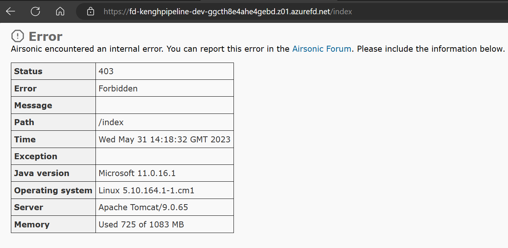

# GitHub Workflow Setup
This folder contains workflows that support the process of building the reliable web app pattern.

## Workflow Installation
There are several steps required to install the workflow. One of the challenges this approach
works around is the creation, and reuse, of an existing Azure AD app registration.

1. Create an Azure AD App Registration

    > ./scripts/devOpsScripts/reuseable-app-registrations.sh --console-out --app-name rwa-java-pipeline-test1

    **Outcome**

    You should now be able to browse to Azure AD and see an App Registration that was created
    for use when testing the Proseware web app. Save this data for later to be configured
    in GitHub settings.

1. Create a service principal for the workflow

    <!-- TODO: Explore GH Federated Credentials to replace client-secret -->
    > The following command produces a warning:
    >     https://github.com/Azure/azure-cli/issues/20743
    > 
    > Currently, this is still the recommended approach:
    >     https://github.com/azure/login#configure-a-service-principal-with-a-secret

    ```bash
    az ad sp create-for-rbac --name rwa-gh-java-spn --sdk-auth --role contributor \
    --scopes /subscriptions/{subscription_id}
    ```

    **Outcome**

    You have now created a service principal that GitHub can use to connect, and deploy, to an Azure subscription.
    Save this data for later to be configured in GitHub settings.

1. Give the ServicePrincipal access to assign Azure RBAC

    Use the following command to find the objectId (not the clientId) for the service principal

    Replace `clientId` with the value from the previous command
    ```bash
    az ad sp show --query "id" -o tsv --id <clientId>
    ```

    Use the output from the previous command to replace `service_principal_object_id`
    Set the *subscription_id* to the subscription where this Service Principal was granted **Contributor** access.

    > By default, this should be the subscription shown by `az account show`

    ```bash
    az role assignment create --assignee <service_principal_object_id> --role "User Access Administrator" --scope /subscriptions/<subscription_id>
    ```

    **Outcome**

    The GitHub Service Principal now has access to perform Azure role assignments on RBAC provisioned services. This means that we can encode Key Vault Access Permissions (RBAC permissions) from infrastructure-as-code to give the managed identities (the web app's identity) access to read data from Key Vault.

1. Set workflow variables & secrets in GitHub:

    *Secrets*

    |Name                       |Value                                       | Description                                                          |
    |---------------------------|--------------------------------------------|----------------------------------------------------------------------|
    |AZURE_CLIENT_SECRET        | (GUID FROM APP REGISTRATIONS SCRIPT)       |Provides Proseware with ability to use Azure AD to authenticate users |
    |TERRAFORM_CLIENT_SECRET    | (GUID FROM SERVICE PRINCIPAL CMD)          |Used by the devops pipeline for integration testing                   |
    |AZURE_CREDENTIALS          | (TEXT FROM CONSOLE)                        |Used by the devops pipeline for integration testing                   |
    |AZURE_SUBSCRIPTION_ID      | (TEXT FROM CONSOLE)                        |                                                                      |
    |POSTGRES_DATABASE_PASSWORD | (pick a password)                          |                                                                      |

    > Paste all of the json from the previous command into the textarea as
        the value for the AZURE_CREDENTIALS secret.

    *Variables*

    |Name                       |Value                                       | Description                                                          |
    |---------------------------|--------------------------------------------|----------------------------------------------------------------------|
    |AZURE_APP_NAME             | eapjavarwagh                               |                                                                      |
    |AZURE_LOCATION             | australiaeast                              |                                                                      |
    |AZURE_CLIENT_ID            | (GUID FROM APP REGISTRATIONS SCRIPT)       |Provides Proseware with ability to use Azure AD to authenticate users |
    |AZURE_TENANT_ID            | (GUID FROM APP REGISTRATIONS SCRIPT)       |Provides Proseware with ability to use Azure AD to authenticate users |
    |TERRAFORM_CLIENT_ID        | (GUID FROM SERVICE PRINCIPAL CMD)          |Provides Proseware with ability to use Azure AD to authenticate users |

    **Outcome**

    The workflow is now ready to run.

1. Set the redirectUri

    Run the deployment once. Then, using the Azure Portal, find the Front Door uri
    that was created by the deployment and use that to override the "localhost:8080"
    value that is set as the existing redirectUri in the App Registration.

    **Outcome**

    Users should be able to login to test the web app that was deployed via AZD pipeline.

    > It may take a few minutes for the App Registration to be updated successfully to support testing.

1. Add roles

    Any user that wants to test the deployed DevOps web app must be added to the role.

    Troubleshooting: `Airsonic encountered an internal error` status *403* error *Forbidden*

    

## Workflow Overview
There are three workflows:
- build-and-deploy.yml: a terraform based workflow that builds a war file artifact
- scheduled-azure-build-and-deploy.yml: a terraform flow executed through AZD as a reader would execute this guide
- scheduled-azure-teardown.yml: a clean up workflow to manage costs and remove failed deployments

### build-and-deploy.yml

This TerraForm workflow deployment is meant as a starter template to help readers with devOps
deployments of this content.

The starter template is not currently complete and includes some remaining tasks that must
be addressed before it can be applied in a dev environment:

1. The tfplan file must be persisted so that infrastructure can be managed by Terraform
1. The database should not be managed by the code, it should be managed by a database lifecylce process that manages schema changes as scripts that are under source control and reviewed by your database administrator to prevent any data loss as columns change.
1. The war file packaged, and created by the pipeline, should support web app startup.
