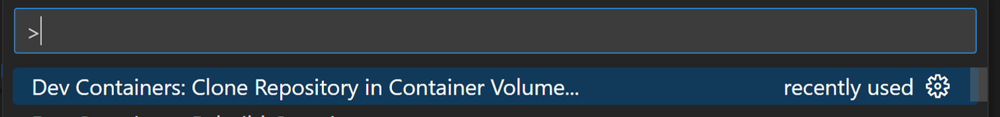
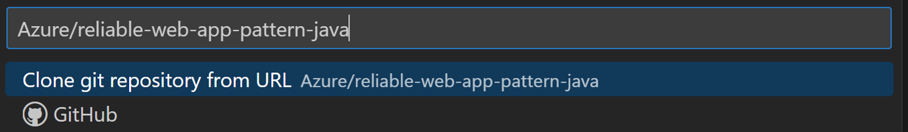
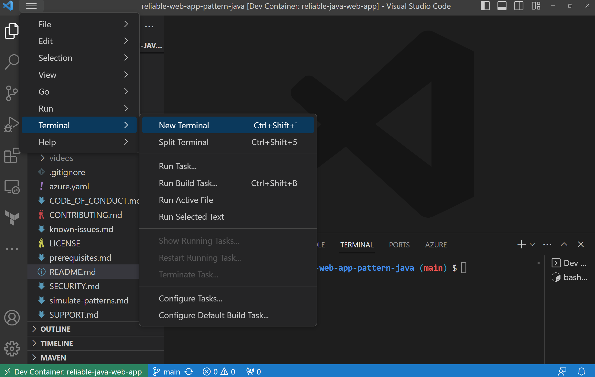

# Reliable web app pattern for Java

This reference implementation provides a production-grade web application that uses best practices from our guidance and gives developers concrete examples to build their own reliable web application in Azure.

The reliable web app pattern shows you how to update web apps moving to the cloud. It defines the implementation guidance you need to re-platform web apps the right way. The reliable web app pattern focuses on the minimal code changes you need be successful in the cloud. It shows you how to add reliability design patterns to your code and choose managed services so that you can rapidly adopt the cloud. Here's an outline of the contents in this readme:

- [Architecture guidance](#architecture-guidance)
- [Architecture diagram](#architecture-diagram)
- [Workflow](#reference-implementation-workflow)
- [Steps to deploy](#steps-to-deploy-the-reference-implementation)

## Architecture guidance

This project has two companion articles in the Azure Architecture Center that provide detailed implementation guidance.

- [Plan the implementation](https://learn.microsoft.com/azure/architecture/web-apps/guides/reliable-web-app/java/plan-implementation): The first article explains how to plan the implementation of the reliable web app pattern for Java.
- [Apply the pattern](https://learn.microsoft.com/azure/architecture/web-apps/guides/reliable-web-app/java/apply-pattern): The second article shows you how to apply the pattern with code and architecture details.

For more information on the reliable web app pattern, see [Overview](https://review.learn.microsoft.com/azure/architecture/web-apps/guides/reliable-web-app/overview).

## Architecture diagram

[](docs/assets/reliable-web-app-java.svg#lightbox)

- [Production environment estimated cost](https://azure.com/e/4e27d768a5924e3d93252eeceb4af4ad)
- [Non-production environment estimated cost](https://azure.com/e/1721b2f3f2bd4340a00115e79057177a)

## Reference implementation workflow

- The web app uses two regions in an active-passive configuration to meet the service level objective of 99.9%. It uses Azure Front Door as the global load balancer. Front Door routes all traffic to the active region. The passive region is for failover only. The failover plan is manual and there are no automated scripts with this repo.
- All inbound HTTPS traffic passes through Front Door and Web Application Firewall (WAF). WAF inspects the traffic against WAF policies.
- The web app code implements the Retry, Circuit Breaker, and Cache-Aside patterns. The web app integrates with Azure AD using the Spring Boot Starter for Azure Active Directory.
- Application Insights is the application performance management tool, and it gathers telemetry data on the web app.
- App Service uses virtual network integration to communicate securely with other Azure resources within the private virtual network. App Service requires an `App Service delegated subnet` in the virtual network to enable virtual network integration.
- Key Vault and Azure Cache for Redis have private endpoints in the `Private endpoints subnet`. Private DNS zones linked to the virtual network resolve DNS queries for these Azure resources to their private endpoint IP address.
- Azure Database for PostgreSQL - Flexible server uses virtual network integration for private communication. It doesn't support private endpoints.
- The web app uses an account access key to mount a directory with Azure Files to the App Service. A private endpoint is not used for Azure Files to facilitate the deployment of the reference implementation for everyone. However, it is recommended to use a private endpoint in production as it adds an extra layer of security. Azure Files only accepts traffic from the virtual network and the local client IP address of the user executing the deployment.
- App Service, Azure Files, Key Vault, Azure Cache for Redis, and Azure Database for PostgreSQL use diagnostic settings to send logs and metrics to Azure Log Analytics Workspace. Log Analytics Workspace is used to monitor the health of Azure services.
- Azure Database for PostgreSQL uses a high-availability zone redundant configuration and a read replica in the passive region for failover.

## Prerequisites

* [Azure Subscription](https://azure.microsoft.com/pricing/member-offers/msdn-benefits-details/)
* [Visual Studio Code](https://code.visualstudio.com/)
* [Docker](https://www.docker.com/get-started/)
* [Permissions to register an application](https://learn.microsoft.com/azure/active-directory/develop/quickstart-register-app)
* [Dev Containers extension installed in VS Code](https://marketplace.visualstudio.com/items?itemName=ms-vscode-remote.remote-containers) extension

See [Prerequisites](prerequisites.md) for more detailed information about our prerequisites.

## Steps to deploy the reference implementation

**1. Start VS Code and run Dev Containers: Clone Repository in Container Volume... from the Command Palette (F1).**



**2. Enter azure/reliable-web-app-pattern-java in the input box that appears and press Enter.**



**3. Open a terminal in VS Code**

Open a terminal in VS Code using one of the following methods.

* From the menu, use the Terminal > New Terminal or View > Terminal menu commands.
* To create a new terminal, use the Ctrl+Shift+` keyboard shortcut.


 
 **4. Prepare for deployment**

Enter the following commands in the terminal in VS Code. When prompted to enter a new environment name, choose one that's less than 18 characters.

```shell
azd auth login
azd config set alpha.terraform on
azd env new
```

Set the environment variables.

```shell
azd env set DATABASE_PASSWORD <SOME_VALUE>
azd env set AZURE_LOCATION <AZURE_REGION_NAME e.g. eastus>
azd env set AZURE_SUBSCRIPTION_ID <AZURE_SUBSCRIPTION_ID>
```

> You can find a list of available Azure regions by running
> the following Azure CLI command.
> 
> ```shell
> az account list-locations --query "[].name" -o tsv
> ```

### (Optional) Multi-region support

Prosware devs also use the following command to choose a second Azure location for multiregional deployments. The following constraints were considered for choosing paired regions for Proseware.

1. Regional pairs that align with [Azure Storage redundancy (GZRS)](https://learn.microsoft.com/en-us/azure/storage/common/storage-redundancy#geo-zone-redundant-storage).
2. Regions that support [Azure Database for PostgreSQL - Flexible Server](https://learn.microsoft.com/en-us/azure/postgresql/flexible-server/overview) with [availability zones](https://learn.microsoft.com/en-us/azure/reliability/availability-zones-overview#availability-zones).

We have validated the following paired regions.

| AZURE_LOCATION | AZURE_LOCATION2 |
| ----- | ----- |
| westus3 | eastus |
| westeurope | northeurope |
| australiaeast | australiasoutheast |

```shell
azd env set AZURE_LOCATION2 <region>
```

### (Optional) Select production or development environment.

You should change the `APP_ENVIRONMENT` variable to *prod* for production SKUs.  Default value is *dev* 

```shell
azd env set APP_ENVIRONMENT prod
```

The following table describes the differences in the resources deployed in the 2 environments.

| Service | Dev SKU | Prod SKU | SKU options |
| --- | --- | --- | --- |
| Cache for Redis | Basic | Standard | [Redis Cache SKU options](https://azure.microsoft.com/pricing/details/cache/)
| App Service | P1v3 | P2v3 | [App Service SKU options](https://azure.microsoft.com/pricing/details/app-service/linux/)
| PostgreSQL Flexible Server | Burstable B1ms (B_Standard_B1ms) | General Purpose D4s_v3 (GP_Standard_D4s_v3) | [PostgreSQL SKU options](https://learn.microsoft.com/azure/postgresql/flexible-server/concepts-compute-storage)

**5. Start the Deployment**

Provision the infrastructure using the commands below.

```shell
az login --scope https://graph.microsoft.com//.default
az account set --subscription <SUBSCRIPTION_ID>
azd provision
```

Deploy the web application to the primary region using the commands
below.

```shell
azd deploy
```

If you specified a secondary region then deploy the web application to
it using the commands below.

```shell
SECONDARY_RESOURCE_GROUP=$(azd env get-values --output json | jq -r .secondary_resource_group)
azd env set AZURE_RESOURCE_GROUP $SECONDARY_RESOURCE_GROUP
azd deploy
```

### (Optional) Add Users to Azure Active Directory enterprise applications

The next step is to add a user to the application and assign them a role. To do this, go to Azure Portal --> Azure Active Directory --> Enterprise Applications and search for the Proseware application. Add a user to the application.


### Navigate to Proseware

After adding the user, open the browser and navigate to *Proseware*. Use the following command to get the site name.

```shell
azd env get-values --output json | jq -r .frontdoor_url
```


## Teardown

To tear down the deployment, run the two following commands.

```shell
azd down
```

## Data collection

The software in the reference implementation may collect information about you and your use of the software and send it to Microsoft. Microsoft may use this information to provide services and improve our products and services. You can turn off the telemetry, and the following code shows you how to opt out. There are also some features in the software that enable you and Microsoft to collect data from users of your applications. If you use these features, you must comply with applicable law, including providing appropriate notices to users of your applications together with a copy of [Microsoft Privacy Statement](https://go.microsoft.com/fwlink/?LinkId=521839). You can learn more about data collection and use in the help documentation and our privacy statement. When you use the software, you consent to these practices.

Telemetry collection is on by default.

To opt out, set the environment variable `ENABLE_TELEMETRY` to `false`.

```shell
azd env set ENABLE_TELEMETRY false
```

## Trademarks

This project may contain trademarks or logos for projects, products, or services. Authorized use of Microsoft trademarks or logos is subject to and must follow [Microsoft's Trademark & Brand Guidelines](https://www.microsoft.com/legal/intellectualproperty/trademarks/usage/general).

Use of Microsoft trademarks or logos in modified versions of this project must not cause confusion or imply Microsoft sponsorship. Any use of third-party trademarks or logos are subject to those third-party's policies.

## Additional links

- [Patterns overview](https://learn.microsoft.com/azure/architecture/web-apps/guides/reliable-web-app/overview)
- [Applying the patterns](https://learn.microsoft.com/azure/architecture/web-apps/guides/reliable-web-app/java/apply-pattern)
- [Simulating developer patterns](simulate-patterns.md)
- [Known issues](known-issues.md)
- [Contributing](CONTRIBUTING.md)
