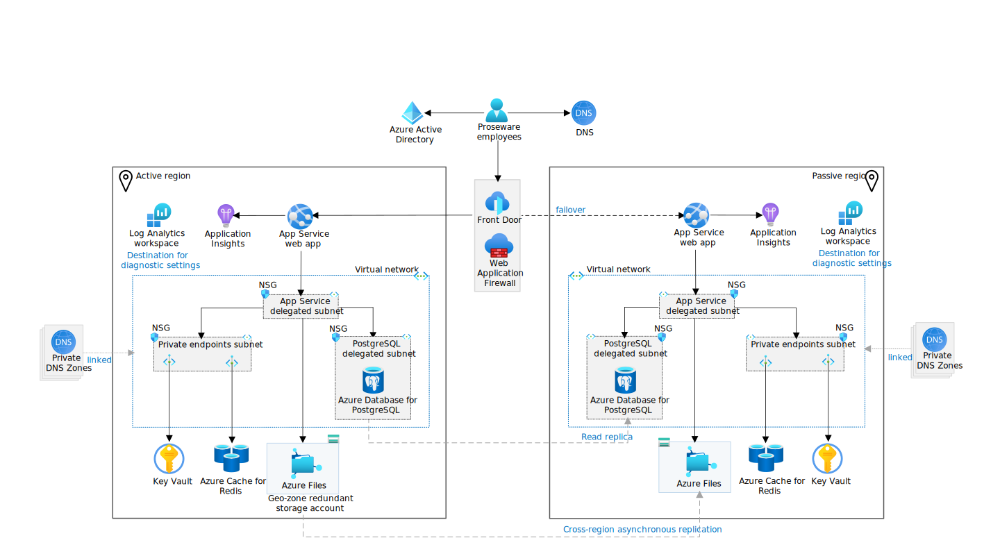
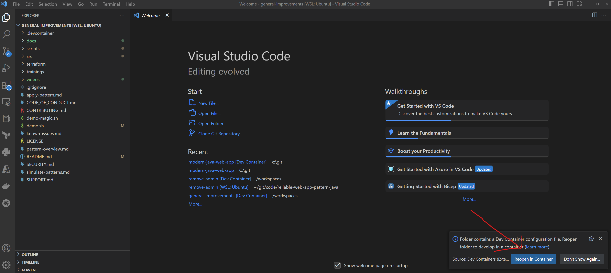
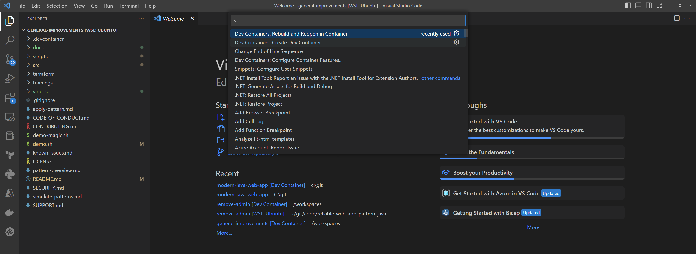
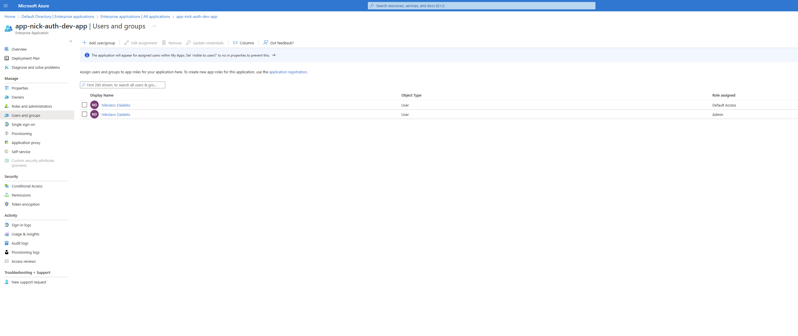
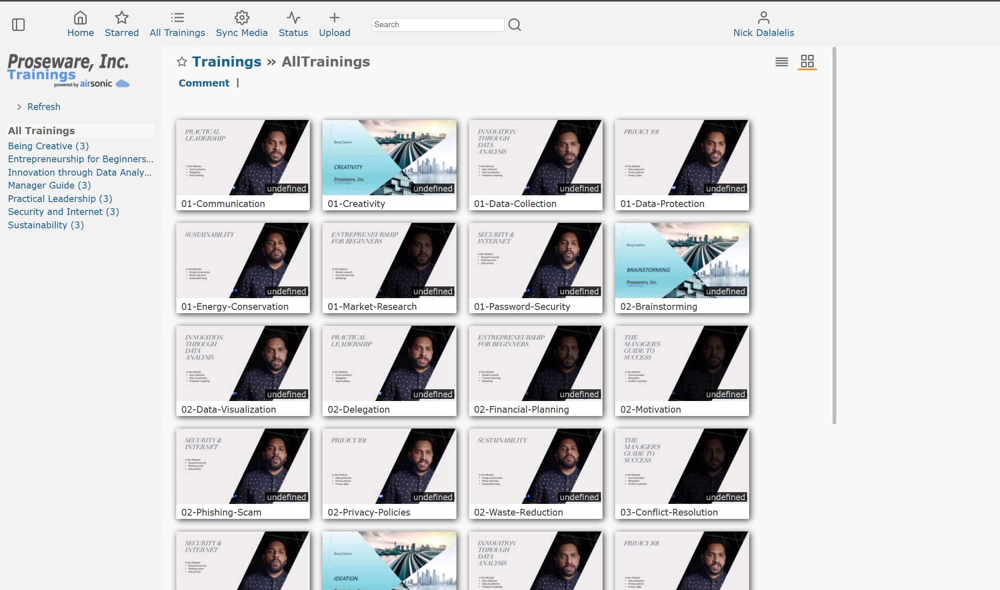

# Reliable web app pattern for Java

> :mega: **Got feedback?** Fill out [this survey](https://aka.ms/eap/rwa/java/survey) to help us shape the future of Enterprise App Patterns and understand whether we're focusing on the business goals and features important to you. [Microsoft Privacy Statement](https://go.microsoft.com/fwlink/?LinkId=521839)

This reference implementation provides a production-grade web application that uses best practices from our guidance and gives developers concrete examples to build their own reliable web application in Azure.

The reliable web app pattern shows you how to update web apps moving to the cloud. It defines the implementation guidance you need to re-platform web apps the right way. The reliable web app pattern focuses on the minimal code changes you need be successful in the cloud. It shows you how to add reliability design patterns to your code and choose managed services so that you can rapidly adopt the cloud. Here's an outline of the contents in this readme:

- [Architecture guidance](#architecture-guidance)
- [Architecture diagram](#architecture-diagram)
- [Workflow](#reference-implementation-workflow)
- [Steps to deploy](#steps-to-deploy-the-reference-implementation)

## Architecture guidance

This project has two companion articles in the Azure Architecture Center that provide detailed implementation guidance.

- [Plan the implementation](https://learn.microsoft.com/azure/architecture/web-apps/guides/reliable-web-app/java/plan-implementation): The first article explains how to plan the implementation of the reliable web app pattern for Java.
- [Apply the pattern](https://learn.microsoft.com/azure/architecture/web-apps/guides/reliable-web-app/java/apply-pattern): The second article shows you how to apply the pattern with code and architecture details.

For more information on the reliable web app pattern, see [Overview](https://learn.microsoft.com/azure/architecture/web-apps/guides/reliable-web-app/overview).

## Architecture diagram

[](docs/assets/reliable-web-app-java.svg#lightbox)

- [Production environment estimated cost](https://azure.com/e/4e27d768a5924e3d93252eeceb4af4ad)
- [Non-production environment estimated cost](https://azure.com/e/1721b2f3f2bd4340a00115e79057177a)

## Reference implementation workflow

- The web app uses two regions in an active-passive configuration to meet the service level objective of 99.9%. It uses Azure Front Door as the global load balancer. Front Door routes all traffic to the active region. The passive region is for failover only. The failover plan is manual and there are no automated scripts with this repo.
- All inbound HTTPS traffic passes through Front Door and Web Application Firewall (WAF). WAF inspects the traffic against WAF policies.
- The web app code implements the Retry, Circuit Breaker, and Cache-Aside patterns. The web app integrates with Azure AD using the Spring Boot Starter for Azure Active Directory.
- Application Insights is the application performance management tool, and it gathers telemetry data on the web app.
- App Service uses virtual network integration to communicate securely with other Azure resources within the private virtual network. App Service requires an `App Service delegated subnet` in the virtual network to enable virtual network integration.
- Key Vault and Azure Cache for Redis have private endpoints in the `Private endpoints subnet`. Private DNS zones linked to the virtual network resolve DNS queries for these Azure resources to their private endpoint IP address.
- Azure Database for PostgreSQL - Flexible server uses virtual network integration for private communication. It doesn't support private endpoints.
- The web app uses an account access key to mount a directory with Azure Files to the App Service. A private endpoint is not used for Azure Files to facilitate the deployment of the reference implementation for everyone. However, it is recommended to use a private endpoint in production as it adds an extra layer of security. Azure Files only accepts traffic from the virtual network and the local client IP address of the user executing the deployment.
- App Service, Azure Files, Key Vault, Azure Cache for Redis, and Azure Database for PostgreSQL use diagnostic settings to send logs and metrics to Azure Log Analytics Workspace. Log Analytics Workspace is used to monitor the health of Azure services.
- Azure Database for PostgreSQL uses a high-availability zone redundant configuration and a read replica in the passive region for failover.

## Prerequisites

We recommend that you use a Dev Container to deploy this application.  The requirements are as follows:

- [Azure Subscription](https://azure.microsoft.com/pricing/member-offers/msdn-benefits-details/).
- [Visual Studio Code](https://code.visualstudio.com/).
- [Docker Desktop](https://www.docker.com/get-started/).
- [Permissions to register an application in Azure AD](https://learn.microsoft.com/azure/active-directory/develop/quickstart-register-app).
- Visual Studio Code [Dev Containers extension](https://marketplace.visualstudio.com/items?itemName=ms-vscode-remote.remote-containers).

If you do not wish to use a Dev Container, please refer to the [prerequisites](prerequisites.md) for detailed information on how to set up your development system to build, run, and deploy the application.

> **WINDOWS**
> If you are using Windows, you must enable long paths.  Do the following as a local Administrator:
>
> - Open the Registry Editor, navigate to `HKLM\SYSTEM\CurrentControlSet\Control\FileSystem` and set DWORD `LongPathsEnabled` to 1.
> - Run `git config --system core.longpaths true`

## Steps to deploy the reference implementation

This section describes the deployment steps for the reference implementation of a reliable web application pattern with Java on Microsoft Azure. There are nine steps, including teardown.

For users familiar with the deployment process, you can use the following list of the deployments commands as a quick reference. The commands assume you have logged into Azure through the Azure CLI and Azure Developer CLI and have selected a suitable subscription:

```shell
git clone https://github.com/Azure/reliable-web-app-pattern-java.git
cd reliable-web-app-pattern-java
azd config set alpha.terraform on
azd env new eap-javarwa
azd env set DATABASE_PASSWORD "AV@lidPa33word"
azd env set APP_ENVIRONMENT prod
azd env set AZURE_LOCATION westus3
azd env set AZURE_LOCATION2 eastus
azd up
SECONDARY_RESOURCE_GROUP=$(azd env get-values --output json | jq -r .secondary_resource_group)
azd env set AZURE_RESOURCE_GROUP $SECONDARY_RESOURCE_GROUP
azd deploy
```

The following detailed deployment steps assume you are using a Dev Container inside Visual Studio Code.

### 1. Clone the repo

If using Windows, ensure you have enabled long paths.  Then clone the repository from GitHub:

```shell
git clone https://github.com/Azure/reliable-web-app-pattern-java.git
cd reliable-web-app-pattern-java
```

### 2. Open Dev Container in Visual Studio Code (optional)

If required, ensure Docker Desktop is started and enabled for your WSL terminal [more details](https://learn.microsoft.com/windows/wsl/tutorials/wsl-containers#install-docker-desktop). Open the repository folder in Visual Studio Code. You can do this from the command prompt:

```shell
code .
```

Once Visual Studio Code is launched, you should see a popup allowing you to click on the button **Reopen in Container**.



If you don't see the popup, open the Visual Studio Code Command Palette to execute the command. There are three ways to open the command palette:

- For Mac users, use the keyboard shortcut ⇧⌘P
- For Windows and Linux users, use Ctrl+Shift+P
- From the Visual Studio Code top menu, navigate to View -> Command Palette.

Once the command palette is open, search for `Dev Containers: Rebuild and Reopen in Container`.



### 3. Log in to Azure

Before deploying, you must be authenticated to Azure and have the appropriate subscription selected.  To authenticate:

```shell
az login --scope https://graph.microsoft.com//.default
azd auth login
```

Each command will open a browser allowing you to authenticate.  To list the subscriptions you have access to:

```shell
az account list
```

To set the active subscription:

```shell
export AZURE_SUBSCRIPTION="<your-subscription-id>"
az account set --subscription $AZURE_SUBSCRIPTION
azd config set defaults.subscription $AZURE_SUBSCRIPTION
```

### 4. Create a new environment

The environment name should be less than 18 characters and must be comprised of lower-case, numeric, and dash characters (for example, `eap-javarwa`).  The environment name is used for resource group naming and specific resource naming. Also, select a password for the admin user of the database.

Run the following commands to set these values and create a new environment:

```shell
azd config set alpha.terraform on
azd env new eap-javarwa
azd env set DATABASE_PASSWORD "AV@lidPa33word"
```

Substitute the environment name and database password for your own values.

By default, Azure resources are sized for a "development" mode. Set the `APP_ENVIRONMENT` to `prod` using the following code to deploy production SKUs:

```shell
azd env set APP_ENVIRONMENT prod
```

The following table lists the the development and production SKU differences.

| Service | Dev SKU | Prod SKU | SKU options |
| --- | --- | --- | --- |
| Cache for Redis | Basic | Standard | [Redis Cache SKU options](https://azure.microsoft.com/pricing/details/cache/) |
| App Service | P1v3 | P2v3 | [App Service SKU options](https://azure.microsoft.com/pricing/details/app-service/linux/) |
| PostgreSQL Flexible Server | Burstable B1ms (B_Standard_B1ms) | General Purpose D4s_v3 (GP_Standard_D4s_v3) | [PostgreSQL SKU options](https://learn.microsoft.com/azure/postgresql/flexible-server/concepts-compute-storage) |

### 5. Select a region for deployment

The application can be deployed in either a single region or multi-region manner. You can find a list of available Azure regions by running the following Azure CLI command.

> ```shell
> az account list-locations --query "[].name" -o tsv
> ```

Set the `AZURE_LOCATION` to the primary region:

```shell
azd env set AZURE_LOCATION westus3
```

You want to make sure the region has availability zones. Azure Database for PostgreSQL - Flexible Server [zone-redundant high availability](https://learn.microsoft.com/azure/postgresql/flexible-server/concepts-high-availability) requires availability zones.

If doing a multi-region deployment, set the `AZURE_LOCATION2` to the secondary region:

```shell
azd env set AZURE_LOCATION2 eastus
```

Make sure the secondary region is a paired region with the primary region (`AZURE_LOCATION`). Paired regions are required to support [geo-zone-redundant storage (GZRS) failover](https://learn.microsoft.com/azure/storage/common/storage-disaster-recovery-guidance). For a full list of region pairs, see [Azure region pairs](https://learn.microsoft.com/azure/reliability/cross-region-replication-azure#azure-cross-region-replication-pairings-for-all-geographies). We have validated the following paired regions.

| AZURE_LOCATION | AZURE_LOCATION2 |
| ----- | ----- |
| westus3 | eastus |
| westeurope | northeurope |
| australiaeast | australiasoutheast |

### 6. Provision and deploy the application

Run the following command to create the infrastructure:

```shell
azd provision --no-prompt
```

Run the following command to deploy the code to the created infrastructure:

```shell
azd deploy
```

If you are doing a multi-region deployment, you must also deploy the code to the secondary region:

```shell
SECONDARY_RESOURCE_GROUP=$(azd env get-values --output json | jq -r .secondary_resource_group)
azd env set AZURE_RESOURCE_GROUP $SECONDARY_RESOURCE_GROUP
azd deploy
```

The provisioning and deployment process can take anywhere from 20 minutes to over an hour, depending on system load and your bandwidth.

### 7. Add users to Azure Active Directory enterprise applications (optional)

By default, your user account is added to the application.  To enable additional users:

- Sign in to the [Azure Portal](https://portal.azure.com).
- Select **Azure Active Directory** -> **Enterprise Applications**.
- Search for, then select **Proseware**.
- Add the user to the application.



### 8. Open and use the application

Use the following to find the URL for the Proseware application that you have deployed:

```shell
azd env get-values --output json | jq -r .frontdoor_url
```



It takes approximately 5 minutes for the Azure App Service to respond to requests using the code deployed during step 6.

### 9. Teardown

To tear down the deployment, run the following command:

```shell
azd down
```

## Data collection

The software in the reference implementation may collect information about you and your use of the software and send it to Microsoft. Microsoft may use this information to provide services and improve our products and services. You can turn off the telemetry, and the following code shows you how to opt out. There are also some features in the software that enable you and Microsoft to collect data from users of your applications. If you use these features, you must comply with applicable law, including providing appropriate notices to users of your applications together with a copy of [Microsoft Privacy Statement](https://go.microsoft.com/fwlink/?LinkId=521839). You can learn more about data collection and use in the help documentation and our privacy statement. When you use the software, you consent to these practices.

Telemetry collection is on by default.

To opt out, set the environment variable `ENABLE_TELEMETRY` to `false`.

```shell
azd env set ENABLE_TELEMETRY false
```

## Trademarks

This project may contain trademarks or logos for projects, products, or services. Authorized use of Microsoft trademarks or logos is subject to and must follow [Microsoft's Trademark & Brand Guidelines](https://www.microsoft.com/legal/intellectualproperty/trademarks/usage/general).

Use of Microsoft trademarks or logos in modified versions of this project must not cause confusion or imply Microsoft sponsorship. Any use of third-party trademarks or logos are subject to those third-party's policies.

## Additional links

- [Patterns overview](https://learn.microsoft.com/azure/architecture/web-apps/guides/reliable-web-app/overview)
- [Applying the patterns](https://learn.microsoft.com/azure/architecture/web-apps/guides/reliable-web-app/java/apply-pattern)
- [Simulating developer patterns](simulate-patterns.md)
- [Known issues](known-issues.md)
- [Contributing](CONTRIBUTING.md)
