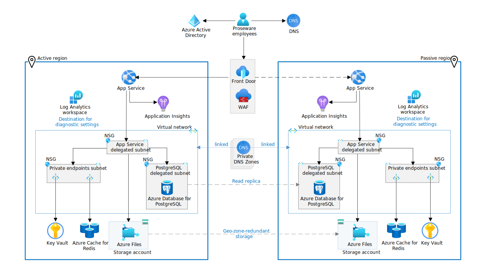

# Reliable web app pattern for Java

This reference implementation provides a production-grade web application that uses best practices from our guidance and gives developers concrete examples to build their own Reliable Web Application in Azure. It simulates the journey from an on-premises Java application to a migration to Azure. It shows you what changes to make to maximize the benefits of the cloud in the initial cloud adoption phase. Here's an outline of the contents in this readme:

- [Architecture guidance](#architecture-guidance)
- [Videos](#videos)
- [Architecture](#architecture)
- [Workflow](#workflow)
- [Steps to deploy the reference implementation](#steps-to-deploy-the-reference-implementation)

## Architecture guidance

This project has [companion architecture guidance](adopt-pattern.md) that describes design patterns and best practices for migrating to the cloud. We suggest you read it as it will give important context to the considerations applied in this implementation.

## Videos

The internally accessible video covers the details of reliable web app pattern for Java. For more information, see [Reliable web app pattern videos (Sharepoint)](https://aka.ms/rwa-java-video).

## Architecture

[](docs/assets/reliable-web-app-java-implementation.svg)

- [Production environment estimated cost](https://azure.com/e/65354031bc084e539b6c8ccfc1a7b097)

- [Non-production environment estimated cost](https://azure.com/e/af7d105ce24340dab93dfe666909a3e0)

## Reference implementation workflow

- The web app uses two regions in an active-passive configuration to meet the service level objective. The deployment uses three resources groups: active region, passive region, and a shared resources group for Azure Front Door, Web Application Firewall, Private DNS Zones, and the Azure Database for PostgreSQL. The main database and the read replica need to be in the same resource group.
- The web app uses the built-in authentication feature of App Service (EasyAuth) to manage the initial sign-in flow (cookies) and Azure AD as the identity platform.
- All inbound HTTPS traffic passes through Azure Front Door and Azure Web Application Firewall (WAF). WAF inspects the traffic against WAF rules.
- Front Door routes all traffic to the active region. The passive region is for failover only. The failover plan is manual and there are no automated scripts with this repo.
- The web app code implements the Retry, Circuit Breaker, and Cache-Aside patterns and integrates app roles with Azure AD using the Microsoft Authentication Library (MSAL).
- Application Insights is the application performance management tool, and it gathers telemetry data on the web app.
- App Service uses virtual network integration to communicate with other Azure resources within the private virtual network. App Service requires an `App Service delegated subnet` in the virtual network to enable virtual network integration.
- Key Vault and Azure Cache for Redis have private endpoints in the `Private endpoints subnet`. Private DNS zones linked to the virtual network resolve DNS queries for these Azure resources to their private endpoint IP address.
- Azure Database for PostgreSQL - Flexible server uses virtual network integration for private communication. It doesn't support private endpoints.
- The web app uses an account access key to mount a directory with Azure Files to the App Service. A private endpoint is not used for Azure Files to make deployment possible, as it would be less efficient. However, it is recommended to use a private endpoint in production as it adds an extra layer of security. Azure Files only accepts traffic from the virtual network and the local client IP address of the user executing the deployment.
- App Service, Azure Files, Key Vault, Azure Cache for Redis, and Azure Database for PostgreSQL use diagnostic settings to send logs and metrics to Azure Log Analytics Workspace.
- Azure Database for PostgreSQL uses a high-availability zone redundant configuration and a read replica in the passive region for failover.

## Prerequisites

* [Azure Subscription](https://azure.microsoft.com/pricing/member-offers/msdn-benefits-details/)
* [Visual Studio Code](https://code.visualstudio.com/)
* [Docker](https://www.docker.com/get-started/)
* [Permissions to register an application](https://learn.microsoft.com/azure/active-directory/develop/quickstart-register-app)
* [Dev Containers extension installed in VS Code](https://marketplace.visualstudio.com/items?itemName=ms-vscode-remote.remote-containers) extension

## Steps to deploy the reference implementation


Note - The following deployment has been tested using devcontainers on **macOS** and **Windows with [Ubuntu on WSL](https://ubuntu.com/wsl)**.

**1. Clone the repo**

Navigate to your desired directory and run the three following commands:

```shell
git clone https://github.com/Azure/reliable-web-app-pattern-java.git
cd reliable-web-app-pattern-java
code .
```

If using WSL, start a WSL Ubuntu terminal and clone the repo to a WSL directory (see example in the following image).


Once Visual Studio Code is launched, you should see a popup allowing you to click on the button **Reopen in Container**.


If you don't see the popup, open up the Visual Studio Code Command Palette. There are three ways to open the Code Command Palette:

- For Mac users, use the keyboard shortcut ⇧⌘P
- For Windows and Linux users, use Ctrl+Shift+P
- In the VS Code, navigate to View -> Command Palette.

Then, search for `Dev Containers: Rebuild and Reopen in Container` in the Command Palette.


**2. Prepare for deployment**

```shell
azd auth login
azd config set alpha.terraform on
azd env new
azd env set DATABASE_PASSWORD <SOME_VALUE>
azd env set AZURE_LOCATION <region>
azd env set AZURE_SUBSCRIPTION_ID <SUBSCRIPTION_ID>
```

> You can find a list of available Azure regions by running
> the following Azure CLI command.
> 
> ```shell
> az account list-locations --query "[].name" -o tsv
> ```

### Multi-region support

Prosware devs also use the following command to choose a second Azure location because the production environment is multiregional.

```shell
azd env set AZURE_LOCATION2 <region>
```

### Select production or development environment.

You should change the `APP_ENV_NAME` variable to either *prod* or *dev*. 

```shell
azd env set APP_ENV_NAME prod
```

The following table describes the differences in the resources deployed in the 2 environments.

| Service | Dev SKU | Prod SKU | SKU options |
| --- | --- | --- | --- |
| Cache for Redis | Basic | Standard | [Redis Cache SKU options](https://azure.microsoft.com/pricing/details/cache/)
| App Service | P1v2 | P2v2 | [App Service SKU options](https://azure.microsoft.com/pricing/details/app-service/linux/)
| PostgreSQL Flexible Server | Burstable B1ms (B_Standard_B1ms) | General Purpose D4s_v3 (GP_Standard_D4s_v3) | [PostgreSQL SKU options](https://learn.microsoft.com/azure/postgresql/flexible-server/concepts-compute-storage)

**3. Start the Deployment**

Provision the infrastructure using the commands below.

```shell
az login --scope https://graph.microsoft.com//.default
az account set --subscription <SUBSCRIPTION_ID>
azd provision
```

Deploy the web application to the primay region using the commands
below.

In the first command below substitute the FILL_IN_RESOURCE_GROUP_NAME
with the resource group name of the primary region.

```shell
azd env set AZURE_RESOURCE_GROUP FILL_IN_RESOURCE_GROUP_NAME
azd deploy
```

If you specified a secondary region then deploy the web application to
it using the commands below.

In the command below substitute the FILL_IN_SECONDARY_RESOURCE_GROUP_NAME
with the resource group name of the secondary region

```shell
azd env set AZURE_RESOURCE_GROUP FILL_IN_SECONDARY_RESOURCE_GROUP_NAME
azd deploy
```

### (Optional) Add Users to Azure Active Directory enterprise applications

The next step is to add a user to the application and assign them a role. To do this, go to Azure Portal --> Azure Active Directory --> Enterprise Applications and search for the Proseware application. Add a user to the application.


### Navigate to Proseware

After adding the user, open the browser and navigate to *Proseware*. Use the following command to get the site name.

```shell
azd env get-values --output json | jq -r .frontdoor_url
```


## Teardown

To tear down the deployment, run the two following commands.

```shell
azd down
```

## Data collection

The software in the reference implementation may collect information about you and your use of the software and send it to Microsoft. Microsoft may use this information to provide services and improve our products and services. You can turn off the telemetry, and the following code shows you how to opt out. There are also some features in the software that enable you and Microsoft to collect data from users of your applications. If you use these features, you must comply with applicable law, including providing appropriate notices to users of your applications together with a copy of [Microsoft Privacy Statement](https://go.microsoft.com/fwlink/?LinkId=521839). You can learn more about data collection and use in the help documentation and our privacy statement. When you use the software, you consent to these practices.

Telemetry collection is on by default.

To opt out, set the environment variable `ENABLE_TELEMETRY` to `false`.

```shell
azd env set ENABLE_TELEMETRY false
```

## Trademarks

This project may contain trademarks or logos for projects, products, or services. Authorized use of Microsoft trademarks or logos is subject to and must follow [Microsoft's Trademark & Brand Guidelines](https://www.microsoft.com/legal/intellectualproperty/trademarks/usage/general).

Use of Microsoft trademarks or logos in modified versions of this project must not cause confusion or imply Microsoft sponsorship. Any use of third-party trademarks or logos are subject to those third-party's policies.

## Additional links

- [Patterns overview](adopt-pattern.md)
- [Applying the patterns](apply-pattern.md)
- [Simulating developer patterns](simulate-patterns.md)
- [Known issues](known-issues.md)
- [Contributing](CONTRIBUTING.md)
