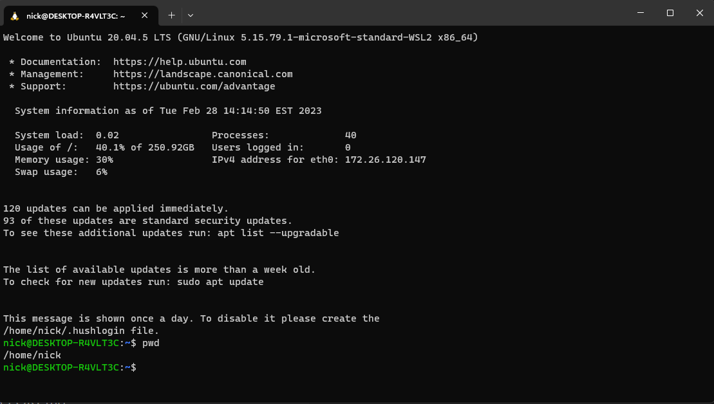

# Reliable web app pattern for Java

This reference implementation provides a production-grade web application that uses best practices from our guidance and gives developers concrete examples to build their own Reliable Web Application in Azure. It simulates the journey from an on-premises Java application to a migration to Azure. It shows you what changes to make to maximize the benefits of the cloud in the initial cloud adoption phase. Here's an outline of the contents in this readme:

- [Architecture guidance](#architecture-guidance)
- [Videos](#videos)
- [Architecture](#architecture)
- [Workflow](#workflow)
- [Steps to deploy the reference implementation](#steps-to-deploy-the-reference-implementation)

## Architecture guidance

This project has [companion architecture guidance](pattern-overview.md) that describes design patterns and best practices for migrating to the cloud. We suggest you read it as it will give important context to the considerations applied in this implementation.

## Videos

The internally accessible video covers the details of reliable web app pattern for Java. For more information, see [Reliable web app pattern videos (Sharepoint)](https://aka.ms/rwa-java-video). 

## Architecture

[](docs/assets/java-architecture.png)

* [Production environment estimated cost](https://azure.com/e/c530c133f36c423e9774de286f7dd28a)

* [Non-production environment estimated cost](https://azure.com/e/48201e05118243e089ded6855839594a)

## Workflow

A detailed workflow of the reference implementation is forthcoming.

## Steps to deploy the reference implementation

Deploy this sample using [Visual Studio Code](https://code.visualstudio.com/) with [Dev Containers](https://marketplace.visualstudio.com/items?itemName=ms-vscode-remote.remote-containers) extension.

Note - The following deployment has been tested using devcontainers on **macOS** and **Windows with [Ubuntu on WSL](https://ubuntu.com/wsl)**.

### Clone the repo

If using WSL, start a WSL Ubuntu terminal and clone the repo to a WSL directory.

[

```shell
git clone https://github.com/Azure/reliable-web-app-pattern-java.git
cd reliable-web-app-pattern-java
code .
```

Once Visual Studio Code is launched, you should see a popup allowing you to click on the button **Reopen in Container**.

[

If you don't see the popup, open up the Visual Studio Code Command Palette with the keyboard shortcut ⇧⌘P (Windows, Linux Ctrl+Shift+P) or navigating to View -> Command Palette... in the VS Code UI.

[

### Prepare for deployment

Open *./scripts/setup-initial-env.sh* and update the following variables:

```shell
export SUBSCRIPTION=
export APP_NAME=
```

*The variable APP_NAME needs to be globally unique across all of Azure and less than 16 characters.  This sample uses the APP_NAME as the base for names the Azure Resources. Some Azure Resources have a limit to the length of the name.* 

You may change the `APP_ENVIRONMENT` variable to either *prod* or *dev*. The following table describes the differences in the resources deployed in the 2 environments.

| Resource | Dev | Prod | Notes |
|:-----------------:|:-----------------:|:-----------------:|:-----------------:|
| PostgreSQL Flexible Server | Burstable B1ms (B_Standard_B1ms) | General Purpose D4s_v3 (GP_Standard_D4s_v3) | https://learn.microsoft.com/en-us/azure/postgresql/flexible-server/concepts-compute-storage |
| Redis Cache | Basic | Standard | https://azure.microsoft.com/en-in/pricing/details/cache/ |
| App Service | P1v2 | P2v2 | https://azure.microsoft.com/en-us/pricing/details/app-service/linux/ |

*Note - There is a guided [demo.sh](./demo.sh) script that you can run that will execute the deployment steps.*

```shell
./demo.sh
```

Once the demo script completes, skip to the [Add Users to Azure Active Directory enterprise applications](#add-users-to-azure-active-directory-enterprise-applications) section.

*You may choose to do this manually by following the steps below starting with [Start the deployment](#start-the-deployment)*

### Start the Deployment

Run the following to set up the environment:

```shell
source ./scripts/setup-initial-env.sh
```

### Login using Azure CLI

Login to Azure using the Azure CLI and choose your active subscription. 

```shell
az login --scope https://graph.microsoft.com//.default
az account set --subscription ${SUBSCRIPTION}
```

### Allow AZ CLI extensions to install without prompt

```shell
az config set extension.use_dynamic_install=yes_without_prompt
```

### Deploy Azure Infrastructure

Create the Azure resources by running the following commands:

```shell
terraform -chdir=./terraform init
terraform -chdir=./terraform plan -var application_name=${APP_NAME} -var environment=${APP_ENVIRONMENT} -out airsonic.tfplan
terraform -chdir=./terraform apply airsonic.tfplan
```

### Download training videos

If you plan on seeding the Proseware with videos and playlists, you may want to run the following scripts while the Azure resources defined in Terraform are being provisioned.  In a separate terminal, run the following.

```shell
source ./scripts/setup-initial-env.sh
./scripts/download-trainings.sh
```

After the completion of this step, you should see a videos directory that contains training videos.

### Upload training videos and playlists

The following command uploads the training videos and playlists to the `Azure Storage` account.  Run the following after Terraform has successfully completed deploying the Azure resources.

```shell
./scripts/upload-trainings.sh
```

## Set up local build environment

```shell
source ./scripts/setup-local-build-env.sh
```

## Package and deploy Airsonic

It's now time to compile and package Airsonic, skipping the unit tests.

```shell
cd src/airsonic-advanced
mvn -Dmaven.test.skip=true -DskipTests clean package
```

Now that we have a war file, we can deploy it to our Azure App Service.

```shell
mvn com.microsoft.azure:azure-webapp-maven-plugin:2.6.1:deploy -pl airsonic-main
```

### Add Users to Azure Active Directory enterprise applications

The next step is to add a user to the application and assign them a role. To do this, go to Azure Portal --> Azure Active Directory --> Enterprise Applications and search for the Airsonic application. Add a user to the application.


After adding the user, open the browser and navigate to https://{AIRSONIC_SITE}. Use the following command to get the site name.

```shell
echo $(terraform -chdir=$PROJECT_ROOT/terraform output -raw frontdoor_url)
```


### Teardown

```shell
RESOURCE_GROUP=$(terraform -chdir=$PROJECT_ROOT/terraform output -raw resource_group)
echo $RESOURCE_GROUP
az group delete --name $RESOURCE_GROUP --no-wait

APP_REGISTRATION_ID=$(terraform -chdir=$PROJECT_ROOT/terraform show -json | jq .values.outputs.app_service_module_outputs.value.application_registration_id | tr -d \")
echo $APP_REGISTRATION_ID
az ad app delete --id $APP_REGISTRATION_ID
```

## Trademarks

This project may contain trademarks or logos for projects, products, or services. Authorized use of Microsoft trademarks or logos is subject to and must follow [Microsoft's Trademark & Brand Guidelines](https://www.microsoft.com/en-us/legal/intellectualproperty/trademarks/usage/general).

Use of Microsoft trademarks or logos in modified versions of this project must not cause confusion or imply Microsoft sponsorship. Any use of third-party trademarks or logos are subject to those third-party's policies.

## Additional links

- [Known issues](known-issues.md)
- [Simulating developer patterns](simulate-patterns.md)
- [Contributing](CONTRIBUTING.md)
