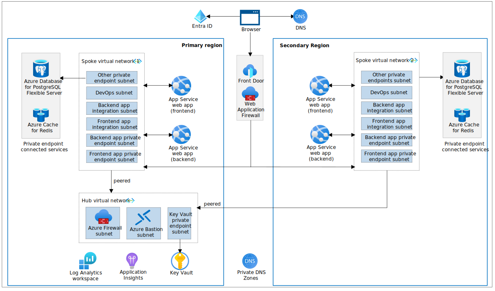

# Reliable web app pattern for Java

> :mega: **Got feedback?** Fill out [this survey](https://aka.ms/eap/rwa/java/survey) to help us shape the future of Enterprise App Patterns and understand whether we're focusing on the business goals and features important to you. [Microsoft Privacy Statement](https://go.microsoft.com/fwlink/?LinkId=521839)

The reference implementation provides a production-grade web application that uses best practices from our guidance and gives developers concrete examples to build their own Reliable Web Application in Azure. This repository specifically demonstrates a Customer Account Management System (CAMS) application for the fictional company Contoso Fiber, embodying the reliable web app pattern with a focus on Java technologies. It guides developers through a simulated migration from an on-premises web application to Azure, detailing the architectural changes and enhancements that capitalize on the cloud's strengths during the initial adoption phase. 

This project has a [a companion article in the Azure Architecture Center](https://aka.ms/eap/rwa/java/doc) that describes design patterns and best practices and [a six-part video series (YouTube)](https://aka.ms/eap/rwa/java/videos) that details the reliable web app pattern for Java web app. Here's an outline of the contents in this readme:

- [Architecture](#architecture)
- [Workflow](#workflow)
- [Steps to deploy the reference implementation](#steps-to-deploy-the-reference-implementation)
- [Additional links](#additional-links)
- [Data Collection](#data-collection)

## Architecture

Contoso Fiber aligned to a hub and spoke network topology in the production deployment architecture to centralize common resources. This network topology provided cost savings, enhanced security, and facilitated network integration (platform and hybrid):



This diagram describes the production deployment which is described in the [prod-deployment.md](./prod-deployment.md) file. The following steps below are for a [development deployment](./docs/icoms/reliable-web-app-java-dev.svg) which is a simplified version.

-	Cost efficiency: The hub acts as a central point for shared resources, promoting cost-effective resource reuse. For instance, Azure Bastion is a shared service in the hub, providing secure and cost-effective remote access without the need for separate deployments for each application.
-	Traffic control and security: Network traffic is managed and secured using Network Security Groups and Route tables in each subnet, creating secure boundaries for Azure resources. Private endpoints add an extra layer of security, and a Jump Host allows for deployment within these boundaries, maintaining local IP access to resources.
-	Network integration: The topology supports network integrations for data transfer across applications and hybrid scenarios. While the reference architecture doesn't include ExpressRoute or Azure VPN Gateway, these should be considered for applications requiring hybrid network connections.

## Workflow

This description details the workflow for Contoso Fiber's CAMs application. It highlights key components and functionality to help you emulate its design:
 
- Global traffic routing: Azure Front Door acts as a global traffic manager, routing users to the primary region for optimal performance and failing over to a secondary region during outages for uninterrupted service.
- Security inspection: Incoming traffic is inspected by Azure Web Application Firewall to protect against web vulnerabilities before reaching the web app.
- Static and dynamic content delivery: Users receive static content, like the home page, immediately upon request. Dynamic content, such as the 'Support Case' page, are generated by making SQL calls to the backend, which fetches data from Azure Database for PostgreSQL - Flexible Server.
- Session state management: User sessions are managed by Azure Cache for Redis, ensuring persistence and consistency across scale-out events.
- User authentication: Microsoft Entra ID handles user authentication, suitable for environments where accounts are centrally managed, enhancing security and control.
- Networking and access control: Azure Private DNS, Network Security Groups, and Azure Firewall tightly control the flow of traffic within the app's network, maintaining security and isolation.
- Monitoring and telemetry: Application Insights provides monitoring and telemetry capabilities, enabling performance tracking and proactive issue resolution.
- Configuration and secrets management: Initial configuration and sensitive information are loaded from Azure Key Vault into the app's memory upon startup, minimizing access to sensitive data thereafter.

## Steps to deploy the reference implementation

The following detailed deployment steps assume you are using a Dev Container inside Visual Studio Code.

### 1. Clone the repo

> For Windows users, we recommend using Windows Subsystem for Linux (WSL) to [improve Dev Container performance](https://code.visualstudio.com/remote/advancedcontainers/improve-performance).

```pwsh
wsl
```

Clone the repository and open the project using the Dev Container.

```shell
git clone https://github.com/Azure/web-app-pattern-java.git

cd web-app-pattern-java
```

### 2. Open Dev Container in Visual Studio Code

If required, ensure Docker Desktop is started. Open the repository folder in Visual Studio Code. You can do this from the command prompt:

```shell
code .
```

Once Visual Studio Code is launched, you should see a popup allowing you to click on the button **Reopen in Container**.


If you don't see the popup, open the Visual Studio Code Command Palette to execute the command. There are three ways to open the command palette:

- For Mac users, use the keyboard shortcut ⇧⌘P
- For Windows and Linux users, use Ctrl+Shift+P
- From the Visual Studio Code top menu, navigate to View -> Command Palette.

Once the command palette is open, search for `Dev Containers: Rebuild and Reopen in Container`.


### 3. Log in to Azure

Login into Azure using the following command:

```shell
az login --scope https://graph.microsoft.com//.default
```

Login into AZD using the following command:

```shell
azd auth login
```

Set the environment variable to the subscription to be used:

```shell
export AZURE_SUBSCRIPTION_ID="<your-subscription-id>"
```

To set the active subscription to be used by Azure CLI, run the following command:

```shell
az account set --subscription $AZURE_SUBSCRIPTION_ID
```

Set the default subscription to be used by the Azure Developer CLI:

```shell
azd config set defaults.subscription $AZURE_SUBSCRIPTION_ID
```

Enable the Terraform Alpha provider:

```shell
azd config set alpha.terraform on
```

Create a new environment with a globally unique name using:

```shell
azd env new <pick_a_name>
```

Set the environment to 'dev' using:

```shell
azd env set ENVIRONMENT dev
```

Set the Azure region to be used:

```shell
azd env set AZURE_LOCATION <pick_a_region>
```

Telemetry collection is on by default.

To opt out, set the environment variable ENABLE_TELEMETRY to false.

```shell
azd env set ENABLE_TELEMETRY false
```

Now provision the infrastructure using:

```shell
azd up
```

You will see an output similar to the following:

```shell
Deploying services (azd deploy)

  (✓) Done: Deploying service application
  - Endpoint: https://fd-nickcams-dev-frcfgefndcctbgdh.z02.azurefd.net
```

Navigate to the Contoso Fiber App

Navigate to the Front Door URL in a browser to view the Contoso Fiber CAMS application. Use the Endpoint URL from the output of the deployment.

## Tear down the environment

When you are done you can cleanup all the resources using:

```shell
azd down --force --purge
```

## Deployment Options

The Reliable Web App pattern for Java can be deployed using the following options:

- [Local Development](./local-development.md)
- [Dev deployment](./dev-deployment.md)
- [Production Deployment](./prod-deployment.md)

## Additional links

- [Known issues](known-issues.md)
- [Troubleshooting](troubleshooting.md)
- [Pattern Simulations](demo.md)
- [Developer Experience](developer-experience.md)
- [Calculating SLA](./assets/sla-calculation.md)
- [Logging](docs/logging.md)
- [Redis](docs/REDIS.md)
- [Report security concerns](SECURITY.md)
- [Find Support](SUPPORT.md)
- [Contributing](CONTRIBUTING.md)

## Trademarks

This project may contain trademarks or logos for projects, products, or services. Authorized use of Microsoft 
trademarks or logos is subject to and must follow 
[Microsoft's Trademark & Brand Guidelines](https://www.microsoft.com/en-us/legal/intellectualproperty/trademarks/usage/general).
Use of Microsoft trademarks or logos in modified versions of this project must not cause confusion or imply Microsoft sponsorship.
Any use of third-party trademarks or logos are subject to those third-party's policies.

## Data Collection

The software may collect information about you and your use of the software and send it to Microsoft. Microsoft may use this information to provide services and improve our products and services. You may turn off the telemetry as described in the repository. There are also some features in the software that may enable you and Microsoft to collect data from users of your applications. If you use these features, you must comply with applicable law, including providing appropriate notices to users of your applications together with a copy of Microsoft's privacy statement. Our privacy statement is located at https://go.microsoft.com/fwlink/?LinkId=521839. You can learn more about data collection and use in the help documentation and our privacy statement. Your use of the software operates as your consent to these practices.

### Telemetry Configuration

Telemetry collection is on by default.

To opt out, run the following command `azd env set ENABLE_TELEMETRY` to `false` in your AZD environment.