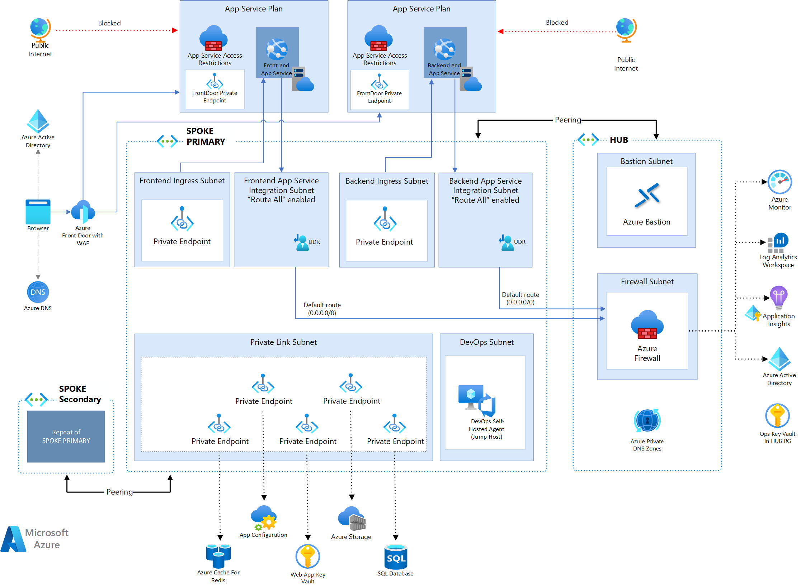
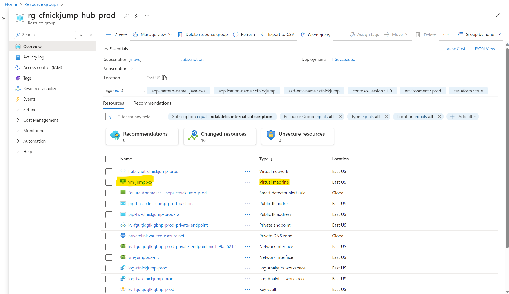
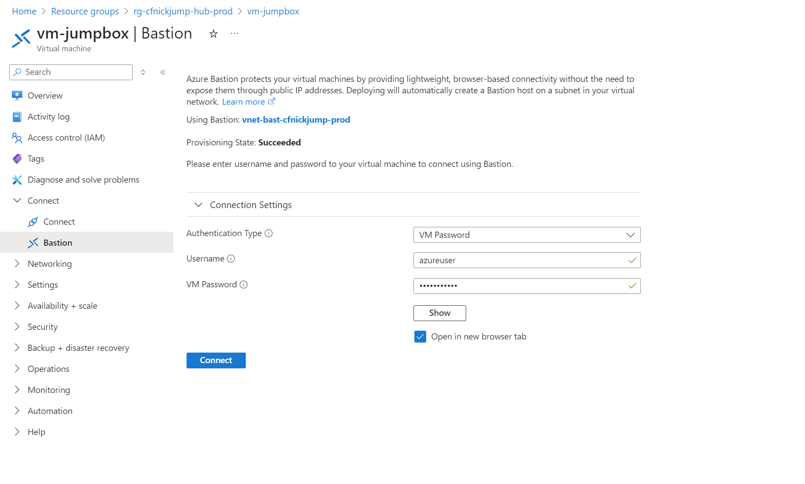
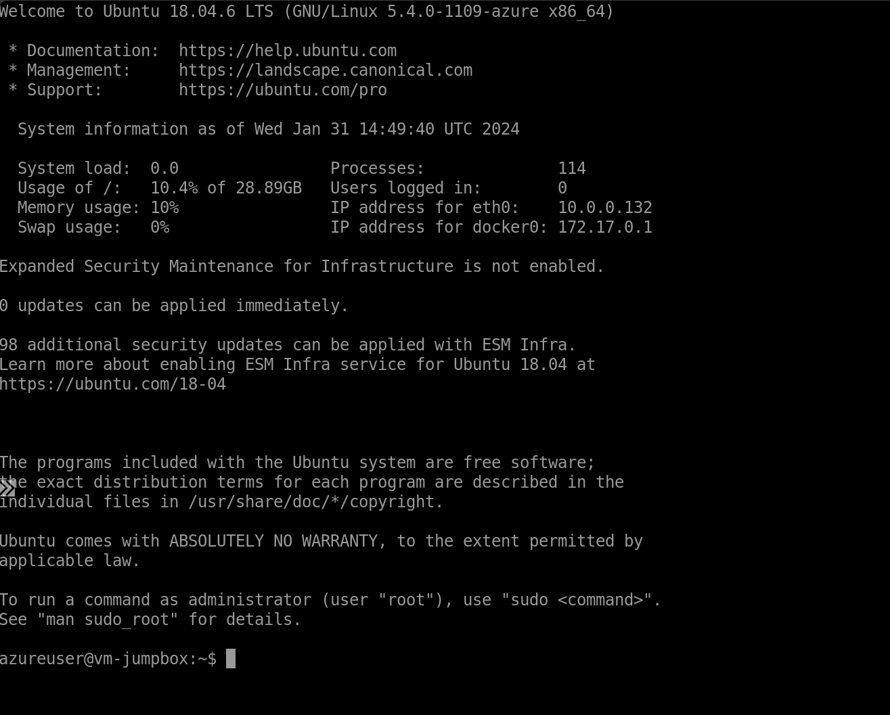

# Reliable web app pattern for Java

> :mega: **Got feedback?** Fill out [this survey](https://aka.ms/eap/rwa/dotnet/survey) to help us shape the future of Enterprise App Patterns and understand whether we're focusing on the business goals and features important to you. [Microsoft Privacy Statement](https://go.microsoft.com/fwlink/?LinkId=521839)

The reference implementation provides a production-grade web application that uses best practices from our guidance and gives developers concrete examples to build their own Reliable Web Application in Azure.

## Architecture

TODO: update image with Java Web App




## Deployment

Clone the repository and open the project using the Dev Container.

```shell
git clone https://github.com/Azure/web-app-pattern-java.git

cd web-app-pattern-java
```

If you don't see the popup to *Reopen in Container*, open the Visual Studio Code Command Palette to execute the command. There are three ways to open the command palette:

- For Mac users, use the keyboard shortcut ⇧⌘P
- For Windows and Linux users, use Ctrl+Shift+P
- From the Visual Studio Code top menu, navigate to View -> Command Palette.

## Deploy the Azure Infrastructure

After starting the Dev Container, open a terminal in Visual Studio Code.

You must first be authenticated to Azure and have the appropriate subscription selected.  To authenticate:

```shell
az login --scope https://graph.microsoft.com//.default

azd auth login
```

Each command will open a browser allowing you to authenticate.  To list the subscriptions you have access to:

```shell
az account list
```

To set the active subscription:

```shell
export AZURE_SUBSCRIPTION_ID="<your-subscription-id>"

az account set --subscription $AZURE_SUBSCRIPTION_ID

azd config set defaults.subscription $AZURE_SUBSCRIPTION_ID
```

Enable the Terraform Alpha provider:

```shell
azd config set alpha.terraform on
```

### 1. Create a new environment

The environment name should be less than 18 characters and must be comprised of lower-case, numeric, and dash characters (for example, `contosocams`).  The environment name is used for resource group naming and specific resource naming. 

**Choose a unique name for the environment**

Run the following commands to set these values and create a new environment:

```shell
azd env new contosocams
```

### 2. Set the AZD Environment Values

The following are required values that must be set:

- `JUMPBOX_PASSWORD` - This is the password for the jump box. The password has to fulfill 3 out of these 4 conditions: Has lower characters, Has upper characters, Has a digit, Has a special character other than "_"

Run the following commands to set these values:

```shell
azd env set JUMPBOX_PASSWORD <password>
```

The following are optional values that can be set:

- `JUMPBOX_USERNAME` - This is the username for the jump box.  The default is `azureuser`.
- `JUMPBOX_VM_SIZE` - This is the size of the jump box VM.  The default is `Standard_B2s`.

These values can be set by running the following commands:

```shell
azd env set <variable> <value>
```

### 3. Select a region for deployment

The application can be deployed in either a single region or multi-region manner. PROD deployments are multi-region. You can find a list of available Azure regions by running the following Azure CLI command.

> ```shell
> az account list-locations --query "[].name" -o tsv
> ```

Set the `AZURE_LOCATION` to the primary region:

```shell
azd env set AZURE_LOCATION westus3
```

You want to make sure the region has availability zones. Azure Database for PostgreSQL - Flexible Server [zone-redundant high availability](https://learn.microsoft.com/azure/postgresql/flexible-server/concepts-high-availability) requires availability zones.

Make sure the secondary region is a paired region with the primary region (`AZURE_LOCATION`). For a full list of region pairs, see [Azure region pairs](https://learn.microsoft.com/azure/reliability/cross-region-replication-azure#azure-cross-region-replication-pairings-for-all-geographies). We have validated the following paired regions.

| AZURE_LOCATION | AZURE_SECONDARY_LOCATION |
| ----- | ----- |
| westus3 | eastus |

 Set the `AZURE_SECONDARY_LOCATION` to the secondary region:

```shell
azd env set AZURE_SECONDARY_LOCATION eastus
```

### 4. Telemetry

Telemetry collection is on by default.

To opt out, set the environment variable ENABLE_TELEMETRY to false.

```shell
azd env set ENABLE_TELEMETRY false
```

### 5. Provision infrastructure

Run the following command to create the infrastructure and deploy the app:

```shell
azd up
```

### 6. Set the environment variables for the next step

The output of the deployment will be displayed in the terminal.

```
Outputs:

app_service_name = "app-nickcontosocams-westus3-prod"
frontdoor_url = "https://fd-contosocams-prod-eveaa7cwcthah0dr.b01.azurefd.net"
secondary_app_service_name = "app-contosocams-eastus-prod"
secondary_spoke_resource_group = "rg-contosocams-spoke2-prod"
spoke_resource_group = "rg-contosocams-spoke-prod"
```

> **Record the output. The values are required in order to run the next steps of the deployment.**

## Deploy the Contoso Fiber App

In order to deploy the Contoso Fiber CAMS application, we will need to log into the Jump Box and run the deployment commands from there. Log into the Jump Box by navigating to the Microsoft Azure Portal. From there, find the hub resource group and click on the `vm-jumpbox` resource.



Click on the `Connect` menu item and choose `Bastion`.

Finally click the `Connect` button. Use the password that you set for the `JUMPBOX_PASSWORD` environment variable.



This will open a new tab in the browser and allow you to connect to the Jump Box.



Once connected to the Jump Box, you can run the following commands to deploy the Contoso Fiber application.

### 1. Log into Azure

```shell
az login --use-device-code
```

Navigate to the URL and enter the code provided.  Once authenticated, you can close the browser and return to the terminal.

### 2. Set the active subscription:

```shell
az account set --subscription <your-subscription-id>
```

### 3. Clone the Repository

Before cloning the repository, you will need to authenticate to GitHub. There are many ways to do this, but one way is to set up a [personal access token](https://docs.github.com/en/authentication/keeping-your-account-and-data-secure/managing-your-personal-access-tokens#creating-a-fine-grained-personal-access-token).

Once you have the token, you can use the following command to clone the repository:

```shell
git clone https://github.com/Azure/web-app-pattern-java.git

cd web-app-pattern-java
```

### 4. Build Contoso Fiber

Run the following command to build the Contoso Fiber application:

```shell
./mvnw clean package
```

This will create the `jar` file cams-0.0.1-SNAPSHOT.jar in the `target` directory. This file will be used to deploy the application to Azure App Service.

### 5. Deploy Contoso Fiber to Azure App Service

The Azure CLI is used to deploy the Contoso Fiber application to Azure App Service. The following command will deploy the application to the App Service instance was created in the spoke.

In the Jump Box terminal, run the following command replacing the values for the resource group and app service name from the previous step:

```shell
az webapp deploy --resource-group <spoke_resource_group> --name <app_service_name> --src-path src/contoso-fiber/target/cams-0.0.1-SNAPSHOT.jar --type jar
```

Run the same command for the secondary region, using the secondary resource group and app service name:

```shell
az webapp deploy --resource-group <secondary_spoke_resource_group> --name <secondary_app_service_name> --src-path src/contoso-fiber/target/cams-0.0.1-SNAPSHOT.jar --type jar
```

## Navigate to the Contoso Fiber App

Navigate to the Front Door URL in a browser to view the Contoso Fiber CAMS application.

## Local Development

Local development is supported on Windows, Linux, and macOS. Please follow the instructions in the [development.md](./local-development.md) file to get started.

## Contributing

This project welcomes contributions and suggestions.  Most contributions require you to agree to a
Contributor License Agreement (CLA) declaring that you have the right to, and actually do, grant us
the rights to use your contribution. For details, visit https://cla.opensource.microsoft.com.

When you submit a pull request, a CLA bot will automatically determine whether you need to provide
a CLA and decorate the PR appropriately (e.g., status check, comment). Simply follow the instructions
provided by the bot. You will only need to do this once across all repos using our CLA.

This project has adopted the [Microsoft Open Source Code of Conduct](https://opensource.microsoft.com/codeofconduct/).
For more information see the [Code of Conduct FAQ](https://opensource.microsoft.com/codeofconduct/faq/) or
contact [opencode@microsoft.com](mailto:opencode@microsoft.com) with any additional questions or comments.

## Trademarks

This project may contain trademarks or logos for projects, products, or services. Authorized use of Microsoft 
trademarks or logos is subject to and must follow 
[Microsoft's Trademark & Brand Guidelines](https://www.microsoft.com/en-us/legal/intellectualproperty/trademarks/usage/general).
Use of Microsoft trademarks or logos in modified versions of this project must not cause confusion or imply Microsoft sponsorship.
Any use of third-party trademarks or logos are subject to those third-party's policies.

## Additional links

- [Known issues](known-issues.md)
- [Troubleshooting](troubleshooting.md)
- [Developer patterns](simulate-patterns.md)
- [Local Development](local-development.md)
- [Report security concerns](SECURITY.md)
- [Find Support](SUPPORT.md)