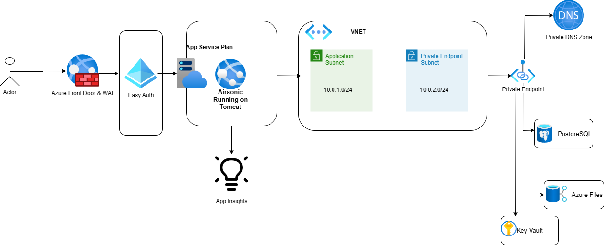

# Reliable Web App Pattern

This repository provides resources to help developers build a Reliable Java web app on Azure. A Reliable Web App is a set of services, code, and infrastructure deployed in Azure that applies practices from the [Well-Architected Framework](https://learn.microsoft.com/en-us/azure/architecture/framework). This pattern is designed to help you build a web app that follows Microsoft's recommended guidance for achieving reliability, scalability, and security in the cloud.

## Project Status

**Project status:** *alpha*

**This project is currently under active development.**

---

## Overview

The goal of this project is to put ourselves in the customer's shoes as they would experience migrating a *legacy* Java application to Azure while applying practices from the [Well-Architected Framework](https://learn.microsoft.com/en-us/azure/architecture/framework). We chose [Airsonic](https://github.com/airsonic/airsonic) to demonstrate a customer's migration journey to Azure.

### What is Airsonic?

Airsonic is a free, web-based media streamer, providing ubiquitous access to your music. 

### Why did we pick Airsonic?

1. Airsonic was chosen as our representative Java application because of the legacy Tomcat deployment. Airsonic is packaged as a war file and runs inside of an [Apache Tomcat](https://tomcat.apache.org/) server. This is a different deployment than what customers with a more modern tech stack may have. A modern tech stack may include Java [Spring Boot](https://spring.io/projects/spring-boot) applications with an embedded tomcat.

1. Airsonic is a typical Java [N-tier application](https://learn.microsoft.com/en-us/azure/architecture/guide/architecture-styles/n-tier) consisting of a database and local storage. The UI is written using Java Server Pages (JSP) and the backend is written using the [Java Spring Framework](https://spring.io/).

## Architecture 

Below is the architecture diagram of Airsonic deployed to Azure.

### Overview Videos
---

[Introduction Video (12~ mins)](https://microsoftapc-my.sharepoint.com/:v:/g/personal/nanil_microsoft_com/EVeC0AjLPxdBjUke0tRpe_IBua-phq4_qvFP2TcOHLtbZg?e=aQfW6o)

[Airsonic Application on Azure App Service Video (~9 mins)](https://microsoft-my.sharepoint.com/:v:/p/ndalalelis/EUqaE9TY9UdJpGvJRqvyowABruJSWaxaNvpNfsAXvMBK5Q?e=GRr995)

## Get Started

Get started quickly by deploying Airsonic on Azure using the [Quick Start Guide](docs/quick-start-guide.md).

## Design Docs

For details on the design, please refer to the [Design Docs](docs/README.md).

## Contributing

This project welcomes contributions and suggestions.  Most contributions require you to agree to a
Contributor License Agreement (CLA) declaring that you have the right to, and actually do, grant us
the rights to use your contribution. For details, visit https://cla.opensource.microsoft.com.

When you submit a pull request, a CLA bot will automatically determine whether you need to provide
a CLA and decorate the PR appropriately (e.g., status check, comment). Simply follow the instructions
provided by the bot. You will only need to do this once across all repos using our CLA.

This project has adopted the [Microsoft Open Source Code of Conduct](https://opensource.microsoft.com/codeofconduct/).
For more information see the [Code of Conduct FAQ](https://opensource.microsoft.com/codeofconduct/faq/) or
contact [opencode@microsoft.com](mailto:opencode@microsoft.com) with any additional questions or comments.

## Trademarks

This project may contain trademarks or logos for projects, products, or services. Authorized use of Microsoft 
trademarks or logos is subject to and must follow 
[Microsoft's Trademark & Brand Guidelines](https://www.microsoft.com/en-us/legal/intellectualproperty/trademarks/usage/general).
Use of Microsoft trademarks or logos in modified versions of this project must not cause confusion or imply Microsoft sponsorship.
Any use of third-party trademarks or logos are subject to those third-party's policies.
