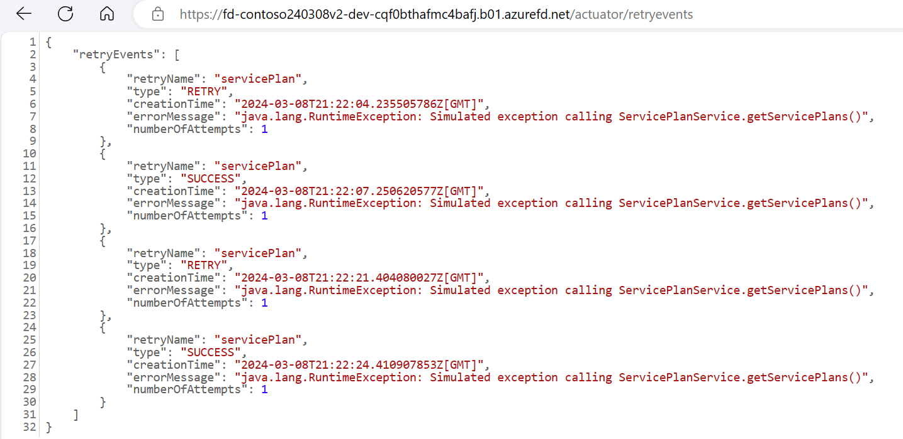
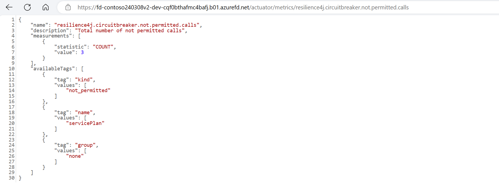
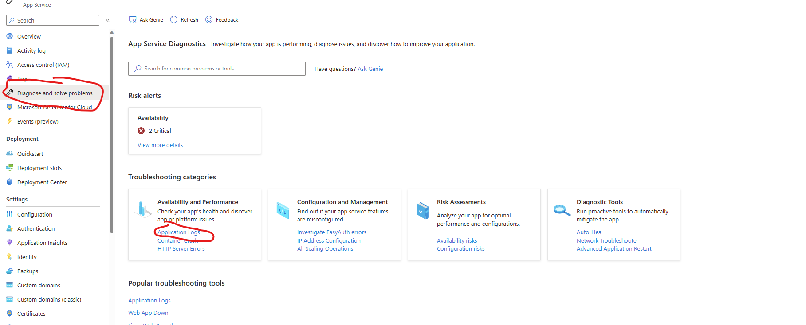

# Pattern Simulations

You can test and configure the three code-level design patterns with this implementation: retry, circuit-breaker, and cache-aside. The following paragraphs detail steps to test the three code-level design patterns.

The Contoso Fiber Customer Account Management System (CAMS) web application is used by the team to manage customer accounts and help them with support tickets related to their internet or cable services. To demo the full application, you can:
1. Click on the "Account" page in the left side menu
1. Click on the "Add Account" button in the list of accounts
1. Create an Account
1. On the "Account Details" page, click on the "New Support Case" button
1. Create a Support Case
1. On the "Account Details" page, click on the row of the support case to see the details
1. Click on the "Escalte to L2" button to escalate the support case
1. Click on the "Level 2" page in the left side menu to see the list of all escalated support cases

In the web app, the Contoso Fiber team uses this process, with the help of role based access, to address customer support issues in a timely manner.

## Retry pattern

We built a configuration setting that lets you simulate and test a failure from the web app. The setting is called `CONTOSO_RETRY_DEMO`. We've included this configuration in the deployable code. The `CONTOSO_RETRY_DEMO` setting simulates an error when the end user tries to get Service Plans within the Contoso Fiber application. `CONTOSO_RETRY_DEMO` is an editable setting that determines the number of back-to-back errors between a successful request. A value of 2 generates 1 error after returning one successful response. This is disabled by default.  Removing the setting, or changing the value to 0 will disable the feature.

Follow these steps to set up this test:

1. Update the setting App Service.
    - Go to the App Service in the Azure Portal
    - Navigate to the "Environment variables" by clicking the link in the left-hand blade under "Settings"
    - Enter the following data and then click "Apply":

    |Name|Value|
    |-----|-----|
    |*Key*|CONTOSO_RETRY_DEMO|
    |*Value*|2|

    > It will take a few minutes for the App Service to restart. When it restarts, the application will use the `CONTOSO_RETRY_DEMO` configuration.

    We recommend observing telemetry to see the effect of this change and how the Retry pattern helps solve intermittent errors. We've configured Application Insights to collect telemetry and we added Spring Actuator Dependencies to the Contoso Fiber project. Using the actuator endpoints, you can see the retry events and the number of retries while browsing the site.

    > App Insights can take up to a minute to aggregate the data it receives, and failed requests might not appear right away in the Failures view.

    To see the Retry pattern in action you can follow these steps:

1. Click on the "Service Plans" link in the left-side menu of the Contoso Fiber application. This will try to make a query to retrieve a list of all service plans.

    

1. Navigate to the following page in your browser to observe the retry events.
    * https://<FRONT_DOOR_URL>/actuator/retryevents

    

## Circuit Breaker pattern

We built a configuration setting that lets you simulate and test a failure from the web app. The setting is called `CONTOSO_RETRY_DEMO`. We've included this configuration in the deployable code. The `CONTOSO_RETRY_DEMO` setting simulates an error when the end user tries to get Service Plans within the Contoso Fiber application. `CONTOSO_RETRY_DEMO` is an editable setting that determines the number of back-to-back errors between a successful request. A value of 2 generates 1 error after returning one successful response. A value of 1 will always cause the simulated error response. This is disabled by default.  Removing the setting, or changing the value to 0 will disable the feature.

Follow these steps to set up this test:

1. Update the setting App Service.
    - Go to the App Service in the Azure Portal
    - Navigate to the "Environment variables" by clicking the link in the left-hand blade under "Settings"
    - Enter the following data and then click "Apply":

    |Name|Value|
    |-----|-----|
    |*Key*|CONTOSO_RETRY_DEMO|
    |*Value*|1|

    > It will take a few minutes for the App Service to restart. When it restarts, the application will use the `CONTOSO_RETRY_DEMO` configuration.

    > App Insights can take up to a minute to aggregate the data it receives, and failed requests might not appear right away in the Failures view.

    To see the Circuit Breaker pattern in action you can follow these steps:

1. Click on the "Service Plans" link in the left-side menu of the Contoso Fiber application. This will try to make a query to retrieve a list of all service plans. And, because the `CONTOSO_RETRY_DEMO` setting is set to 1, the application will return an error.

    

1. Navigate to the following page in your browser to observe the retry events that now describe circuit breaker behavior.
    * https://<FRONT_DOOR_URL>/actuator/retryevents

    

1. Navigate to the following page in your browser to observe the circuit breaker behavior.
    * https://<FRONT_DOOR_URL>/actuator/metrics/resilience4j.circuitbreaker.not.permitted.calls

    


## Cache-Aside pattern

The Cache-Aside pattern enables us to limit read queries to  the Azure PostgreSQL Flexible Server. It also provides a layer of redundancy that can keep parts of our application running in the event of issue with Azure PostgreSQL Database.

For more information, see [Cache-Aside pattern](https://learn.microsoft.com/azure/architecture/patterns/cache-aside).

We can observe this behavior in the web app by following these steps:

1. Click on the "Accounts" link in the left-side menu of the Contoso Fiber application.

    

1. Fill out the form and click "Add Account". This will create a new account and store it in the Azure PostgreSQL Flexible Server.

    

1. When successful, the account details page is shown.

      

    Using the (PREVIEW) Redis Console we can see this data stored in Redis.

    Open the Redis Console by navigating to the Azure Cache for Redis resource in the Azure Portal and clicking the "Console" link above the overview details for this resource.

    

    Run the following command to see all cached keys:

    ```
    SCAN 0 COUNT 1000 MATCH *
    ```

    Run the next command to see the cached account details data:

    ```
    GET com.contoso.cams.account-details::1 
    ```

    


# Other interesting features
The Contoso Fiber CAMS web application has several other interesting features that are worth exploring such as logging, auto scaling, Application Insights, and resiliency with multi-region.

## Logs

Application logging is enabled. To view the logs, navigate to *Diagnose and solve problems*. From there, click on *Application Logs*.




## Auto Scaling

Auto scaling is enabled and the default instance count is set to 1 for development deployments and 2 for production deployments. To view the auto scaling settings, navigate to *Scale out (App Service plan)*.


Click on *Manage Rules Based Settings* to view the auto scaling rules.


These rules are defined in *Terraform* as follows:

```
resource "azurerm_monitor_autoscale_setting" "app_service_scaling" {
  name                = "contosocamsscaling"
  resource_group_name = var.resource_group
  location            = var.location
  target_resource_id  = azurerm_service_plan.application.id
  profile {
    name = "default"
    capacity {
      default = 2
      minimum = 2
      maximum = 10
    }
    rule {
      metric_trigger {
        metric_name         = "CpuPercentage"
        metric_resource_id  = azurerm_service_plan.application.id
        time_grain          = "PT1M"
        statistic           = "Average"
        time_window         = "PT5M"
        time_aggregation    = "Average"
        operator            = "GreaterThan"
        threshold           = 85
      }
      scale_action {
        direction = "Increase"
        type      = "ChangeCount"
        value     = "1"
        cooldown  = "PT1M"
      }
    }
    rule {
      metric_trigger {
        metric_name         = "CpuPercentage"
        metric_resource_id  = azurerm_service_plan.application.id
        time_grain          = "PT1M"
        statistic           = "Average"
        time_window         = "PT5M"
        time_aggregation    = "Average"
        operator            = "LessThan"
        threshold           = 65
      }
      scale_action {
        direction = "Decrease"
        type      = "ChangeCount"
        value     = "1"
        cooldown  = "PT1M"
      }
    }
  }
}
```

## Application Insights

Exceptions in the Contoso Fiber CAMS web application are reported with Application Insights. 


Click on an exception to see the end-to-end details:


Navigate to the Application Map blade:


Navigate to the Performance blade:


Navigate to the Live Metrics blade to see real-time performance:


## Resiliency with Multi-Region

The Contoso Fiber CAMS web application is deployed in two regions. All traffic is initially routed to the primary region. In the event of an outage in the active region, traffic can be routed to the secondary region. This process in not automatic and requires manual intervention.


An **Azure Database for PostgreSQL Flexible Server** is in the secondary region. This database is a read replica of the primary database. In the event of an outage in the primary region, the application can continue to function using the secondary database. For more information on read replicas, see [Read replicas in Azure Database for PostgreSQL - Flexible Server](https://learn.microsoft.com/en-us/azure/postgresql/flexible-server/concepts-read-replicas). 

## Using Microsoft Entra ID RBAC to control access in the application
The web app also includes a role-based access control (RBAC) feature. The Contoso Fiber team uses Microsoft Entra ID for authentication. This system has an "Account Manager" role and a "Field Service" role. The "Account Manager" role has access to create new Accounts.


From the code, we can see that the "Account Manager" role has access to the "Add Account" button.

```html
<div id="toolbar" sec:authorize="hasAuthority('APPROLE_AccountManager')">
            <a id="addAccount" class="btn btn-primary" th:href=@{~/accounts/new}>
                <i class="fa fa-plus"></i> Add Account
            </a>
        </div>
```
> Code snippet from the `list.html` file in the `src/main/resources/templates/pages/account` directory.

And, the `AccountController` class has a method that is only accessible to the "Account Manager" role.

```java
    @PostMapping("/new")
    @PreAuthorize("hasAnyAuthority('APPROLE_AccountManager')")
    public String newAccount(Model model, @Valid @ModelAttribute("account") NewAccountRequest newAccountRequest, BindingResult result) {
        log.info("submitNewCustomer: {}", newAccountRequest);

        try {
            if (result.hasErrors()) {
                String errorMessage = result.getAllErrors().get(0).getDefaultMessage();
                log.error("Validation errors while submitting new account: {}", errorMessage);
                throw new IllegalArgumentException("Validation errors while submitting new account - " + errorMessage);
            }

            Account newAccount = accountService.createAccount(newAccountRequest);
            return "redirect:/accounts/details?id=" + newAccount.getId();
        } catch (IllegalArgumentException ex) {
            model.addAttribute("message", ex.getMessage());
            model.addAttribute("servicePlans", accountService.findAllServicePlans());
            return "pages/account/new";
        }
    }
```
> Code snippet from the `AccountController` class in the `src/main/java/cams/account` directory.
