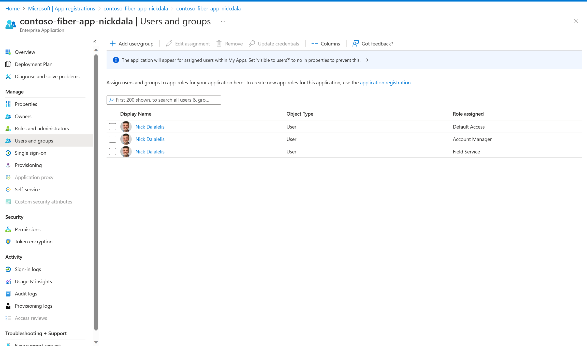

# Development

## Setup 

1. Create the file *docker/.env*

### PostgresSQL and pgAdmin

1. Add the following environment variables to the file *docker/.env*. 

    ```
    PG_PASSWORD=secret
    ```

After creating the file, the *docker/.env* file should look like the following.

    ```
    cat docker/.env

    PG_PASSWORD=secret
    ```

## Docker Compose

1. Start the docker containers for PostgreSQL and pgAdmin.

    ```
    docker compose -f docker/compose.yaml up
    ```

1. Stop the containers
    ```
    docker compose -f ./docker/compose.yaml down
    ```

1. (Optional) Stop the containers removing the volumes

    ```
    docker compose -f ./docker/compose.yaml down -v
    ```


## PGAdmin

1. Navigate to the [pgAdmin](https://www.pgadmin.org/) UI at [http://localhost:5050](http://localhost:5050)


## Redis

Run bash in the container and then start the redis-cli

```
docker exec -it contoso_fiber_redis bash
root@redis:/data# redis-cli
```

### Testing our Redis instance

Issue the PING command to test the connection.

```
127.0.0.1:6379> PING
PONG
```

If you see the response *PONG*, then you have successfully connected to the Redis instance.

## Dev Container

Connect to PostgreSQL from the dev container using *host.docker.internal*. From the terminal, enter the following command to test the connection. When asked for the password, use the password defined in the [docker compose file](./docker/compose.yaml).

```
psql -h host.docker.internal -p 54321 -U postgres
```

# Azure AD

Contoso Fiber uses Azure AD for authentication. To register the app, follow the steps below.

Before running the following commands, make sure you are in the scripts/azure-ad directory.

```shell
cd scripts/azure-ad
```

## 1. Login to Azure

Login to Azure using the Azure CLI.

```shell
az login
```

## 2. Register Application with Azure AD

Run the following command to register the application with Azure AD.  You can modify the script to change the application name by modifying the `AD_DISPLAY_NAME` variable.

```shell
./register-app.sh
```

This script will output the following information. Make sure to save this information for later use.

```shell
---------------------
Spring Security Properties
---------------------
CLIENT_ID: 12345678-1234-1234-1234-123456789012
CLIENT_SECRET: abcd
TENANT_ID: 567890ab-5678-5678-5678-567890abcdef
---------------------
```

> This script creates the following files. These files are sensitive and should not be checked into source control. The `register-app.sh` script attempts to delete these files. If the script fails, make sure to delete these files manually.
> - *ad-app.json* - contains the output of the `az ad app create` command.
> - *ad-credentials.json* - contains the output of the `az ad app credential reset` command.

Go into the Azure Portal and assign the `Account Manager` and `Field Service` roles.  You can find the roles in the `Enterprise Applications` section of the Azure Entra blade.



## Build

```
./mvnw clean package
```

## Compile

```
./mvnw -pl src/contoso-fiber compile
```

## Run

If you're running the Contoso Fiber app inside of a dev container, make sure to set the property *spring.datasource.url* inside *src/contoso-fiber/src/main/resources/application-local.properties*  file appropriately to use *host.docker.internal* to connect to the PostgreSQL container.

```
spring.datasource.url=jdbc:postgresql://host.docker.internal:54321/contoso_fiber
```

Next, update the application-local.properties with the PostgreSQL username and password.

```
# pull the username from the docker/compose.yaml file
spring.datasource.username=CHANGE-ME
# pull the password from the docker/compose.yaml file 
spring.datasource.password=CHANGE-ME
```

Now, you can run the app by executing the following command.

```
export SPRING_PROFILES_ACTIVE=local
./mvnw -pl contoso-fiber spring-boot:run
```

