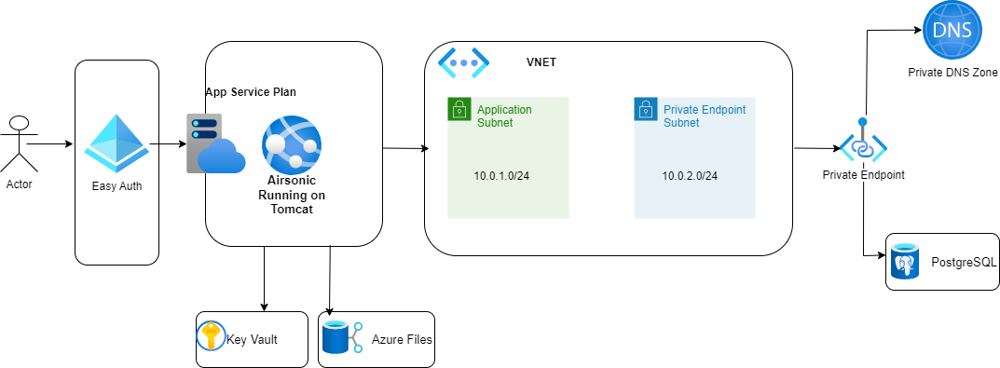

# Reliable Java Eeb Application

The focus of this sample is to apply the principles of the [Well-Architected Framework](https://docs.microsoft.com/azure/architecture/framework/) while migrating and modernizing a legacy, line-of-business (LOB) web app to the cloud. The guide addresses the challenges in refactoring a monolithic Java application with a PostgreSQL database and developing a modern, reliable, and scalable Java application. 

This is a complete solution with deployable artifacts. The deployable artifacts create a modernized LOB web application that has improved reliability, security, performance, and more mature operational practices at a predictable cost. It provides a foundation upon which you can achieve longer-term objectives.

## Use Cases

This solution is ideal for organizations that have an internal LOB application, but it can apply to other industries.

### TODO Refine the below business story

Airsonic internal training application with plans to expand by selling training material to the public. Onsite training facility grows up to training as a service in order to compete in a digital first world.

## Architecture

The diagram depicts the web application solution that you can deploy with the implementation guidance.

## Considerations

The five pillars of the Azure Well-Architected Framework provide guiding tenets that improve the quality of cloud applications.  Refer to the links below to see how each of the pillars were incorporated into the solution.

- [Reliability](./reliability.md)
- [Security](./security.md)
- [Cost Optimization](./cost-optimization.md)
- [Operational Excellence](./operational-excellence.md)
- [Performance Efficiency](./performance-efficiency.md)

## Deploy the sample application

This solution uses the Azure CLI and Terraform to set up Azure services and deploy the code. Follow the [Quick Start Guide](./quick-start-guide.md) to deploy the code to Azure.
