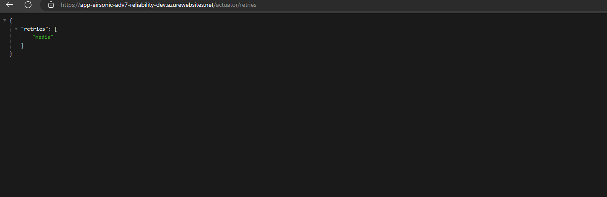

# Reliability

A reliable workload is one that is both resilient and available. Resiliency is the ability of the system to recover from failures and continue to function. The goal of resiliency is to return the application to a fully functioning state after a failure occurs. Availability is whether your users can access your workload when they need to. These patterns are used by the Proseware sample to improve reliability.

## Retry Pattern

Given the distributed nature of cloud applications, they must be designed to operate under the assumption of unreliable communications. An application that communicates with elements running in the cloud must be sensitive to the transient faults that can occur in this environment. Faults include the momentary loss of network connectivity to components and services, the temporary unavailability of a service, or timeouts that occur when a service is busy.

Most Azure services and client SDKs include a [retry mechanism](https://learn.microsoft.com/azure/architecture/best-practices/retry-service-specific).

In other scenarios, we use the [Retry Pattern](https://docs.microsoft.com/azure/architecture/patterns/retry). This is because these faults are typically self-correcting and if a service call is retried after a short delay, then it is likely to succeed. Adding the Retry Pattern helped the team build a web app that insulates the user experience from these transient errors.

To implement the Retry Pattern in Java, [Resilience4j](https://github.com/resilience4j/resilience4j) is used. Resilience4j is a lightweight fault tolerance library inspired by Netflix Hystrix, but designed for functional programming. It provides higher-order functions (decorators) to enhance any functional interface, lambda expression or method reference with a Circuit Breaker, Rate Limiter, Retry or Bulkhead.  The following example shows how to decorate a lambda expression with a Circuit Breaker and Retry in order to retry the call to get the media file from disk.

```java
private MediaFile checkLastModified(MediaFile mediaFile, MusicFolder folder, boolean minimizeDiskAccess) {
        Retry retry = retryRegistry.retry("media");
        CheckedFunction0<MediaFile> supplier = () -> doCheckLastModified(mediaFile, folder, minimizeDiskAccess);
        CheckedFunction0<MediaFile> retryableSupplier = Retry.decorateCheckedSupplier(retry, supplier);
        Try<MediaFile> result = Try.of(retryableSupplier).recover((IOException) -> mediaFile);
        return result.get();
    }
```

<sup>Sample code demonstrates how to use **Resilience4j** to retry a filesystem call to Azure Files to get the last modified time. [Link to Startup.cs](https://github.dev/airsonic-advanced/airsonic-advanced/blob/master/airsonic-main/src/main/java/org/airsonic/player/service/MediaFileService.java#L191)</sup>

In this sample, we see how the retry registry is used to get a `Retry` object. The Vavr’s Try Monad is used to to recover from an exception and invoke another lambda expression as a fallback. In this case, the original `MediaFile` is returned if the maximum amount of retries has occured.

You can configure your `Retry` properties in the application.yaml file.  See more way to configure Resiliency4J [here](https://resilience4j.readme.io/v1.7.0/docs/getting-started-3).

```yaml
resilience4j.retry:
    instances:
        media:
            maxRetryAttempts: 8
            waitDuration: 10s
            enableExponentialBackoff: true
            exponentialBackoffMultiplier: 2
            retryExceptions:
                - java.nio.file.FileSystemException
                - java.io.IOException
```

## Testing

We use the `Spring Boot Actuator` to monitor retries in our application.  After deploying the application, you can hit the actuator endpoint.




## Resources

https://resilience4j.readme.io/v1.7.0/docs/getting-started