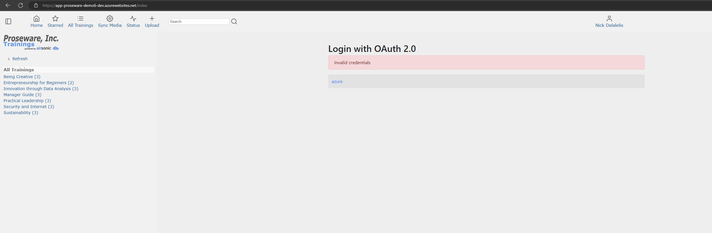
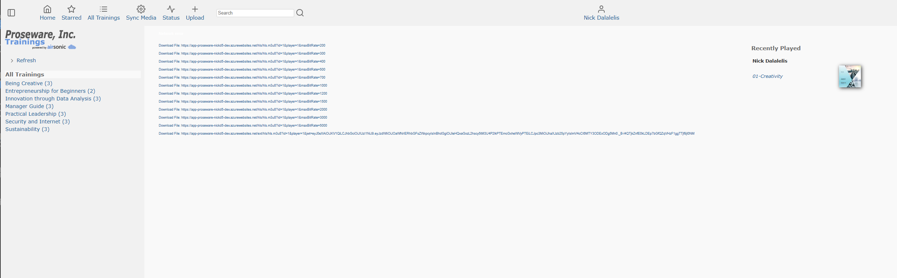
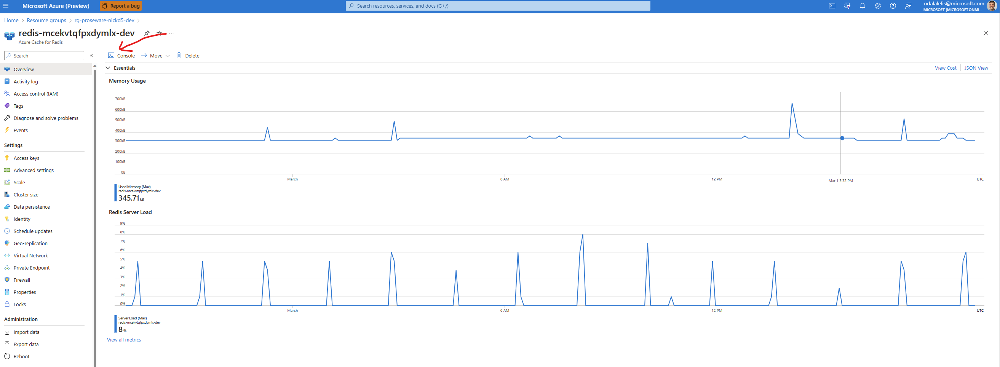
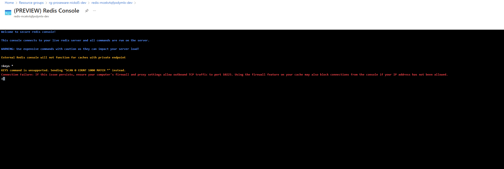
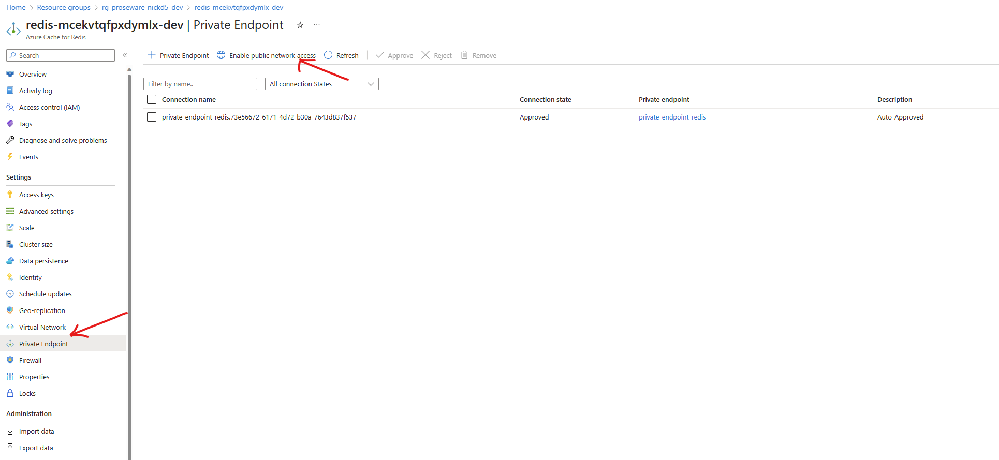
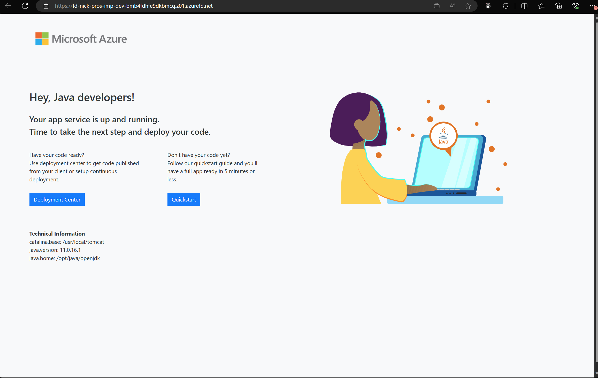

# Known issues

This document helps with troubleshooting and provides an introduction to the most requested features, gotchas, and questions.

* To facilitate deployment from a developer system, we explicitly allow the IP address of the current system through the firewall for Azure Storage and Key Vault. Ensure you are running the deployment from a system where the external IP address (as seen by Azure) does not change during the deployment.

* Perform the following steps if you need to restart the deployment process.

    1. Teardown the deployment.
    
        ```shell
        azd down
        ```

    1. Start a new azd deployment.

        ```shell
        azd env new
        ```

    1. Retry from *Set the environment variables* under *Prepare for deployment* in [README.md](./README.md).

* Login with OAuth 2.0 Invalid credentials

    

    Refresh the browser to recover from the above error.

* Some of the videos may not play correctly.  Skip the video and choose a different one to play.

    

* In some cases, the deployment of Redis Cache can take a long time.
    
    ```
    module.cache.azurerm_redis_cache.cache: Still creating... [18m10s elapsed]
    module.cache.azurerm_redis_cache.cache: Still creating... [18m20s elapsed]
    module.cache.azurerm_redis_cache.cache: Still creating... [18m30s elapsed]
    module.cache.azurerm_redis_cache.cache: Still creating... [18m40s elapsed]
    module.cache.azurerm_redis_cache.cache: Still creating... [18m50s elapsed]
    module.cache.azurerm_redis_cache.cache: Still creating... [19m0s elapsed]
    module.cache.azurerm_redis_cache.cache: Still creating... [19m10s elapsed]
    module.cache.azurerm_redis_cache.cache: Still creating... [19m20s elapsed]
    ````

* Access to the Azure Redis Cache console error

    You can launch the console for Azure Redis Cache through the Azure Portal.

    

    You may encounter the following errors when issuing Redis commands.

    

    Enable *public network access* to use the console.

    

* App Service Timing Issue After Deploying seware

    You may see the following *Welcome* page after you deploy Proseware and navigate to the site.

    

    This is because App Service may require additional time to process the recently uploaded *WAR* package. It may take up to 5 minutes for the uploaded WAR package to be processed. Refresh the page to see the Proseware site.

* Connection time out errors in the azd provision step

    Re-run the `azd provision` command if you encounter connection timeout errors like the one below.

    ```
    Error: local-exec provisioner error with null_resource.app_service_startup_script,
    │   on main.tf line 282, in resource "null_resource" "app_service_startup_script":
    │  282:   provisioner "local-exec" {
    │ 
    │ Error running command 'az webapp deploy --name <removed> --resource-group <removed> --src-path
    │ scripts/startup.sh --type=startup': exit status 1. Output: WARNING: This command is in preview and under development. Reference and
    │ support levels: https://aka.ms/CLI_refstatus
    │ ERROR: The command failed with an unexpected error. Here is the traceback:
    │ ERROR: ('Connection aborted.', RemoteDisconnected('Remote end closed connection without response'))
    │ Traceback (most recent call last):
    ```