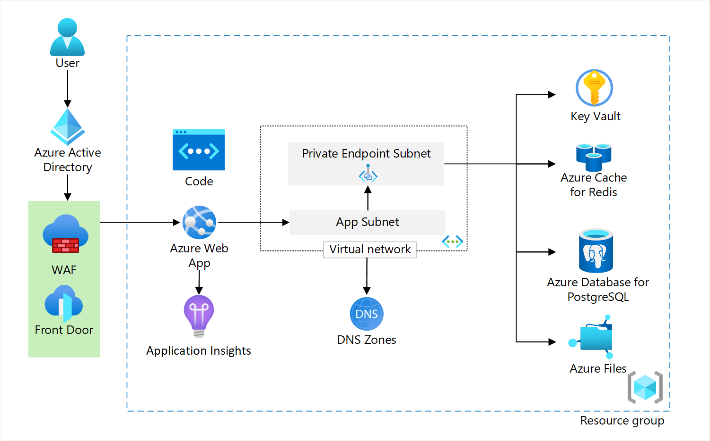

# Reliable web app pattern planning (Java)

The reliable web app pattern is a set of best practices built on the [Azure Well-Architected Framework](https:/learn.microsoft.com/en-us/azure/architecture/framework/) that helps developers successfully migrate web applications to the cloud. The goal is to improve the cost, performance, security, operations, and reliability of your web application with minimal changes. The reliable web app pattern is an essential first step for web applications converging on the cloud and sets a foundation for future modernizations in Azure.

This article defines objectives of the reliable web app pattern and details the business drivers, on-premises context, and the reasons the web app uses each Azure service. There's a companion article that shows you how to [apply the reliable web app pattern for java and a reference implementation you can deploy. The following diagram shows the architecture of the reference implementation that applies the reliable web app pattern

This article provides an overview of the pattern. There's a companion article that shows you how to [apply the pattern](apply-pattern.md) and a [reference implementation](README.md#steps-to-deploy-the-reference-implementation) of the reliable web app pattern that you can deploy. The reference implementation is an employee-facing, line of business, concert ticketing app, and the guidance refers to it throughout.

## Pattern objectives and implementation

The reliable web app pattern is a set of objectives that follow the pillars of [Azure Well-Architected Framework](https:/learn.microsoft.com/en-us/azure/architecture/framework/) and 12 Factor Apps. How you implement this pattern varies based on the web application and language. The following table outlines the pattern objectives and how the reference implementation met these objectives.

| Objectives | Implementation for Java |
| --- | --- |
|▪ Low-cost high-value wins ▪ Minimal code changes ▪ Security best practices  ▪ Reliability design patterns ▪ Improve operational excellence ▪ Cost-optimized environments ▪ Well Architected Framework principles ▪ Service level objective: 99.86% |▪ Retry pattern   ▪ Circuit-breaker pattern  ▪ Cache-aside pattern  ▪ Right-size resource  ▪ Managed identities  ▪ Private endpoints  ▪ Secrets management  ▪ Repeatable infrastructure  ▪ Telemetry, logging, monitoring|

## Business context

This guidance mirrors the journey of a fictional company, Proseware, Inc, that wants to take their on-premises, line of business (LOB) web application to the cloud. Proseware’s leadership decided to expand their business into the EdTech application market. After their initial technical research, they concluded they could use their existing internal training platform as a starting point and modernize them into a B2C EdTech App. The current on-premises training application is a customized version of the open-source monolithic Airsonic web-based media streamer. To expand its business into a highly competitive EdTech market, the on-premises infrastructure needs to provide a cost-efficient means to scale, and a migration to the cloud offers the most return on investment. The migration of their application should meet the increasing business demand with minimal investments in the existing monolithic app. Here are some short-term and long-term goals for the application.

| Short term goals | Long term goals |
| --- | --- |
| ▪ Apply low-cost, high-value code changes to the LOB web application.   ▪ Mature development team practices for modern development and operations.   ▪ Create cost-optimized production and development environments.   ▪ Implement reliability and security best practices in the cloud.   ▪ Service-level objective of 99.86%.| ▪ Open the application directly to online customers through multiple web and mobile experiences.   ▪ Improve availability.   ▪ Reduce time required to deliver new features.   ▪ Independently scale different components of the system based on traffic.

## Web application starting point

The on-premises starting point is a monolithic Java web application running on an Apache Tomcat web server with a PostgreSQL database. It’s an employee-facing LOB training application. Employees use the application to complete required HR training. The web application suffers from common legacy challenges, including extended timelines to build and ship new features and difficulty scaling different application components under higher load.

## Service level objective

A service level objective (SLO) for availability defines how available you want a web app to be for users. Proseware has a target SLO of 99.86% for availability. You need to define what it means to be available for your web application. For Proseware, the web app is available when employees can watch training videos 99.86% of the time. When you have a definition of available, list all the dependencies on the critical path of availability. Dependencies should include Azure services and third-party solutions.

For each dependency in the critical path, you need to assign an availability goal. Service Level Agreements (SLAs) from Azure provide a good starting point. SLAs don't factor in, for example, downtime associated with the application code run on those services, deployment/operations methodologies, or architecture choices to connect the services. So the availability metric you assign to a dependency shouldn't exceed the SLA.

For example, Proseware used Azure SLAs for Azure services. The following diagram illustrates Proseware's dependency list with availability goals for each dependency.

Finally, use the formulas for composite SLAs to estimate the composite availability of the dependencies on the critical path. This number should meet or exceed your SLO. For more information, see:

- [Composite SLA formula](https:/learn.microsoft.com/en-us/azure/architecture/framework/resiliency/business-metrics#composite-slas)
- [Multiregional SLA formula](https:/learn.microsoft.com/en-us/azure/architecture/framework/resiliency/business-metrics#slas-for-multiregion-deployments)

## Choose the right services

Choosing the right Azure services is an important part of the planning phase before moving your app to Azure. Understanding the level of performance and availability you need for your app will have an impact on the total cost to run your solution. You should start by defining a target SLO for your solution and use that information to determine which products and SKUs you should be using.  We provide our decision process for each service in the solution. Our two main requirements - an SLA of 99.86% for the production environment and an average daily-user load will be around 1,000 users.

### Application Platform

[Azure App Service](https:/learn.microsoft.com/en-us/azure/app-service/overview) for Tomcat on Linux allows developers to quickly build, deploy and scale their Tomcat web apps on a fully managed Linux-based service. The open-source Maven Plugin for App Service helps Java developers deploy Maven projects. App Service is an HTTP-based, managed service for hosting web applications, REST APIs, and mobile back ends. App Service isn’t the only compute option, see: compute decision tree. We chose Azure App Service because it met the following requirements:

- **High SLA:** It has a 99.95% uptime SLA and meets our requirements for the production environment.
- **Reduced management overhead:** It’s a fully managed hosting solution.
- **Java support:** App Service supports Java SE, Tomcat, and JBoss EAP web apps.
- **Containerization capability:** App Service works with private container image registries like Azure Container Registry, which we can use to containerize in the future.
- **Autoscaling:** The web app can rapidly scale up, down, in, and out based on user traffic.

### Identity management

[Azure Active Directory (Azure AD)](https:/learn.microsoft.com/en-us/azure/active-directory/fundamentals/active-directory-whatis) is a cloud-based identity and access management service. It authenticates and authorizes users based on roles that integrate with our application. Azure AD provides the application with the following abilities:

- **Authentication and authorization:** The application needed to authenticate and authorize call center employees.
- **Scalable:** It scale to support larger scenarios.
- **User-identity control:** Call center employees can use their existing enterprise identity.
- **Support authorization protocols:** It supports OAuth 2.0 for managed identities and OpenID Connect for future B2C support.

### Database

[Azure Database for PostgreSQL](https://learn.microsoft.com/azure/en-us/postgresql/single-server/overview) is a fully managed database service that provides built-in high availability, automated maintenance for underlying hardware, operating system and database engine, data protection using automatic backups and point-in-time restore, enterprise grade security and industry-leading compliance to protect sensitive data at-rest and in-motion.

Azure Database for PostgreSQL includes single-server and Flexible Server options. We chose Flexible Server because it meets the following requirements:

- **Reliability:** we chose a single-zone high availability configuration, ideal for infrastructure redundancy with lower network latency. It provides high availability without the need to configure app redundancy across zones. Same-zone HA is available in all Azure regions where you can deploy Flexible Server and offers an uptime SLA of 99.95%.
- **Performance:** Flexible Server provides your apps with predictable performance and intelligent tuning to automatically improve your database’s performance based on real usage data.
- **Reduced management overhead:** Flexible Server is a fully managed database-as-a-service offering.
- **Migration support:** Flexible Server supports database migration from on-premises Single Server PostgreSQL databases. Microsoft has a [preview migration tool](https://learn.microsoft.com/en-us/azure/postgresql/migrate/concepts-single-to-flexible) to simplify the migration process.
- **Consistency with on-premises configurations:** Azure Database for PostgreSQL supports community versions of PostgreSQL 11, 12, 13 and 14, with plans to add new versions as they are released.
- **Resiliency:** Flexible Server automatically creates [server backups](https://learn.microsoft.com/en-us/azure/postgresql/flexible-server/concepts-backup-restore) and stores them on zone redundant storage (ZRS) within the region. Backups can be used to restore your server to any point-in-time within the backup retention period. All backups are encrypted using AES 256-bit encryption.

### Application performance monitoring

Application Insights is a feature of Azure Monitor that provides extensible application performance management (APM) and monitoring for live web apps. We chose to incorporate Application Insights for the following reasons.

- **Anomaly detection:** It automatically detects performance anomalies
- **Troubleshooting:** It helps diagnose issues in our running app.
- **Telemetry:** It collects information about how users are using the app and allows us to easily send custom events we want to track in our app.

Azure Monitor is a comprehensive suite of monitoring tools to collect data from a variety of Azure services. Review the following concepts to quickly come up to speed on its capabilities:

- [Smart detection in application insights](https://learn.microsoft.com/en-us/azure/azure-monitor/alerts/proactive-diagnostics)
- [Application Map: Triaging Distributed Applications](https://learn.microsoft.com/en-us/azure/azure-monitor/app/app-map?tabs=net)
- [Profile live App Service apps with Application Insights](https://learn.microsoft.com/en-us/azure/azure-monitor/profiler/profiler)
- [Usage analysis with Application Insights](https://learn.microsoft.com/en-us/azure/azure-monitor/app/usage-overview)
- [Getting started with Azure Metrics Explorer](https://learn.microsoft.com/en-us/azure/azure-monitor/essentials/metrics-getting-started)
- [Application Insights Overview dashboard](https://learn.microsoft.com/en-us/azure/azure-monitor/app/overview-dashboard)
- [Log queries in Azure Monitor](https://learn.microsoft.com/en-us/azure/azure-monitor/logs/log-query-overview)

### Cache

[Azure Cache for Redis](https://learn.microsoft.com/azure/en-us/azure-cache-for-redis/cache-overview) is a managed in-memory data store based on the Redis software. Our load is heavily skewed toward viewing concerts and venue details. The web app needed a cache that provided the following benefits:

- **Reduce management overhead:** It's a fully managed service.
- **Speed and volume:** It has high-data throughput and low latency reads for commonly accessed, slow changing data.
- **Diverse supportability:** It's a unified cache location for all instances of our web app to use.
- **Externalized:** The on-premises application servers performed VM-local caching. This setup didn't offload highly frequented data, and it couldn't invalidate data.
- **Enabling non-sticky sessions:** Externalizing session state supports non-sticky sessions.

### Content delivery network

[Azure Front Door](https://learn.microsoft.com/en-us/azure/frontdoor/front-door-overview) sets up additional features such as Web Application Firewall and positions us to use a content delivery network to provide site acceleration as traffic to the web app increases. We chose Azure Front Door because it provides the following capabilities.

- **Traffic acceleration:** It uses anycast to reach the nearest Azure point of presence and find the fastest route to our web app.
- **Custom domains:** It supports custom domain names with flexible domain validation.
- **Health probes:** The application needed intelligent health probe monitoring. Azure Front Door then uses these responses from the probe to determine the "best" origin to route your client requests.
- **Monitoring support:** It supports built-in reports with an all-in-one dashboard for both Front Door and security patterns. You can configure alerts that integrate with Azure Monitor. It lets the application log each request and failed health probes.
- **DDoS protection:** It has built-in layer 3-4 DDoS protection.

### Web application firewall

[Azure Web Application Firewall](https://learn.microsoft.com/en-us/azure/web-application-firewall/overview) provides centralized protection of your web applications from common exploits and vulnerabilities. It's built into Azure Front Door and prevents malicious attacks close to the attack sources before they enter your virtual network. Azure Web Application Firewall provided the following benefits.

- **Global protection:** It provides global web app protection without sacrificing performance.
- **Botnet protection:** The team can monitor and configure to address security concerns from botnets.
- **Parity with on-premises**: The service allowed us to maintain parity with our on-premises solution, which was running behind a web application firewall managed by IT.

### Secrets manager

[Azure Key Vault](https://learn.microsoft.com/en-us/azure/key-vault/general/overview) provides centralized storage of application secrets to control their distribution. We prefer managed identities over secrets, but we an Azure Active Directory client secret in our local development environment and need a secure secret store. Key Vault was chosen because it provides:

- **Encryption:** It supports encryption at rest and in transit.
- **Supports managed identities:** The application services can use managed identities to access the secret store.
- **Monitoring and logging:** It facilitates audit access and generate alert us when stored secrets change.

### Object storage

Azure Files offers fully managed file shares in the cloud that are accessible via Server Message Block (SMB) protocol, Network File System (NFS) protocol, and Azure Files REST API. Our app uses the filesystem to save uploaded training videos.  We used the Azure Files integration in App Service to mount an NFS share, which allows our Tomcat app server to seamlessly access the share. Azure Files was a good fit for us because it simplified the process of getting our app running on the cloud.

- **Replace existing file server:** Azure Files allows us to replace our existing file server without having to modify our code to use an alternative blob storage mechanism.
- **Fully managed:** Azure file shares allow us to maintain compatibility without needing to manage hardware or operating system for a file server.
- **Resiliency:** Azure Files has been built from the ground up to be always available.

### Endpoint security

[Azure Private Link](https:/learn.microsoft.com/en-us/azure/private-link/private-link-overview) provides access to PaaS Services (such as, Azure Cache for Redis and PostgreSQL Database) over a private endpoint in your virtual network. Traffic between your virtual network and the service travels across the Microsoft backbone network. Azure Private DNS with Azure Private Link enables your solution to communicate securely with Azure services like Azure Database for PostgreSQL. The web app uses Azure Private Link for the following reasons:

- **Secure communication:** It lets the application privately access services on the Azure platform and reduces the network footprint of data stores to protect against data leakage.
- **Minimal effort:** The private endpoints support the web application platform and database platform the web app uses. Both platforms mirror existing on-premises setup for minimal change.

## Deploy the reference implementation

You can deploy the reference implementation by following the instructions in the [reliable web app pattern for Java repository](README.md#steps-to-deploy-the-reference-implementation). Follow the deployment guide to set up a local development environment and deploy the solution to Azure.

## Next Steps

This article covered the architecture and planning details around the reliable web app pattern. The following article shows you [how to apply the reliable web app pattern](apply-pattern.md).
