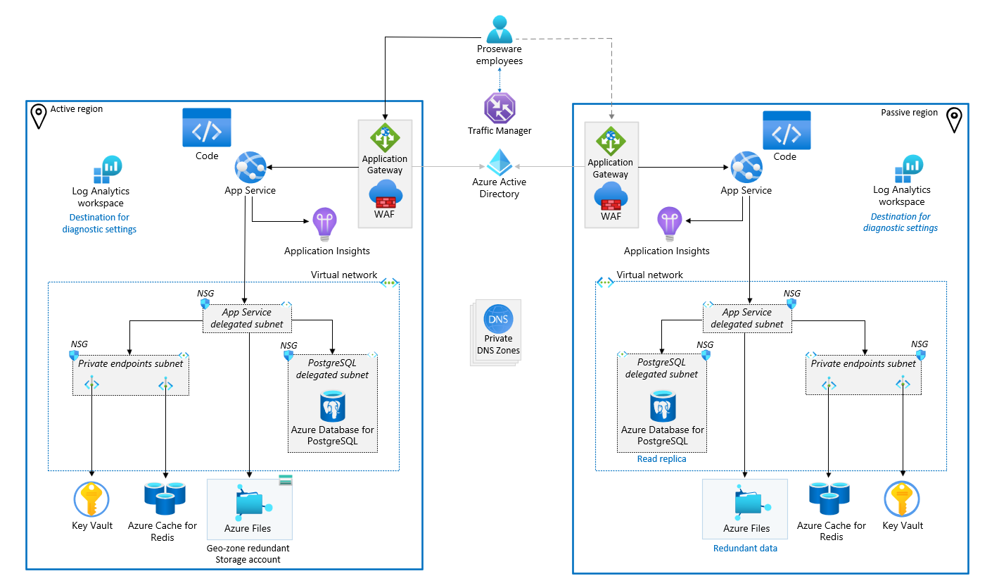

# Proseware Failover playbook

One of Proseware's business objectives was to operate a system that is available 99.9% of the time. To meet that objective the team deploys the web app to two regions with active/passive configuration. In this setup 100% of use traffic is handled by a single region and data is replicated to a secondary region. This enables Proseware to quickly transition from the primary region to the secondary to mitigate the risk of an outage from impacting their availability.

To transition from the primary region Proseware built the following plan that is executed manually. Health checks and automated transition are not part of the plan in this phase.

## Understaning the Proseware system
Before we build, or execute, the failover plan we should understand the system and how it is used. Proseware is an Azure web application that provides streaming video training content. The solution architecture includes Azure App Service, Azure Storage (mounted as File Storage on App Service), Application Insights, Key Vault, Azure Cache for Redis, and Azure Database for Postgresql. These components are vnet integrated and secured with private endpoints. Users authenticate with Azure AD and diagnostics for Azure services are stored in Azure Log Analytics Workspace.

The system is also placed behind an Azure Front Door with Azure Web Application Firewall enabled. This provides an active/passive load balancing capability between 1 instance of the application and another that provides high availability. The secondary region is a standby region that receives replicated data from the primary region.



In this system we have data stored in different places and each one of those should be handled by the failover.

1. Videos on disk: Proseware training videos are stored in Azure Storage
1. User data: Data for users is handled with RDBMS with PostgreSQL and cached in Redis
1. System settings: Configuration in Key Vault, and other environment settings
1. Monitoring: Diagnostic data stored in Log Analytics and Application Insights

For this plan, Proseware chooses only to address the first two considerations. When traffic is transitioned from primary to secondary region we expect users to continue where they left off with minimal impact to their experience. To support this goal we need to replicae data for Azure Storage and Azure Database for PostgreSQL. Diagnostic data in Log Analytics and Application Insights are not replicated. This approach is also designed to rebuild any information that was stored in Redis as traffic is migrated to the new region.

> **Note**<br>
> Traffic routing and final migration diagram pending final solution architecture

## Executing the transition
Use the following steps to transition users from primary to secondary region.

> **Note**<br>
> The following content describes failover by region name because the meaning of "primary" is adjusted throughout the context of the plan. *eastus* is primary and *westus* is secondary.

At this point, the decision to failover has been made. Interruption of services and implications of potential data-loss have been communicated to users.

Two flows of traffic we will address:
* User traffic: dashed blue line
* Data replication: solid green line


<!-- assumes Traffic Manager -->
### Cut-off traffic to the *eastus* region

We want to inform users about the outage and stop traffic flowing to *eastus* while we peform maintenance on the system.

1. Create a new Azure App Service
    1. Deploy an informational maintenance page to the new App Service
1. Update traffic manager endpoint
    1. primary-region: change target resource to Azure App Service Maintenance page
    Additional details: [Add Traffic Manager endpoints](https://learn.microsoft.com/azure/traffic-manager/quickstart-create-traffic-manager-profile#add-traffic-manager-endpoints)


### Stop Data Replication

We want to modify the solid green arrow in this step of the failover. In this simplified representation, the line represents two types of data (Azure Files and Database replication).

1. Initiate Storage Account failover
    <!-- intentially omitting Last Sync Time as data loss is expected to be handled by re-uploading any training videos that were uploaded -->
    
    ```sh
    az storage account show \ --name accountName \ --expand geoReplicationStats
    az storage account failover \ --name accountName
    ```

    > **Note**<br>
    > After the failover, your storage account type is automatically converted to locally redundant storage (LRS) in the new primary region.

    Additional details: [Initiate a storage account failover](https://learn.microsoft.com/azure/storage/common/storage-initiate-account-failover)

<!-- work in progress

1. initiate a failover PostgreSQL
- disable connections to primary database (stop new data generation)
- break the replication
- elect database in secondary region to primary

1. update Azure web app settings
- update connection string to 

1. Update Traffic manager
- phased start up of 2nd region with 20%, 40%, 60%, 80%, and 100% migration increments
- route traffic to secondary region
- disable route for primary region

1. Restore PostgresSQL replication
- the original database is now a backup that can be discarded when convenient
- create a new database
- establish a new replication connection between new database and current primary

-->