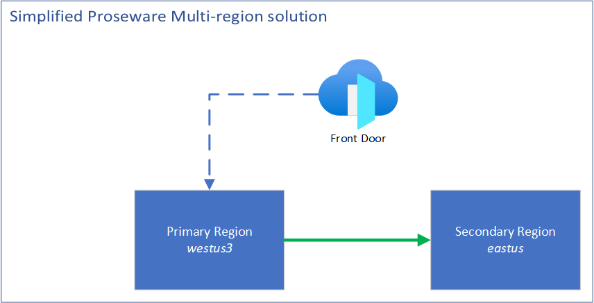
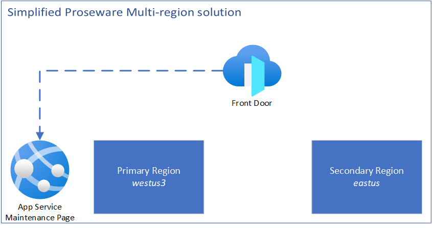

# Proseware Failover playbook

One of Proseware's business objectives was to operate a system that is available 99.9% of the time. To meet that objective the team deploys the web app to two regions with active/passive configuration. In this setup 100% of user traffic is handled by a single region and data is replicated to a secondary region. This enables Proseware to quickly transition from the primary region to the secondary to mitigate the risk of an outage from impacting their availability.

To transition from the primary region Proseware built the following plan that is executed manually. Health checks and automated transition are not part of the plan in this phase.

## Understanding the Proseware system
Before we execute the failover plan we should understand the system and how it is used. Proseware is an Azure web application that provides streaming video training content. The solution architecture includes Azure App Service, Azure Storage (mounted as File Storage on App Service), Application Insights, Key Vault, Azure Cache for Redis, and Azure Database for PostgreSQL. These components are vnet integrated or secured with private endpoints. Users authenticate with Azure AD and diagnostics for Azure services are stored in Azure Log Analytics Workspace.

The system is also placed behind an Azure Front Door with Azure Web Application Firewall enabled. This provides active/passive load balancing between 1 instance of the application and another to achieve high availability. The secondary region is a standby region that receives replicated data from the primary region.


In this system we have data stored in different places and each one of those should be handled by the failover.

1. Videos on disk: Proseware training videos are stored in Azure Storage
1. User data: Relational user data is stored in PostgreSQL and cached user data is stored in Redis
1. System settings: Configuration in Key Vault, and other environment settings
1. Monitoring: Diagnostic data stored in Log Analytics and Application Insights

For this plan, Proseware chooses only to address the first two considerations. When traffic is transitioned from primary to secondary region we expect users to continue where they left off with minimal impact to their experience. To support this goal we need to replica data for Azure Storage and Azure Database for PostgreSQL. The system settings and configuration data are expected to be handled with infrastructure as code keeping both regions synchronized. Diagnostic data in Log Analytics and Application Insights are not replicated. This approach is also designed to rebuild any information that was stored in Redis as traffic is migrated to the new region.

## Executing the transition
Use the following steps to transition users from primary to secondary region. At this point, the decision to failover has been made. Interruption of services and the risk of potential data-loss has been communicated to users.

> **Note**<br>
> The following content describes failover by region name because the meaning of "primary" is adjusted throughout the context of the plan. In this context *westus3* is primary and *eastus* is secondary.

The two flows of traffic we will address are:
* User traffic: dashed blue line
* Data replication: solid green line



### Cut-off traffic to the *westus3* region

We want to inform users about the outage and stop traffic flowing to *westus3* while we perform maintenance on the system.

1. Create a new Azure App Service
    1. Deploy an informational maintenance page to the new App Service
1. Update Azure Front Door origin group
    1. Add the new maintenance web app as an origin <br />
    Additional details:
       - [Create a Front Door - Portal](https://learn.microsoft.com/azure/frontdoor/create-front-door-portal)
    1. Disable the *westus3* origin.

With these changes complete, the simplified Proseware multi-region solution is adjusted as shown. Azure Front Door no longer sends data to the *westus3* region.


### Stop data replication to *eastus*

We want to disconnect the solid green arrow in this step of the failover. In this simplified representation, the line represents two types of data (Azure Files and Database replication).

1. Initiate storage account failover
    <!-- intentionally omitting Last Sync Time as data loss is expected to be handled by re-uploading any training videos that were uploaded -->
    
    ```sh
    az storage account show --name <accountName> --expand geoReplicationStats
    az storage account failover --name <accountName>
    ```

    > **Note**<br>
    > This operation will take several minutes to complete. <br>
    > After the failover, your storage account type is automatically converted to locally redundant storage (LRS) in the new primary region.

    Additional details:
    - [Initiate a storage account failover](https://learn.microsoft.com/azure/storage/common/storage-initiate-account-failover)

1. Stop replication for Azure Database for PostgreSQL

    > **Note**<br>
    > After you stop replication to a primary server and a read replica, it can't be undone. The read replica becomes a standalone server that supports both reads and writes. The standalone server can't be made into a replica again.

    ```sh
    az postgres server replica stop --name <mydemoserver-replica> --resource-group <myresourcegroup>
    ```

    Additional details:
    - [Manage read replicas - Azure portal - Azure Database for PostgreSQL - Single Server](https://learn.microsoft.com/en-us/azure/postgresql/single-server/how-to-read-replicas-portal#stop-replication)
    - [Manage read replicas - Azure CLI, REST API - Azure Database for PostgreSQL - Single Server](https://learn.microsoft.com/en-us/azure/postgresql/single-server/how-to-read-replicas-cli#stop-replication-to-a-replica-server)

With these changes complete, the simplified Proseware multi-region solution is adjusted as shown. The solid green arrow for data replication is removed. Both *westus3* and *eastus* are stand-alone copies of the production web app and we have prepared *eastus* to become the primary region.



### Update web app configuration
To connect to the Azure Database for Postgres Flexible Server in *east* we need to use a new connection string.

1. Update Key Vault connection string for PostgreSQL database
1. Restart the web app in *eastus*

With these changes complete the *eastus* web app is now ready for testing.


### Restore Data Replication to *westus3*

We want to modify the solid green arrow in this step of the failover. In this simplified representation, the line represents two types of data (Azure Files and Database replication).

1. Change the replication type to geo-redundant to replicate data to the secondary region:
    ```sh
    az storage account update --name <storage_account_name> --resource-group <resource_group_name> --sku Standard_GRS
    ```

    Initiating replication will take varying time to complete based on the data being replicated. You can monitor the status of the of the replication type change by running the following:

    ```sh
    az storage account show --name <storage_account_name> --resource-group <resource_group_name> --query "provisioningState"
    ```

    Additional details:
    - [Replication change table](https://learn.microsoft.com/en-us/azure/storage/common/redundancy-migration?tabs=portal#replication-change-table)

1. Create a new Azure Database for PostgreSQL Flexible server and database

1. Create a read replica for Azure Database for PostgreSQL

    ```sh
    az postgres server replica create --name <mydemoserver-replica> --source-server <mydemoserver> --resource-group <myresourcegroup> --location <westus3>
    ```

    Additional details:
    - [Manage read replicas - Azure portal - Azure Database for PostgreSQL - Single Server](https://learn.microsoft.com/en-us/azure/postgresql/single-server/how-to-read-replicas-portal#stop-replication)
    - [Manage read replicas - Azure CLI, REST API - Azure Database for PostgreSQL - Single Server](https://learn.microsoft.com/en-us/azure/postgresql/single-server/how-to-read-replicas-cli#stop-replication-to-a-replica-server)

With these changes complete, the simplified Proseware multi-region solution is adjusted as shown. The solid green arrow for data replication is re-added. However website traffic is still flowing to the maintenance page.


### Validate the *eastus* traffic

1. Configure App Service Access Restriction to allow traffic that does not come from Front Door.

    Additional details:
    - [Azure App Service access restrictions](https://learn.microsoft.com/azure/app-service/app-service-ip-restrictions?tabs=azurecli#restrict-access-to-a-specific-azure-front-door-instance)

Modifying the network settings for the web app enables the team to perform any manual testing that is necessary to validate that the website is functional before we send traffic to the site.

1. Validate the website.

1. Reconfigure App Service Web App to disallow traffic that does not come from Front Door.

### Send traffic to *eastus*

We want to stop traffic flowing to the maintenance page and send it to the now ready and waiting *eastus* region.

1. Update Azure Front Door origin group
    1. Enable the *eastus* origin.
    1. Disable the origin for the maintenance page.

With these changes complete, the simplified Proseware multi-region solution is adjusted as shown. Replication is restored and Azure Front Door is now sending traffic to the secondary region.


### Clean up

1. Azure App Service maintenance page can now be removed
1. Azure PostgreSQL Database Flexible Server *westus3* is now a point-in-time backup of the production system that can be used as another recovery option or removed from the subscription.


## Failback
Using the steps described above Proseware plans to migrate their traffic from *eastus* back to *westus3* when possible as latency in the web app is a primary concern for their users.
