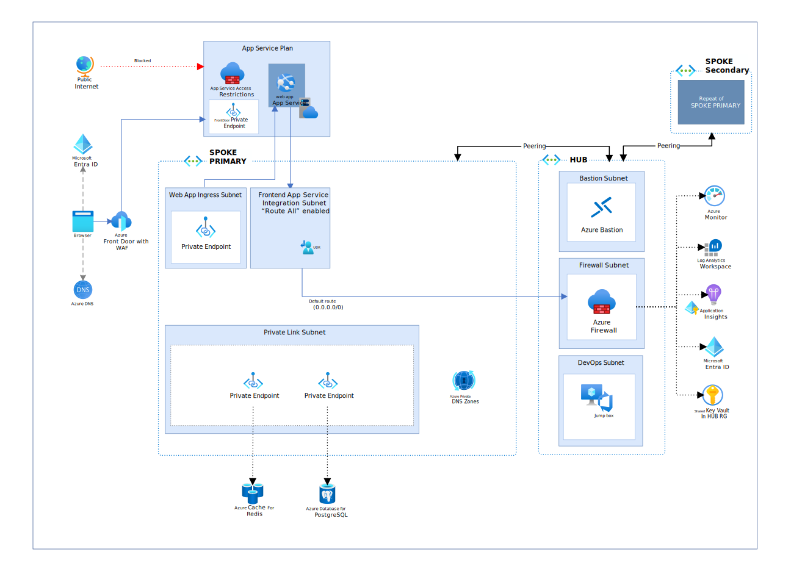

# Steps to deploy the production deployment
This section describes the deployment steps for the reference implementation of a reliable web application pattern with Java on Microsoft Azure. These steps guide you through using the jump box that is deployed when performing a network isolated deployment because access to resources will be restricted from public network access and must be performed from a machine connected to the vnet.



## Prerequisites

We recommend that you use a Dev Container to deploy this application.  The requirements are as follows:

- [Azure Subscription](https://azure.microsoft.com/pricing/member-offers/msdn-benefits-details/).
- [Visual Studio Code](https://code.visualstudio.com/).
- [Docker Desktop](https://www.docker.com/get-started/).
- [Permissions to register an application in Microsoft Entra ID](https://learn.microsoft.com/azure/active-directory/develop/quickstart-register-app).
- Visual Studio Code [Dev Containers extension](https://marketplace.visualstudio.com/items?itemName=ms-vscode-remote.remote-containers).

If you do not wish to use a Dev Container, please refer to the [prerequisites](prerequisites.md) for detailed information on how to set up your development system to build, run, and deploy the application.

> **Note**
>
> These steps are used to connect to a Linux jump box where you can deploy the code. The jump box is not designed to be a build server. You should use a devOps pipeline to manage build agents and deploy code into the environment. Also note that for this content the jump box is a Linux VM. This can be swapped with a Windows VM based on your organization's requirements.

## Steps to deploy the reference implementation

The following detailed deployment steps assume you are using a Dev Container inside Visual Studio Code.

### 1. Log in to Azure


1. Start a terminal in the dev container:
    ```sh
    az login --scope https://graph.microsoft.com//.default
    ```

1. Set the subscription to the one you want to use (you can use [az account list](https://learn.microsoft.com/en-us/cli/azure/account?view=azure-cli-latest) to list available subscriptions):


    ```sh
    export AZURE_SUBSCRIPTION_ID="<your-subscription-id>"
    ```

    ```sh
    az account set --subscription $AZURE_SUBSCRIPTION_ID
    ```

1. Azure Developer CLI (azd) has its own authentication context. Run the following command to authenticate to Azure:

    ```sh
    azd auth login
    ```

### 2. Provision the app

1. Create a new AZD environment to store your deployment configuration values:

    ```sh
    azd env new <pick_a_name>
    ```

1. Set the default subscription for the azd context:

    ```sh
    azd env set AZURE_SUBSCRIPTION_ID $AZURE_SUBSCRIPTION_ID
    ```

1. To create the prod deployment:

    ```pwsh
    azd env set ENVIRONMENT prod
    ```

1. Production is a multi-region deployment. Choose an Azure region for the primary deployment (Run [az account list-locations --query '[].{Location: name}'](https://learn.microsoft.com/en-us/cli/azure/account?view=azure-cli-latest) to see a list of locations):

    ```pwsh
    azd env set AZURE_LOCATION <pick_a_region>
    ```

    *You want to make sure the region has availability zones. Azure Database for PostgreSQL - Flexible Server [zone-redundant high availability](https://learn.microsoft.com/azure/postgresql/flexible-server/concepts-high-availability) requires availability zones.*

1. Choose an Azure region for the secondary deployment:

    ```pwsh
    azd env set AZURE_SECONDARY_LOCATION <pick_a_region>
    ```

    *We encourage readers to choose paired regions for multi-regional web apps. Paired regions typically offer low network latency, data residency in the same geography, and sequential updating. Read [Azure paired regions](https://learn.microsoft.com/en-us/azure/reliability/cross-region-replication-azure#azure-paired-regions) to learn more about these regions.*

1. Optional: Set the App Registration Service Management Reference:

    ```shell
    azd env set AZURE_SERVICE_MANAGEMENT_REFERENCE <service_management_reference>
    ```

1. Run the following command to create the Azure resources (about 45-minutes to provision):

    ```pwsh
    azd provision
    ```

    When successful the output of the deployment will be displayed in the terminal.

    ```sh
      Outputs:
      
      bastion_host_name = "vnet-bast-nickcontosocams-prod"
      frontdoor_url = "https://fd-nickcontosocams-prod-facscqd0a2gqf2eh.z02.azurefd.net"
      hub_resource_group = "rg-nickcontosocams-hub-prod"
      jumpbox_resource_id = "/subscriptions/1234/resourceGroups/rg-nickcontosocams-hub-prod/providers/Microsoft.Compute/virtualMachines/vm-jumpbox"
      primary_app_service_name = "app-nickcontosocams-eastus-prod"
      primary_spoke_resource_group = "rg-nickcontosocams-spoke-prod"
      secondary_app_service_name = "app-nickcontosocams-centralus-prod"
      secondary_spoke_resource_group = "rg-nickcontosocams-spoke2-prod"
    ```

    **Record the output. The values are required in order to run the next steps of the deployment.**

### 3. Upload the code to the jump box

1. Run the following command to build the Contoso Fiber application:

    ```shell
    ./mvnw clean package
    ```

    This will create the jar file `cams.jar` in the `src/contoso-fiber/target/` directory. This file will be used to deploy the application to Azure App Service.

1. Start a *new* terminal in the dev container

1. Run the following to set the environment variables for the bastion tunnel:

    ```sh
    bastion_host_name=$(azd env get-values --output json | jq -r .bastion_host_name)
    hub_resource_group=$(azd env get-values --output json | jq -r .hub_resource_group)
    jumpbox_resource_id=$(azd env get-values --output json | jq -r .jumpbox_resource_id)
    ```

    We use the [Azure CLI](https://learn.microsoft.com/en-us/cli/azure/) to create a bastion tunnel that allows us to connect to the jump box:

1. Run the following command to create a bastion tunnel to the jump box:

    ```sh
    az network bastion tunnel --name $bastion_host_name --resource-group $hub_resource_group --target-resource-id $jumpbox_resource_id --resource-port 22 --port 50022
    ```

    > **NOTE**
    >
    > Now that the tunnel is open, change back to use the original terminal session to deploy the code.

1. Install the SSH extension for Azure CLI:

    ```shell
    az extension add --name ssh
    ```

1. Obtain an SSH key from entra:
    
    ```shell
    az ssh config --ip 127.0.0.1 -f ./ssh-config
    ```

1. From the first terminal, use the following command to upload the code to the jump box. 

    ```shell
    rsync -av -e "ssh -F ./ssh-config -p 50022" src/contoso-fiber/target/cams.jar 127.0.0.1:~/cams.jar
    ```

1. Run the following command to start a shell session on the jump box:

    ```shell
    az ssh vm --ip 127.0.0.1 --port 50022
    ```

### 4. Deploy code from the jump box

1. Login into Azure using:

    ```shell
    az login --use-device-code
    ```

1. Set the subscription id:

    ```shell
    az account set --subscription <subscription_id>
    ```

1. Deploy the application to the primary region using:

    ```shell
    az webapp deploy --resource-group <primary_spoke_resource_group> --name <primary_app_service_name> --src-path cams.jar --type jar
    ```

1. Deploy the application to the secondary region using:

    ```shell
    az webapp deploy --resource-group <secondary_spoke_resource_group> --name <secondary_app_service_name> --src-path cams.jar --type jar
    ```

    > **WARNING**
    >
    > In some scenarios, the DNS entries for resources secured with Private Endpoint may have been cached incorrectly. It can take up to 10-minutes for the DNS cache to expire.

1. Navigate to the Front Door URL in a browser to view the Contoso Fiber CAMS application.

    

    > You can learn more about the web app by reading the [Pattern Simulations](demo.md) documentation.


### 5. Teardown

1. Exit the jumpbox using:

    ```shell
    exit
    ```

1. Close the tunnel in the SEPARATE terminal using:

    ```shell
    CTRL+C
    ```

1. When you are done you can cleanup all the resources using:

    ```shell
    azd down --force --purge
    ```
