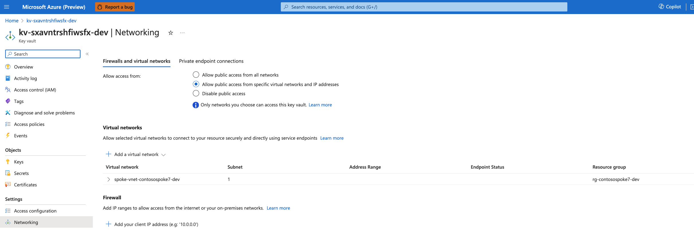

# Java Web App - App Service Secure Baseline Serivces

In the previous step, we deployed the [spoke](../02-spoke/README.md) and now we're ready to deploy the Contoso Fiber. However, before we deploy the application, we're going to first deploy the following resources.

- Azure App Service
- Azure PostgreSQL Flexible Database
- Azure Redis Cache
- Private Link for each, including related DNS Private Zone configuration

## Deploy the Services

The following commands should be entered in the Visual Studio code terminal if running in the Dev Container.  If running locally, open a terminal and navigate to the `scenarios/secure-baseline/03-services` directory.

```bash
cd $PROJECT_ROOT/scenarios/secure-baseline/03-services
```

### 1. Log in to Azure

Before deploying, you must be authenticated to Azure and have the appropriate subscription selected.  To authenticate, follow the instructions [here](../README.md#1-log-in-to-azure)

### 2. Create a new environment

The environment name should be less than 18 characters and must be comprised of lower-case, numeric, and dash characters (for example, `contososervices`).  The environment name is used for resource group naming and specific resource naming. 

**Choose a unique name for the environment**

Run the following commands to set these values and create a new environment:

```shell
azd env new contososervices
```

### 3. Set the AZD Environment Values

The following are required values that must be set:

- `APP_INSIGHTS_ID` - The resource ID of the Application Insights instance created in the hub.
- `LOG_ANALYTICS_WORKSPACE_ID` - The resource ID of the Log Analytics workspace created in the hub.
- `KEY_VAULT_ID` - The resource ID of the Key Vault created in the hub.
- `SPOKE_VNET_ID` - The resource ID of the spoke VNet created in the spoke.

Run the following commands to set these values:

```shell
azd env set APP_INSIGHTS_ID $application_insights_id
azd env set LOG_ANALYTICS_WORKSPACE_ID $log_analytics_workspace_id
azd env set KEY_VAULT_ID $key_vault_id
azd env set SPOKE_VNET_ID $spoke_vnet_id
```

Optionally, you can update the following values:

- `APP_ENVIRONMENT` - The name of the environment.  This value is used for resource group naming and choosing service SKUs.  The default value is `dev`. Valid values are `dev` and `prod`.

```shell
azd env set APP_ENVIRONMENT prod
```

### 4. Select a region for deployment

You can find a list of available Azure regions by running the following Azure CLI command.

> ```shell
> az account list-locations --query "[].name" -o tsv
> ```

Set the `AZURE_LOCATION` to the primary region:

```shell
azd env set AZURE_LOCATION eastus
```

### 5. Provision infrastructure

Run the following command to create the infrastructure and deploy the app:

```shell
azd up
```

### 6. Set the environment variables for the next step

The output of the deployment will be displayed in the terminal.

```
Outputs:

app_service_name = "app-contosserv7-eastus-dev"
frontdoor_url = "https://fd-contosserv7-dev-eacycvb0bnd8f5ay.b01.azurefd.net"
```

To bring the environment variables into the current shell, run the following command:

```shell
source $(azd env list --output json | jq -r '.[] | select(.IsDefault == true) | .DotEnvPath')
```

**This step is required in order to run the next steps of the deployment.**

Verify the environment is set by testing one of the variables:

```shell
echo $frontdoor_url
```

### 7. Configure Key Vault Firewall

The Key Vault Firewall must be configured to allow the App Service to access the Key Vault.  

First, get the subnet ID of the App Service subnet in the spoke:

```shell
APP_SERVICE_SUBNET=$(az network vnet subnet show --name serverFarm --vnet-name $spoke_vnet_name --resource-group $spoke_resource_group --query id --output tsv)
```

Verify the subnet ID is correct:

```shell
echo $APP_SERVICE_SUBNET
```

Run the following command to add the App Service subnet to the Key Vault Firewall:

```shell
az keyvault network-rule add --name $key_vault_name --subnet $APP_SERVICE_SUBNET
```

Navigate to the Key Vault in the Azure portal and select **Networking**.  You should see something similar to the following:



### 8. Deploy the App

Follow the instructions in the [README](../04-contoso-app/README.md).

