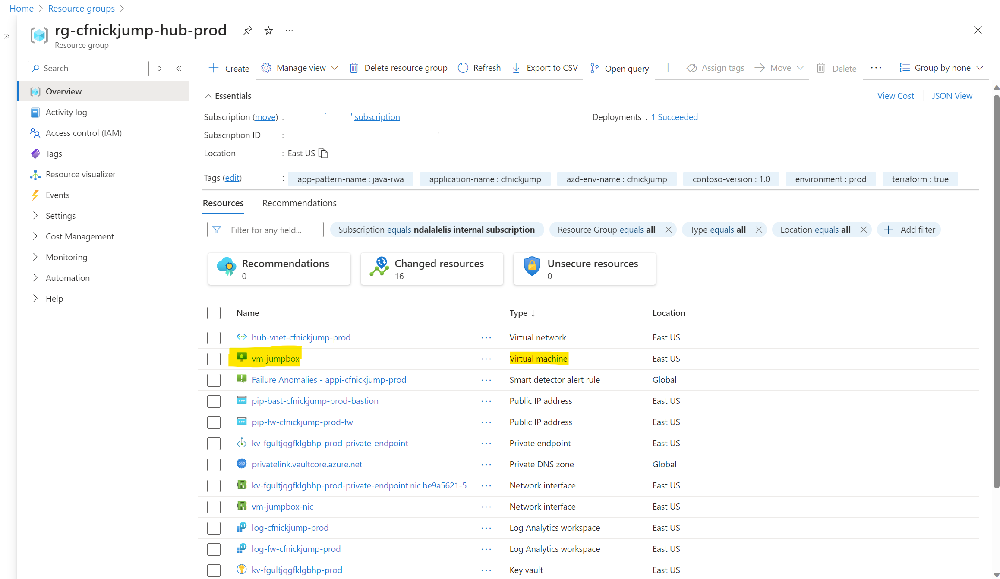
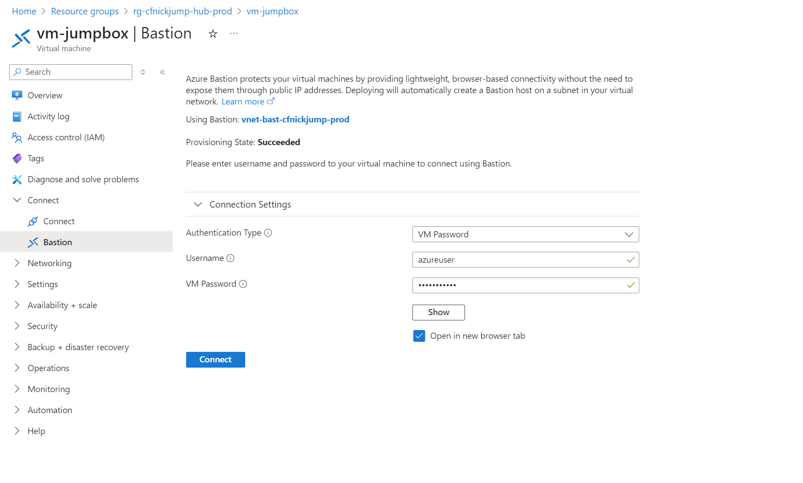
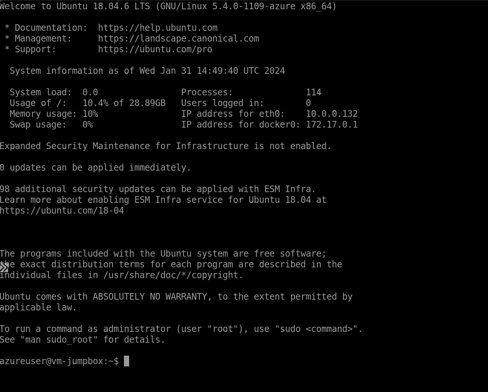

# Java Web App - App Service Secure Baseline

This is a reference impementation of a network isolated Azure environment for a Java Web App.

## Architecture

TODO: update image with Java Web App


## Deployment

Clone the repository and open the project using the Dev Container.

```shell
git clone https://github.com/Azure/web-app-pattern-java.git

cd web-app-pattern-java
```

If you don't see the popup to *Reopen in Container*, open the Visual Studio Code Command Palette to execute the command. There are three ways to open the command palette:

- For Mac users, use the keyboard shortcut ⇧⌘P
- For Windows and Linux users, use Ctrl+Shift+P
- From the Visual Studio Code top menu, navigate to View -> Command Palette.

## Open a Terminal and set the environment variables

Before starting the deployment, we will set the PROJECT_ROOT environment variable. The following commands should be entered in the Visual Studio code terminal if running in the Dev Container.  If running locally, open a terminal.

```shell
PROJECT_ROOT=$PWD
```

You can verify the value by running the following command:

```shell
echo $PROJECT_ROOT
```

You should see the following output:

```shell
/workspaces/web-app-pattern-java
```

## Deploy the Azure Infrastructure

Before deploying, you must be authenticated to Azure and have the appropriate subscription selected.  To authenticate:

```shell
az login --scope https://graph.microsoft.com//.default

azd auth login
```

Each command will open a browser allowing you to authenticate.  To list the subscriptions you have access to:

```shell
az account list
```

To set the active subscription:

```shell
export AZURE_SUBSCRIPTION_ID="<your-subscription-id>"

az account set --subscription $AZURE_SUBSCRIPTION_ID

azd config set defaults.subscription $AZURE_SUBSCRIPTION_ID
```

Enable the Terraform Alpha provider:

```shell
azd config set alpha.terraform on
```

Go to the `secure-baseline` directory:

```shell
cd $PROJECT_ROOT/scenarios/secure-baseline/
```

### 1. Create a new environment

The environment name should be less than 18 characters and must be comprised of lower-case, numeric, and dash characters (for example, `contosocams`).  The environment name is used for resource group naming and specific resource naming. 

**Choose a unique name for the environment**

Run the following commands to set these values and create a new environment:

```shell
azd env new contosocams
```

### 2. Set the AZD Environment Values

The following are required values that must be set:

- `JUMPBOX_PASSWORD` - This is the password for the jump box. The password has to fulfill 3 out of these 4 conditions: Has lower characters, Has upper characters, Has a digit, Has a special character other than "_"

Run the following commands to set these values:

```shell
azd env set JUMPBOX_PASSWORD <password>
```

The following are optional values that can be set:

- `JUMPBOX_USERNAME` - This is the username for the jump box.  The default is `azureuser`.
- `JUMPBOX_VM_SIZE` - This is the size of the jump box VM.  The default is `Standard_B2s`.

These values can be set by running the following commands:

```shell
azd env set <variable> <value>
```

### 3. Select a region for deployment

You can find a list of available Azure regions by running the following Azure CLI command.

> ```shell
> az account list-locations --query "[].name" -o tsv
> ```

Set the `AZURE_LOCATION` to the primary region:

```shell
azd env set AZURE_LOCATION eastus
```

### 4. Provision infrastructure

Run the following command to create the infrastructure and deploy the app:

```shell
azd up
```

### 5. Set the environment variables for the next step

The output of the deployment will be displayed in the terminal.

```
Outputs:

app_service_name = "app-cfnickrwa-eastus-prod"
frontdoor_url = "https://fd-cfnickrwa-prod-atfmd3dadecebmgf.b01.azurefd.net"
spoke_resource_group = "rg-cfnickrwa-spoke-prod"
```

> To bring the environment variables into the current shell, run the following command:

> ```shell
> source $(azd env list --output json | jq -r '.[] | select(.IsDefault == true) | .DotEnvPath')
> ```

> **This step is required in order to run the next steps of the deployment.**

Verify the environment is set by testing one of the variables:

```shell
echo $frontdoor_url
```

## Deploy the Contoso Fiber App

In order to deploy the Contoso Fiber CAMS application, we will need to log into the Jump Box and run the deployment commands from there. Log into the Jump Box by navigating to the Microsoft Azure Portal. From there, find the hub resource group and click on the `vm-jumpbox` resource.



Click on the `Connect` menu item and choose `Bastion`. Enter the username and password you set in the environment variables. Use the following command if you don't remember the password.

```shell
echo $JUMPBOX_PASSWORD
```

Finally click the `Connect` button. 



This will open a new tab in the browser and allow you to connect to the Jump Box.



Once connected to the Jump Box, you can run the following commands to deploy the Contoso Fiber application.

### 1. Log into Azure

```shell
az login --use-device-code
```

Navigate to the URL and enter the code provided.  Once authenticated, you can close the browser and return to the terminal.

### 2. Set the active subscription:

```shell
export AZURE_SUBSCRIPTION_ID="<your-subscription-id>"

az account set --subscription $AZURE_SUBSCRIPTION_ID
```

### 3. Clone the Repository

Before cloning the repository, you will need to authenticate to GitHub. There are many ways to do this, but one way is to set up a [personal access token](https://docs.github.com/en/authentication/keeping-your-account-and-data-secure/managing-your-personal-access-tokens#creating-a-fine-grained-personal-access-token).

Once you have the token, you can use the following command to clone the repository:

```shell
git clone https://github.com/Azure/web-app-pattern-java.git

cd web-app-pattern-java
```

### 4. Build Contoso Fiber

Run the following command to build the Contoso Fiber application:

```shell
./mvnw clean package
```

This will create the `jar` file cams-0.0.1-SNAPSHOT.jar in the `target` directory. This file will be used to deploy the application to Azure App Service.

### 5. Deploy Contoso Fiber to Azure App Service

Rhe Azure CLI is used to deploy the Contoso Fiber application to Azure App Service. The following command will deploy the application to the App Service instance was created in the spoke.

Get the spoke resource group name and the app service name from the environment variables. Run these commands from your dev container:

```shell
echo $spoke_resource_group
echo $app_service_name
```

Now in the Jump Box terminal, run the following command replacing the values for the resource group and app service name from the previous step:

```shell
az webapp deploy --resource-group <spoke_resource_group> --name <app_service_name> --src-path src/contoso-fiber/target/cams-0.0.1-SNAPSHOT.jar --type jar
```

## Navigate to the Contoso Fiber App

Navigate to the Front Door URL in a browser to view the Contoso Fiber CAMS application.

You can get the Front Door URL by running the following command in the dev container terminal:

```shell
echo $frontdoor_url
```
