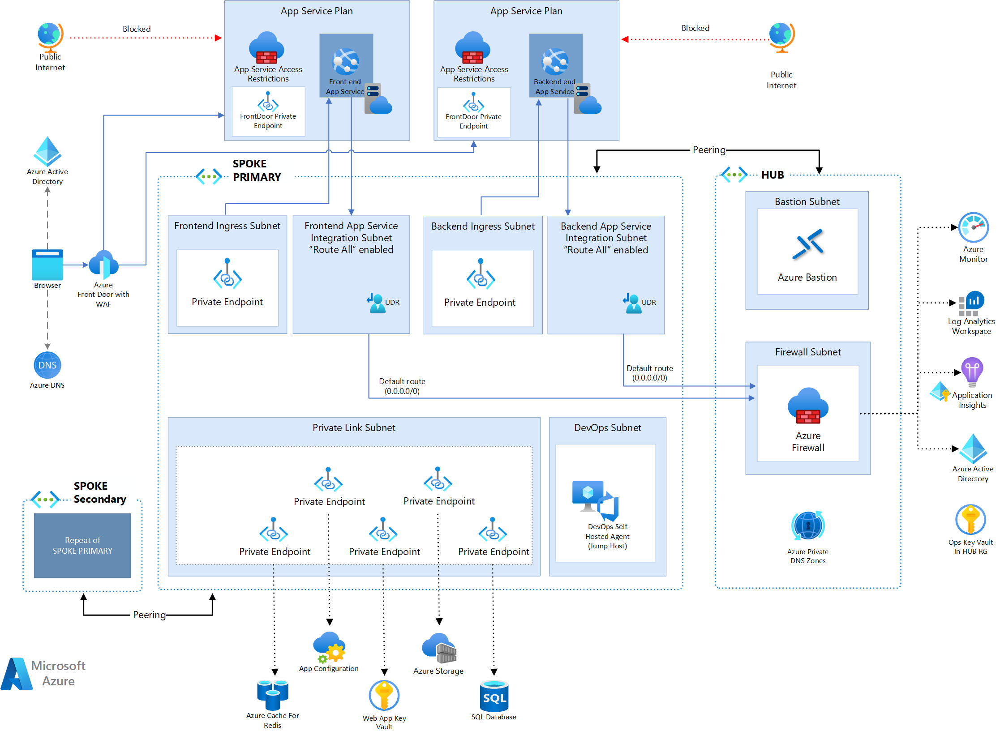

# Java Web App - App Service Secure Baseline

This is a reference impementation of a network isolated Azure environment for a Java Web App.

## Architecture

TODO: update image with Java Web App



## Deployment

Open the project using the Dev Container

1. Start VS Code and run Dev Containers: Clone Repository in Container Volume... from the Command Palette (F1).

1. Select the repository *Azure/web-app-pattern-java* to clone and press Enter.


## Deploy the Azure Infrastructure

Before deploying, you must be authenticated to Azure and have the appropriate subscription selected. The following commands should be entered in the Visual Studio code terminal if running in the Dev Container.  If running locally, open a terminal. To authenticate:

```shell
az login --scope https://graph.microsoft.com//.default

azd auth login
```

Each command will open a browser allowing you to authenticate.  To list the subscriptions you have access to:

```shell
az account list
```

To set the active subscription:

```shell
export AZURE_SUBSCRIPTION_ID="<your-subscription-id>"

az account set --subscription $AZURE_SUBSCRIPTION_ID

azd config set defaults.subscription $AZURE_SUBSCRIPTION_ID
```

Enable the Terraform Alpha provider:

```shell
azd config set alpha.terraform on
```

### 1. Deploy the HUB.  See [01-hub/README.md](./01-hub/README.md) for instructions.

### 2. Deploy the SPOKE.   See [02-spoke/README.md](./02-spoke/README.md) for instructions.

### 3. Deploy the Services.  See [03-services/README.md](./03-services/README.md) for instructions.

### 4. Deploy the Contoso Fiber App.  See [04-contoso-app/README.md](./04-contoso-app/README.md) for instructions.