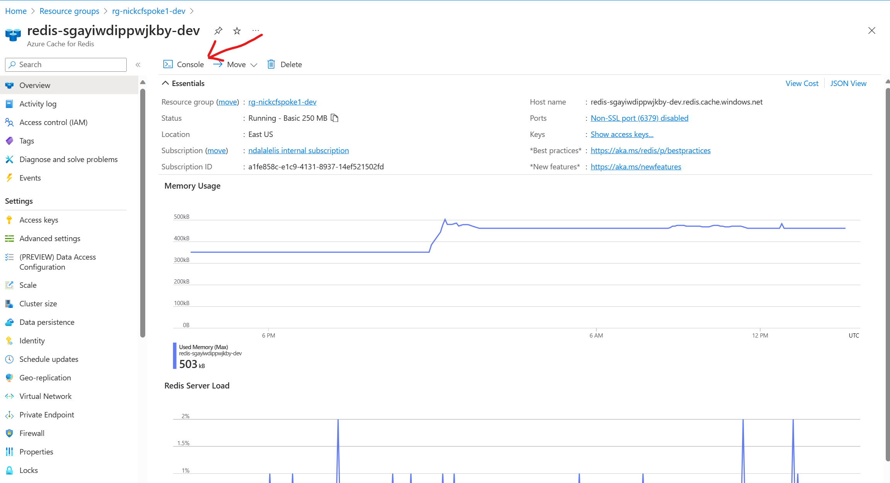

# Simulate the Patterns

You can test and configure the three code-level design patterns with this implementation: retry, circuit-breaker, and cache-aside. The following paragraphs detail steps to test the three code-level design patterns.

## Cache-Aside Pattern

Azure Cache for Redis is a fully managed, open-source compatible in-memory data store that powers fast, high-performing applications, with caching and advanced data structures.

The cache-aside pattern enables us to limit read queries to  the Azure PostgreSQL Flexible Server. It also provides a layer of redundancy that can keep parts of our application running in the event of issue with Azure PostgreSQL Database.

For more information, see [cache-aside pattern](https://learn.microsoft.com/azure/architecture/patterns/cache-aside).

Using the Redis Console we can see that we are caching objects and http sessions from Contoso Fiber in Redis.




# Logs

Application logging is enabled. To view the logs, navigate to *Diagnose and solve problems*. From there, click on *Application Logs*.


## Auto Scaling

Auto scaling is enabled and the default instance count is set to 2. To view the auto scaling settings, navigate to *Scale out (App Service plan)*.


Click on *Manage Rules Based Settings* to view the auto scaling rules.


These rules are defined in *Terraform* as follows:

```
resource "azurerm_monitor_autoscale_setting" "app_service_scaling" {
  name                = "contosocamsscaling"
  resource_group_name = var.resource_group
  location            = var.location
  target_resource_id  = azurerm_service_plan.application.id
  profile {
    name = "default"
    capacity {
      default = 2
      minimum = 2
      maximum = 10
    }
    rule {
      metric_trigger {
        metric_name         = "CpuPercentage"
        metric_resource_id  = azurerm_service_plan.application.id
        time_grain          = "PT1M"
        statistic           = "Average"
        time_window         = "PT5M"
        time_aggregation    = "Average"
        operator            = "GreaterThan"
        threshold           = 85
      }
      scale_action {
        direction = "Increase"
        type      = "ChangeCount"
        value     = "1"
        cooldown  = "PT1M"
      }
    }
    rule {
      metric_trigger {
        metric_name         = "CpuPercentage"
        metric_resource_id  = azurerm_service_plan.application.id
        time_grain          = "PT1M"
        statistic           = "Average"
        time_window         = "PT5M"
        time_aggregation    = "Average"
        operator            = "LessThan"
        threshold           = 65
      }
      scale_action {
        direction = "Decrease"
        type      = "ChangeCount"
        value     = "1"
        cooldown  = "PT1M"
      }
    }
  }
}
```

## Application Insights

Exceptions in the Contoso Fiber CAMS web application are reported with Application Insights. 


Click on an exception to see the end-to-end details:


Navigate to the Application Map blade:


Navigate to the Performance blade:


Navigate to the Live Metrics blade to see real-time performance:


## Resiliency with Multi-Region

The Contoso Fiber CAMS web application is deployed in two regions. All traffic is initially routed to the primary region. In the event of an outage in the active region, traffic can be routed to the secondary region. This proccess in not automatic and requires manual intervention.


An **Azure Database for PostgreSQL Flexible Server** is in the secondary region. This database is a read replica of the primary database. In the event of an outage in the primary region, the application can continue to function using the secondary database. For more information on read replicas, see [Read replicas in Azure Database for PostgreSQL - Flexible Server](https://learn.microsoft.com/en-us/azure/postgresql/flexible-server/concepts-read-replicas). 