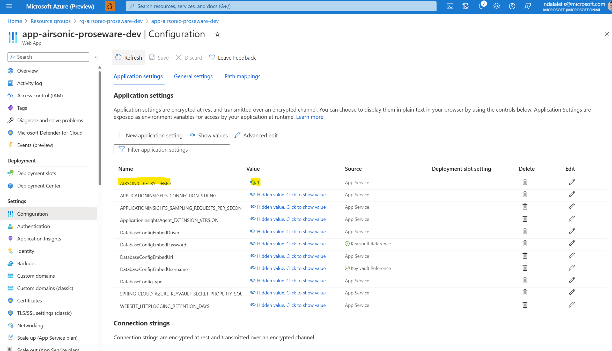
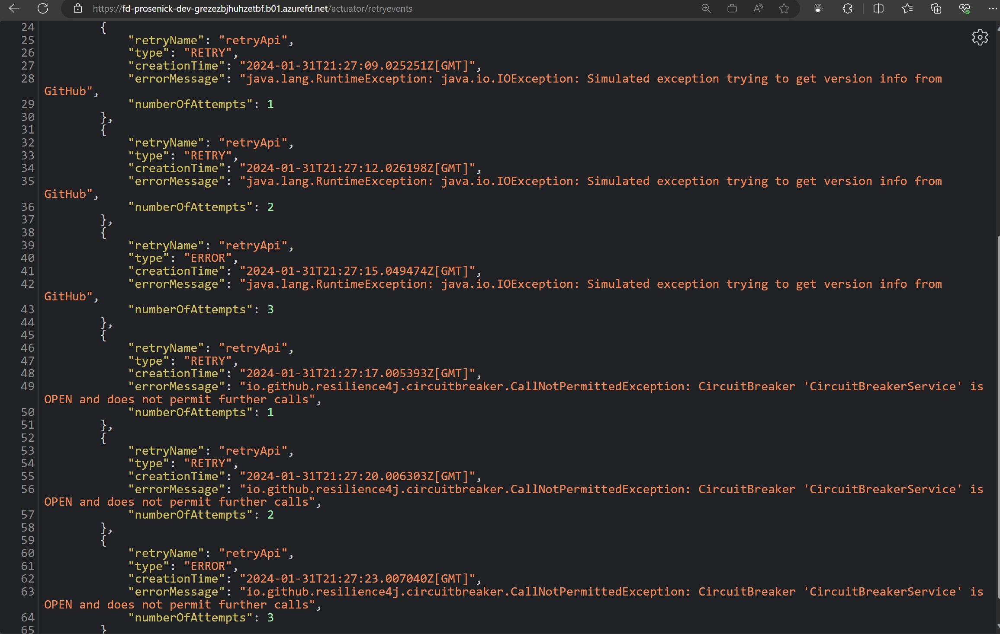
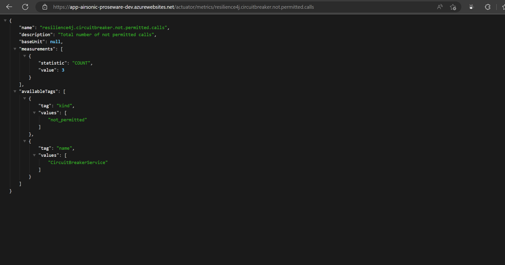
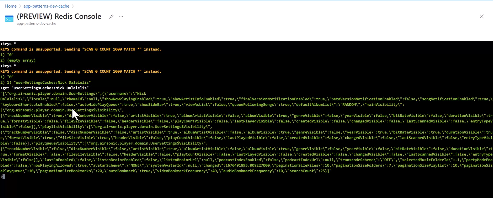
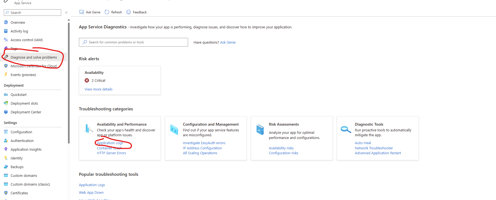
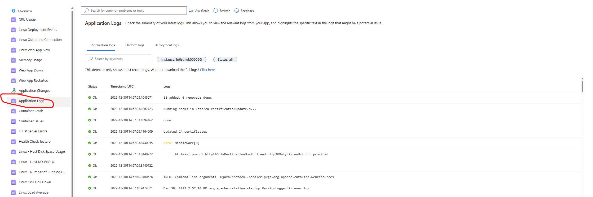
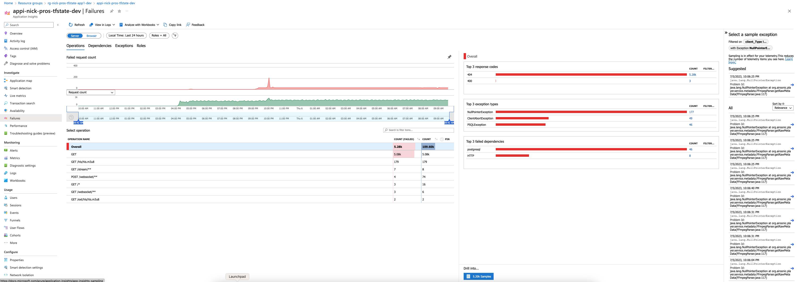
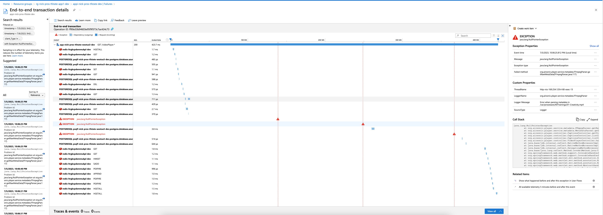

# Simulating the design patterns

You can test and configure the three code-level design patterns with this implementation: retry, circuit-breaker, and cache-aside. The following paragraphs detail steps to test the three code-level design patterns.

## Retry and Circuit Break Pattern

We built an app configuration setting that lets you simulate and test a transient failure when making a web request to GitHub. The reference implementation uses the `Spring Boot Actuator` to monitor retries. After deploying the application, navigate to your site’s `/actuator` endpoint to see a list of Spring Boot Actuator endpoints. Navigate to `/actuator/retries` to see retried calls. Set the `AIRSONIC_RETRY_DEMO` application setting to 1. This will simulate a failure for every web request to GitHub. A value of 2 generates a 503 error for every other request.

Follow these steps to set up this test:

1. Set the `AIRSONIC_RETRY_DEMO` setting to 1 in App Service Configuration.

1. Changing a application setting will cause the App Service to restart. Wait for the app to restart.

1. We added Spring Actuator Dependencies to the Proseware project. This enables actuator endpoints. Navigate to the following sites.
    * https://<APP_NAME>.azurewebsites.net/actuator
    * https://<APP_NAME>.azurewebsites.net/actuator/retryevents
    * https://<APP_NAME>.azurewebsites.net/actuator/retryevents
    * https://<APP_NAME>.azurewebsites.net/actuator/metrics/resilience4j.circuitbreaker.not.permitted.calls

1. Navigate to https://<APP_NAME>.azurewebsites.net/index and refresh the page. Every time you refresh the page, a call to GitHub is made.

1. Make note of the retry events and circuit breaker in the actuator endpoints.

## Cache-Aside Pattern

The cache-aside pattern enables us to limit read queries to  the Azure PostgreSQL Flexible Server. It also provides a layer of redundancy that can keep parts of our application running in the event of issue with Azure PostgreSQL Database.

For more information, see [cache-aside pattern](https://learn.microsoft.com/azure/architecture/patterns/cache-aside).

In the next request we see that the API call was only 55ms because it didn't have to connect to SQL Server and instead used the data from Azure Cache for Redis.

Using the (PREVIEW) Redis Console we can see this data stored in Redis.

## Logs

Application logging is enabled. To view the logs, navigate to *Diagnose and solve problems*. From there, click on *Application Logs*.

## Application Insights

Exceptions in the Prosware web application are reported with Application Insights. Some videos in Proseware cannot be played correctly. 

Using *Application Insights*, we see that a NullPointerException was thrown while processing the videos.

