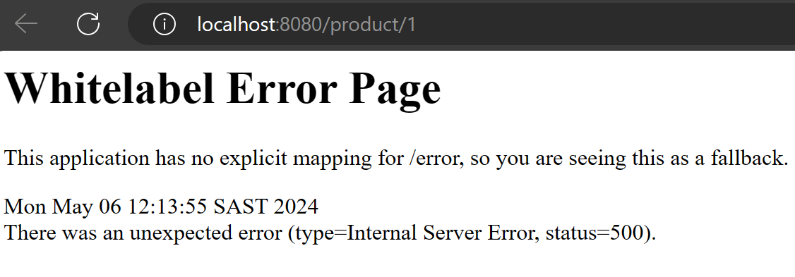
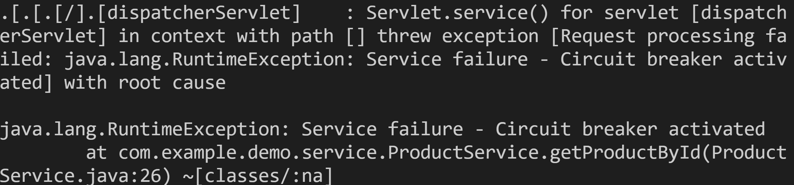

## Introduction to Part 0: Setting Up and Understanding the Basics

Before diving into the exercises of Part 0, it's crucial to understand the infrastructure and tools required to run and manage Java applications effectively. This part of the workshop is designed to familiarize you with the essential software and practices needed for Java development with Maven in Visual Studio Code, particularly focusing on Java 17 projects.

### Essential Installations for Running the Demo Application

To ensure you have a smooth experience during this workshop, here are the installations you'll need:

- **Java Development Kit (JDK) 17**: Essential for developing Java applications. Make sure to install JDK 17 as specified in your `pom.xml` file. [Download JDK 17](https://jdk.java.net/17/)
- **Apache Maven**: A build automation tool used primarily for Java projects. It helps manage project dependencies and streamline the build process. [Download Maven](https://maven.apache.org/download.cgi)
- **Visual Studio Code**: A lightweight but powerful source code editor that runs on your desktop. It's available for Windows, macOS, and Linux. [Download Visual Studio Code](https://code.visualstudio.com/Download)
- **Java Extension Pack for Visual Studio Code**: This extension pack includes essential Java tools such as Maven support and Java 17 compatibility. [Download Java Extension Pack](https://marketplace.visualstudio.com/items?itemName=vscjava.vscode-java-pack)

This setup not only prepares you for the immediate tasks but also lays the groundwork for advanced topics covered later in this workshop. The aim is to ensure that by the time you reach more complex exercises, you are well-equipped with the knowledge and tools needed to tackle them effectively.

## Why These Exercises?

The exercises introduced here are designed to give you hands-on experience with real-world scenarios. By deferring detailed exercises to Part 4, we ensure that you have the necessary context and technical foundation to fully appreciate and understand the significance of each pattern. This structured approach helps you connect the exercises with their practical applications in building reliable systems.

**Note**: The prerequisites for these exercises are integrated into the RWA deployment dev container available by Part 4, allowing you to focus more on learning and less on setup.


- For caching, the project employs the cache-aside pattern and utilizes the Caffeine library to manage the cache effectively.
- To improve system reliability, resiliency patterns such as circuit breakers and retries are implemented, enhancing the application's fault tolerance.

## Prerequisites

- Java 17
- Maven 3.6+

## Installation

1. Navigate to the project directory:

```bash
cd Part0-Basic-App/demo
```

2. Install dependencies:

```bash
mvn clean install
```

## Usage

Start the application using Maven:

```bash
mvn spring-boot:run
```

You can then access the API at `http://localhost:8080/product/1`.

### Example API Call

To retrieve a product by its ID, you can use the following curl command:

```bash
curl http://localhost:8080/product/1
```

## Running the Tests

To run the automated tests for this system, use the following command:

```bash
mvn test
```

These tests verify the functionality of all components, ensuring that the application behaves as expected.

## Failure Mode

One of the most essential principles of the Reliable Web App pattern is the Retry Pattern. It helps your application deal with situations where a service might be temporarily down, a ‘transient fault’. The Retry pattern resends failed requests to the service until it’s working again.

But the Retry Pattern alone is not enough. Sometimes, a service might be unavailable for a long time, or it might even be gone forever. It would be useless to keep trying to call such a service. That’s why we need the Circuit Breaker Pattern.

The application includes a feature to simulate failures, useful for testing its resilience capabilities such as the circuit breaker and retry mechanisms. This simulation can be controlled directly from a web browser, making it easy to demonstrate or test the effects of these patterns.

### Enabling Failures

To simulate failures in the system, which will trigger the circuit breaker or retry logic, you can activate failure mode using the following URL:

```plaintext
http://localhost:8080/configure/failure?fail=true
```
You can then trigger the failure at `http://localhost:8080/product/1`.

View the logs in your browser and terminal:




### Disabling Failures

To return the system to normal operation, disable the failure mode using this URL:

```plaintext
http://localhost:8080/configure/failure?fail=false
```
Test the application again by accessing `http://localhost:8080/product/1`.

> ## Notes
> Remember to close your terminal by pressing `Ctrl+C` to stop the application.


## Circuit Breaker in Testing

The circuit breaker pattern is crucial for managing failures in distributed systems. It prevents a network or service failure from causing your application to become unstable. This pattern temporarily halts operations when a particular service or operation fails repeatedly, which is vital for maintaining overall system health.

The `ProductServiceTest` class in the `Part0-Basic-App/demo/src/test/java/com/example/demo/service/ProductServiceTest.java` tests this behavior by simulating failures to trigger the circuit breaker. Here's an explanation of the test and the method it tests:

### Code Snippets and Explanation

**getProductById Method in ProductService**

This method includes a circuit breaker and retry mechanism, which are critical for handling failures in production environments. Here’s how it works:

```java
    @CircuitBreaker(name = "default", fallbackMethod = "fallback")
    @Retry(name = "default")
    public Product getProductById(Long id) {
        if (failForCircuitBreakerTest || Math.random() > 0.7) {
            throw new RuntimeException("Service failure - Circuit breaker activated");
        }
        return new Product(id, "Product Name", "Product Description");
    }
```
The line `if (failForCircuitBreakerTest || Math.random() > 0.7)` in the `getProductById` method is crucial for testing and demonstrating the resilience of the application. It simulates failures by combining a manual flag (`failForCircuitBreakerTest`) and a random factor (`Math.random() > 0.7`). This setup allows developers to trigger failure scenarios and introduces unpredictability, mimicking real-world conditions. By validating the system's fault tolerance mechanisms, it ensures reliable service even under adverse conditions.

**ProductServiceTest Class**

The test method simulates a scenario where the `getProductById` method is called and a failure is expected to trigger the circuit breaker:

```java
    @Test
    public void whenGetProductByIdCalledMultipleTimes_thenCircuitBreakerShouldBeTriggered() {
        boolean exceptionThrown = false;
        for (int i = 0; i < 20; i++) {
            try {
                productService.getProductById((long) i);
            } catch (RuntimeException e) {
                exceptionThrown = true;
            }
        }
        assertTrue(exceptionThrown);
    }
```

This test ensures that the circuit breaker is functioning as expected by verifying that an exception is thrown when the method is repeatedly called under failure conditions.

These explanations and code snippets help illustrate how the circuit breaker pattern is implemented and tested within this part of the workshop.

## Conclusion

This project provides a simple demonstration of reliable web app patterns in action. By exploring the code and running the application, you can gain a better understanding of how these patterns can enhance the reliability and performance of web applications.

## Next Up

Next, we will deploy the RWA reference application on Azure --> [Part 1 - Tooling](../Part1-Tooling/README.md) 

## Appendix A - Application Properties Configuration

The `application.properties` file in Part0-Basic-App contains key settings that define the behavior of the application and its resilience mechanisms. Here's a detailed explanation of each setting:

### Cache Configuration
- `spring.cache.type=caffeine`: Specifies the type of cache used. Caffeine provides a high-performance, near-optimal caching library based on Java.
- `spring.cache.cache-names=products`: Defines the specific cache names, in this case 'products', which is used to cache product data.
- `spring.cache.caffeine.spec=maximumSize=500,expireAfterAccess=600s`: Sets the cache specifications where `maximumSize=500` limits the number of entries in the cache, and `expireAfterAccess=600s` ensures items are expired from the cache if not accessed within 600 seconds.

### Resilience4j Circuit Breaker Configuration
- `resilience4j.circuitbreaker.instances.default.register-health-indicator=true`: Enables a health indicator for the default circuit breaker instance, useful for monitoring the health of circuit breakers.
- `resilience4j.circuitbreaker.instances.default.sliding-window-type=COUNT_BASED`: Configures the sliding window type to be count-based, affecting how failure rates are calculated.
- `resilience4j.circuitbreaker.instances.default.sliding-window-size=10`: Specifies the size of the sliding window for failure rate calculation.
- `resilience4j.circuitbreaker.instances.default.failure-rate-threshold=50`: Sets the failure rate threshold at which the circuit breaker will trip, in this case at 50%.
- `resilience4j.circuitbreaker.instances.default.wait-duration-in-open-state=10000ms`: Defines how long the circuit breaker should stay in the open state before switching to half-open, in milliseconds.
- `resilience4j.circuitbreaker.instances.default.automatic-transition-from-open-to-half-open-enabled=true`: Allows automatic transition from open to half-open state, facilitating the recovery process.

### Resilience4j Retry Configuration
- `resilience4j.retry.instances.default.maxAttempts=3`: Defines the maximum number of attempts for a retry, set to 3.
- `resilience4j.retry.instances.default.wait-duration=2000`: Specifies the wait duration between retries, in milliseconds.
- `resilience4j.retry.instances.default.retry-exceptions=java.io.IOException`: Lists the exceptions that qualify for a retry, in this case, `java.io.IOException`.
