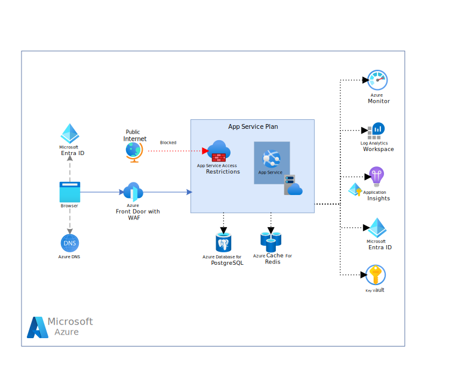
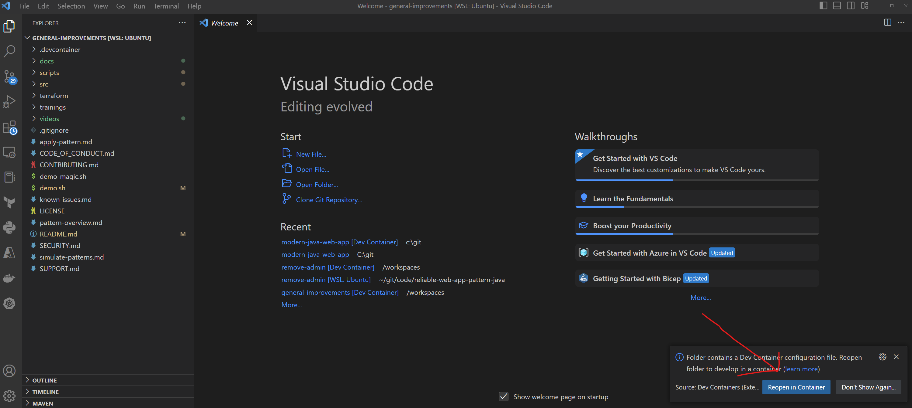
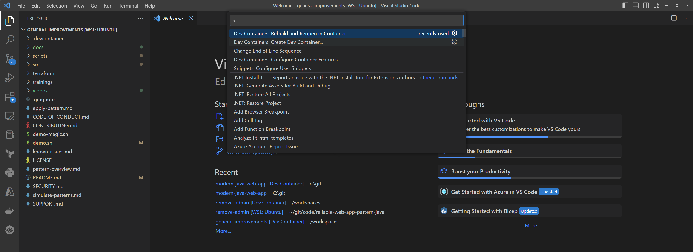
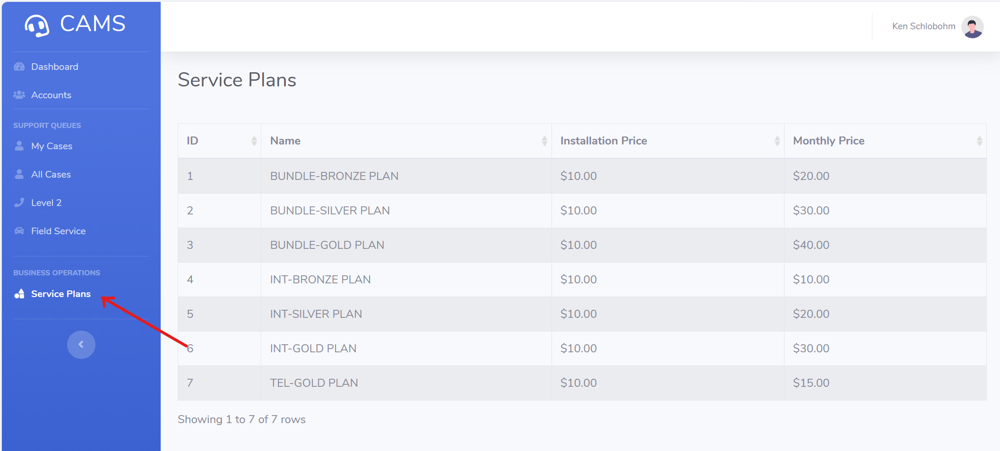

# Introduction

> ## Notes
In this section, we set up the reference example to be explored in Parts 2 through 7 of this workshop. The provisioning and deployment process will take approximately 40 minutes. While the installation is running, please proceed to Parts 2 through 7 to continue with the workshop.

The reference implementation is a production-grade web application that guides developers through migrating an on-premises web application to Azure, showcasing architectural changes and enhancements that leverage Azure strengths.

## Architecture

In the workshop we will only be deploying a development deployment which is a simplified version of the full production deployment.




> ## Notes
> The production environment aligns to a hub and spoke network architecture to centralize common resources. This network topology provided cost savings, enhanced security, and facilitated network integration (platform and hybrid). The full production deployment is not covered in this workshop but is available in the GitHub repository.

## Detailed deployment steps 

**Note**: The teardown section previously found here has been removed to avoid redundancy and maintain clarity throughout the workshop. Teardown instructions are comprehensively covered in Part 7, ensuring that all resources are appropriately cleaned up at the conclusion of the workshop.

```pwsh
wsl
```

Clone the repository and open the project using the Dev Container.

```shell
git clone https://github.com/Azure/reliable-web-app-pattern-java.git

cd reliable-web-app-pattern-java
```

### 2. Open Dev Container in Visual Studio Code

If required, ensure Docker Desktop is started. Open the repository folder in Visual Studio Code. You can do this from the command prompt:

```shell
code .
```

Once Visual Studio Code is launched, you should see a popup allowing you to click on the button **Reopen in Container**.



If you don't see the popup, open the Visual Studio Code Command Palette to execute the command. There are three ways to open the command palette:

- For Mac users, use the keyboard shortcut ⇧⌘P
- For Windows and Linux users, use Ctrl+Shift+P
- From the Visual Studio Code top menu, navigate to View -> Command Palette.

Once the command palette is open, search for `Dev Containers: Rebuild and Reopen in Container`.



### 3. Log in to Azure

Before deploying, you must be authenticated to Azure and have the appropriate subscription selected. Run the following command to authenticate:

```shell
az login --scope https://graph.microsoft.com//.default
```

Set the subscription to the one you want to use (you can use [az account list](https://learn.microsoft.com/en-us/cli/azure/account?view=azure-cli-latest#az-account-list) to list available subscriptions):

```shell
export AZURE_SUBSCRIPTION_ID="<your-subscription-id>"
```

```pwsh
az account set --subscription $AZURE_SUBSCRIPTION_ID
```

Use the next command to login with the Azure Dev CLI (AZD) tool:

```pwsh
azd auth login
```

### 4. Create a New Environment

Next, we provide the AZD tool with variables that it uses to create the deployment. The first thing we initialize is the AZD environment with a name.

The environment name should be less than 18 characters and must be comprised of lower-case, numeric, and dash characters (for example, `contosowebapp`).  The environment name is used for resource group naming and specific resource naming.

```shell
azd env new <pick_a_name>
```

Enable the AZD Terraform provider:

```shell
azd config set alpha.terraform on
```

Select the subscription that will be used for the deployment:
```shell
azd env set AZURE_SUBSCRIPTION_ID $AZURE_SUBSCRIPTION_ID
```

Set the Azure region to be used:

```shell
azd env set AZURE_LOCATION <pick_a_region>
```

### 5. Create the Azure resources and deploy the code

Run the following command to create the Azure resources and deploy the code (about 15-minutes to complete):

```shell
azd up
```

### 6. Open and use the application

Navigate to the Front Door URL in a browser to view the Contoso Fiber CAMS application. Use the Endpoint URL from the output of the deployment.

You will see an output similar to the following:

```shell
Deploying services (azd deploy)

  (✓) Done: Deploying service application
  - Endpoint: https://fd-contosocams-dev-frcfgefndcctbgdh.z02.azurefd.net
```

Click on the "Service Plans" link in the left-side menu of the Contoso Fiber application. This will try to make a query to retrieve a list of all service plans.



### 7. Next Up

Now that you have deployed the reference implementation, you can proceed to the next section of the workshop, which provides an overview of the Reliable Web Application pattern. 

[Part 2 - RWA Overview](../Part2-RWA-Overview/README.md)

### Appendix A (To be run only after completing the workshop)

To tear down the deployment, run the following command:

```shell
azd down --purge --force
```
