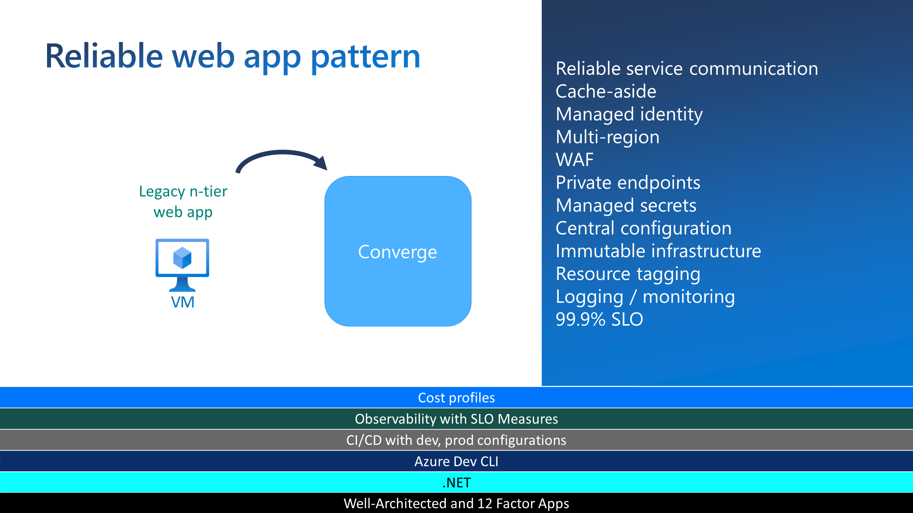
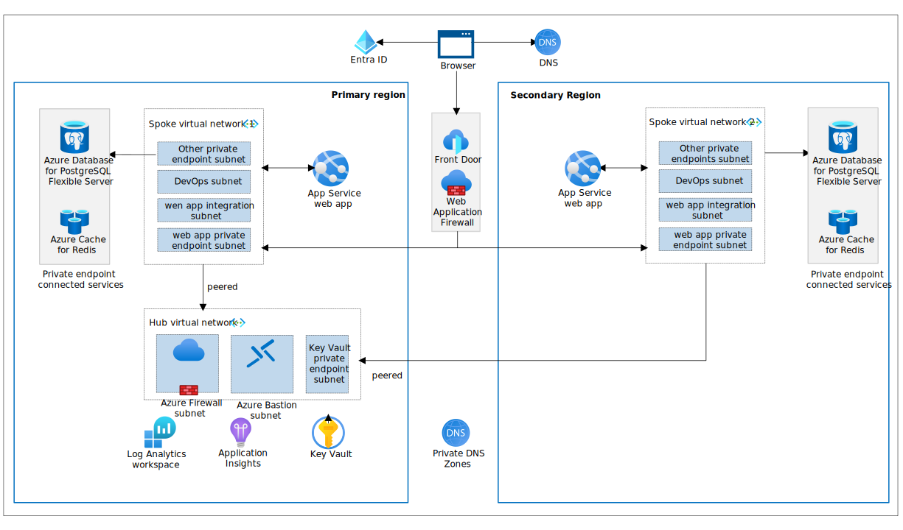

# Reliable Web App Pattern - Java Overview

The reliable web app pattern is a set of principles that help developers successfully migrate web applications to the cloud. The pattern focuses on the minimal changes needed to ensure the success of your web app in the cloud.

## Objectives

The objectives of the reliable web app pattern are straightforward. They are designed to help you:

## The Five Pillars

The reliable web app pattern is built on five pillars. Each pillar is a set of patterns that are derived from both the Azure Well-Architected Framework and the 12-factor app methodology.

## Reference Application

Contoso Fiber is aligned with a hub and spoke network topology in the production deployment architecture to centralize common resources. This network topology provided cost savings, enhanced security, and facilitated network integration (platform and hybrid):

- Cost efficiency: The hub promotes cost-effective resource reuse by acting as a central point for shared resources, such as Azure Bastion for secure and cost-effective remote access.
- Traffic control and security: Network Security Groups, Route tables, and private endpoints ensure secure boundaries for Azure resources. A Jump Box allows for deployment within these boundaries while maintaining local IP access.
- Network integration: The topology supports network integrations for data transfer across applications and hybrid scenarios. Consider ExpressRoute or Azure VPN Gateway for applications requiring hybrid network connections.

## Workflow

- **Global traffic routing**: Azure Front Door routes users to the primary region for optimal performance and fails over to a secondary region during outages.
- **Security inspection**: Azure Web Application Firewall protects against web vulnerabilities before reaching the web app.
- **Content delivery**: Static content is delivered immediately, while dynamic content is generated by making SQL calls to the backend, which fetches data from Azure Database for PostgreSQL - Flexible Server.
- **Session state management**: Azure Cache for Redis manages user sessions for persistence and consistency.
- **User authentication**: Microsoft Entra ID handles user authentication for centrally managed accounts.
- **Networking and access control**: Azure Private DNS, Network Security Groups, and Azure Firewall control traffic flow within the app's network.
- **Monitoring and telemetry**: Application Insights provides monitoring and telemetry capabilities for performance tracking and issue resolution.
- **Configuration and secrets management**: Initial configuration and sensitive information are loaded from Azure Key Vault into the app's memory upon startup.

## Next Up

In the next five sections, we'll delve into each of the five pillars. We will begin by examining cost optimization strategies.

[Part 3 - Cost Optimization](../Part3-Cost-Optimization/README.md)

