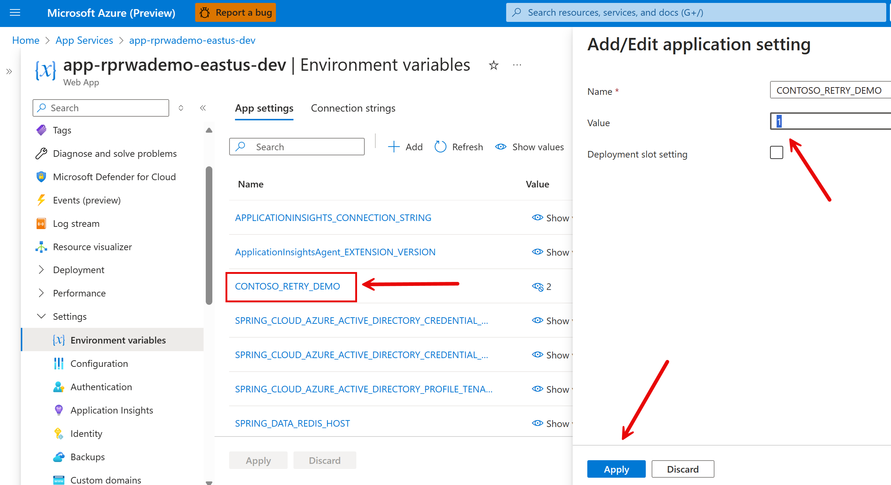
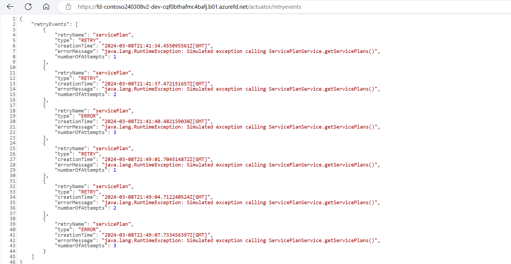
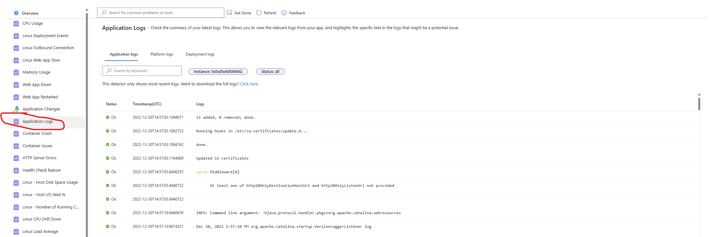

# Reliability

In this part, we guide you through the process of testing and configuring two key code-level design patterns to add redundancy throughout critical flows at different workload layers: the retry and the circuit-breaker. The retry pattern involves making repeated attempts to execute a task until successful, while the circuit-breaker pattern prevents a system from executing a task that's likely to fail, to avoid further system degradation.

Building upon the foundations set in Part 0, where we introduced basic retry and circuit-breaker mechanisms using simple examples, this section dives deeper into their practical applications within larger, more complex systems. Here, we demonstrate how these patterns can be effectively scaled to handle higher loads and more critical business operations, enhancing the overall reliability of your application.

## Retry Pattern

In the reference example, we built an app configuration setting, `CONTOSO_RETRY_DEMO`, that allows you to simulate and test a transient failure when making a web request to GitHub. When set to 1, this setting simulates a failure for every web request to GitHub, triggering both the retry and circuit-breaker mechanisms. A value of 2 generates a 503 error for every other request. Other values will not trigger these behaviors.

The reference implementation uses the `Spring Boot Actuator` to monitor retries. After deploying the application, navigate to your site’s `/actuator` endpoint to see a list of Spring Boot Actuator endpoints. Navigate to `/actuator/retries` to see retried calls.

When the `CONTOSO_RETRY_DEMO` setting is set to 1, we not only simulate a failure for every web request to GitHub, but we also trigger the circuit-breaker mechanism. This mechanism prevents further attempts to call the API when it is failing, thus avoiding unnecessary load and potential cascading failures.

## Exercise - Retry Pattern:

1. Set the `CONTOSO_RETRY_DEMO` setting to 1 in App Service Configuration.

2. Changing an application setting will cause the App Service to restart. Wait for the app to restart.

3. We added Spring Actuator Dependencies to the Proseware project. This enables actuator endpoints. Navigate to the following sites:
    * https://<FRONT_DOOR_URL>/actuator
    * https://<FRONT_DOOR_URL>/actuator/retryevents
    * https://<FRONT_DOOR_URL>/actuator/metrics/resilience4j.circuitbreaker.not.permitted.calls

4. Navigate to https://<FRONT_DOOR_URL>/index and refresh the page. Every time you refresh the page, a call to GitHub is made.
5. Navigate to https://<FRONT_DOOR_URL>/actuator/retryevents and make note of the retry events in the actuator endpoints.

## Exercise - Circuit Breaker Pattern

1. Set the `CONTOSO_RETRY_DEMO` setting to 2 in App Service Configuration.

To see the Circuit Breaker pattern in action you can follow these steps:

1. Click on the "Service Plans" link in the left-side menu of the Contoso Fiber application. This will try to make a query to retrieve a list of all service plans. And, because the `CONTOSO_RETRY_DEMO` setting is set to 1, the application will return an error.

    

1. Navigate to the following page in your browser to observe the retry events that now describe circuit breaker behavior.
    * https://<FRONT_DOOR_URL>/actuator/retryevents

    

1. Navigate to the following page in your browser to observe the circuit breaker behavior.
    * https://<FRONT_DOOR_URL>/actuator/metrics/resilience4j.circuitbreaker.not.permitted.calls

    

## Logs

Application logging is enabled. To view the logs, navigate to *Diagnose and solve problems*. From there, click on *Application Logs*.

## Next Up

In this part, we learned how to test and configure two key code-level design patterns: retry, and circuit-breaker. We also learned how to view application logs.

Next, we need to address the important topic of [Part 5 - Security](../Part5-Security/README.md).

## Resources
[Well-Architected Framework reliability portal](https://learn.microsoft.com/azure/well-architected/reliability)

