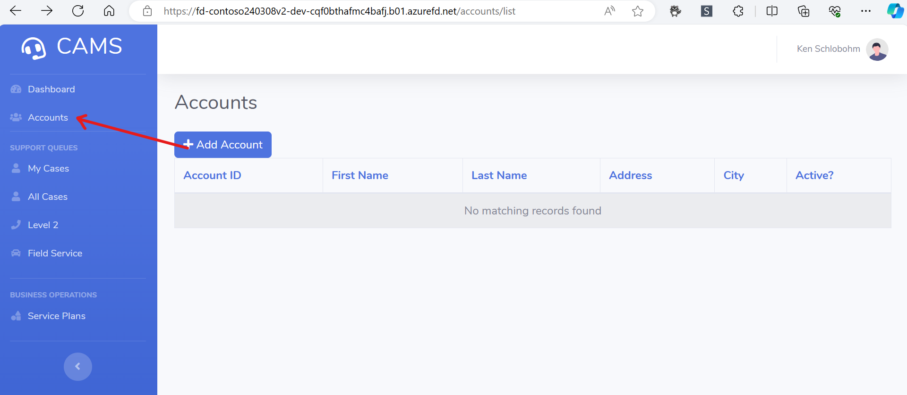
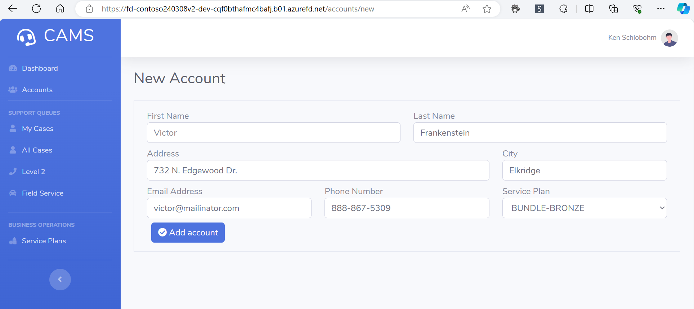
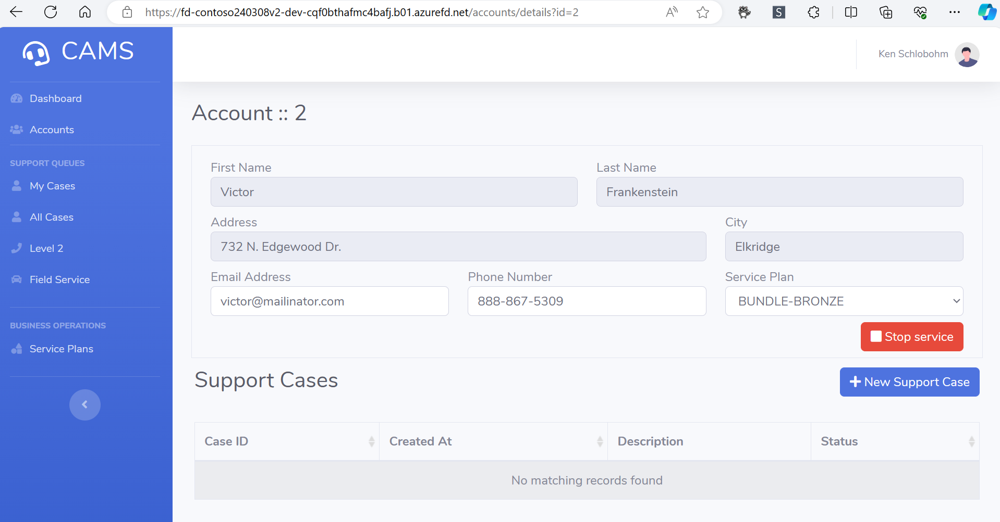
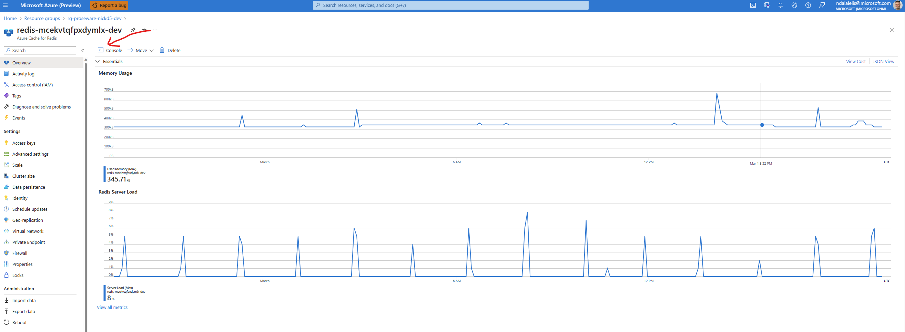
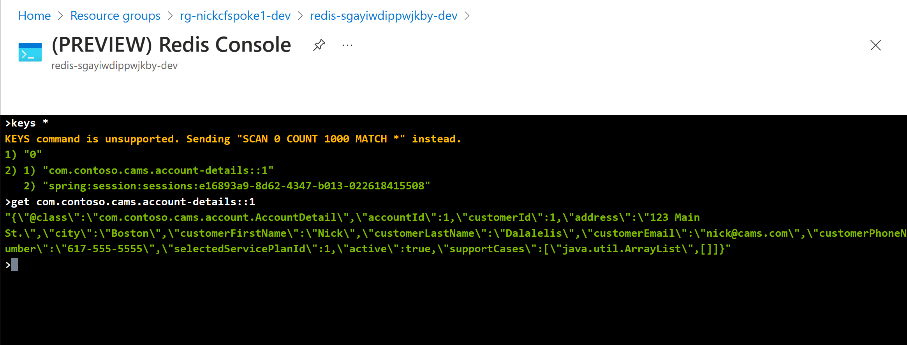
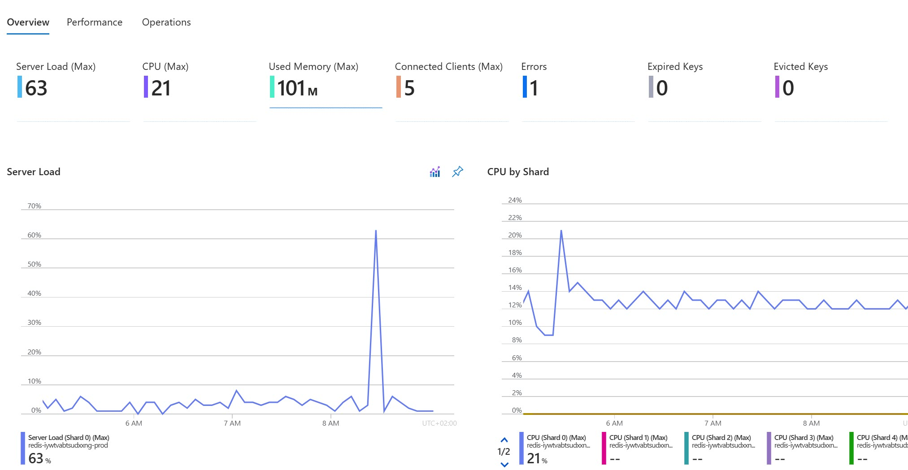
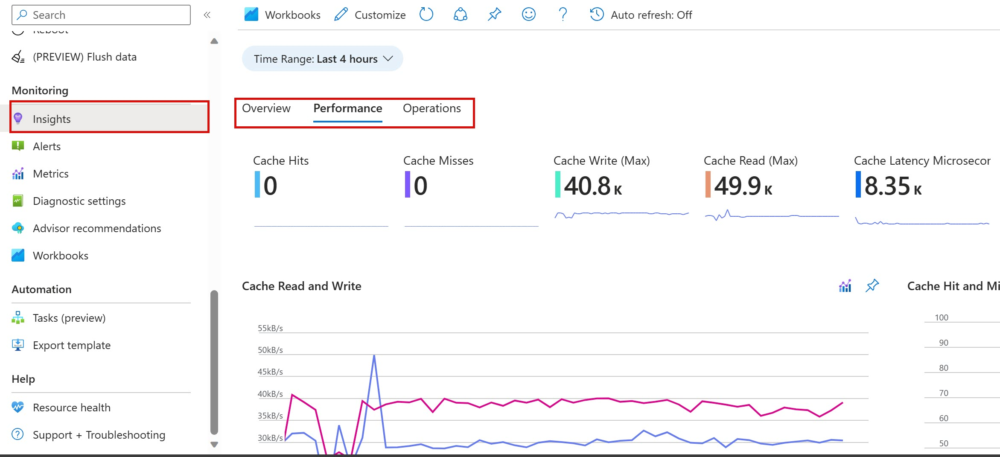
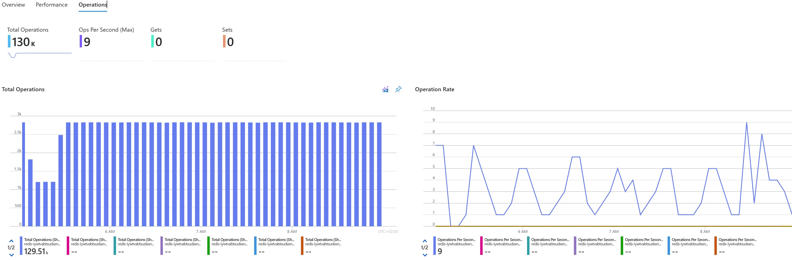

# Performance Efficiency

Performance efficiency is the ability of a workload to scale and meet the demands placed on it by users in an efficient manner. In cloud environments, a workload can anticipate increases in demand to meet business requirements using caches. Building on the simple caching strategies introduced in Part 0, this section further explores how to develop these strategies into more robust caching mechanisms, enabling our applications to handle increased traffic loads efficiently and maintaining high performance under varying loads.

> ## NOTES
> Remember, the auto-scaling strategies discussed during the cost optimization are not only vital for reducing operational costs but also play a critical role in maintaining high availability and operational excellence. It's essential to consider auto-scaling as a part of operational excellence, ensuring that your application remains efficient and responsive under varying loads.

## The Cache-Aside pattern

The Cache-Aside pattern is a technique used to manage in-memory data caching. It reduces the request response time and can lead to increased response throughput. This efficiency reduces the number of horizontal scaling events, making the app more capable of handling traffic bursts. It also improves service availability by reducing the load on the primary data store and decreasing the likelihood of service outages.

The cache-aside pattern enables us to limit read queries to the Azure PostgreSQL Flexible Server. It also provides a layer of redundancy that can keep parts of our application running in the event of an issue with Azure PostgreSQL Database.

## Exercise - Caching

1. Click on the "Accounts" link in the left-side menu of the Contoso Fiber application.

    

1. Fill out the form and click "Add Account". This will create a new account and store it in the Azure PostgreSQL Flexible Server.

    

1. When successful, the account details page is shown.

      

    Using the (PREVIEW) Redis Console we can see this data stored in Redis.

    Open the Redis Console by navigating to the Azure Cache for Redis resource in the Azure Portal and clicking the "Console" link above the overview details for this resource.

    

    Run the following command to see all cached keys:

    ```
    SCAN 0 COUNT 1000 MATCH *
    ```

    Run the next command to see the cached account details data:

    ```
    GET com.contoso.cams.account-details::1 
    ```

    

## Exercise - Caching monitoring

We can use Application Insights to view cache hits:
    - Navigate to your application resource group
    - Select the **Azure Redis Cache**.
    - Select **Application Insights** from the left-hand menu.

The default **Overview** table shows these columns:

- **Used Memory**
- **Server Load**
- **CPU**
- **Connected Clients**
- **Expired and Evicted Keys**
- **Errors (Max)**



The default **Performance** table shows these columns:

- **Cache Read and Write**
- **Cache Hit and Miss**



The default **Operations** table shows these columns:

- **Total Operations**
- **Gets and Sets**



## Conclusion

Caching is a powerful technique for enhancing the performance and scalability of your application. By storing frequently accessed data or content in a cache, you can significantly reduce the load on your backend infrastructure and improve response times. The Cache-Aside pattern is particularly effective in this regard. This pattern first checks the cache to see if the desired data is already stored in memory. If the data is found in the cache, the application can quickly retrieve and return it, bypassing the need for a potentially time-consuming query to the persistent data store. This efficient use of resources can lead to a more responsive and resilient application, capable of handling high traffic loads while providing a smooth user experience.

For more information, see [cache-aside pattern](https://learn.microsoft.com/azure/architecture/patterns/cache-aside).

## Workshop Summary

In this workshop, we focused on different aspects of building and deploying a reliable web application pattern with Java on Microsoft Azure. Here's a summary of the topics covered in each part:

| Part | Topics Covered |
|------|----------------|
| Tooling | Introduction to the tools and technologies used throughout the workshop. |
| RWA Overview | Detailed exploration of Reliable Web Applications (RWA) and the associated patterns. |
| Cost Optimization | Strategies for optimizing costs using nonproduction environments. |
| Reliability | Implementing design patterns to ensure redundancy across different system layers. |
| Security | Overview of the key security features and configurations. |
| Operational Excellence | Approaches to minimize process variance and enhance operational consistency. |
| Performance Efficiency | Techniques and practices for improving caching and overall application performance.

## Cleaning Up

Thank you for attending this workshop.  We hope you learned something and feel more comfortable tackling the patterns that are used in enterprise web applications. You can now clean up the resources that you used.
To tear down the deployment, run the following command (the process to teardown may take up to 20 minutes):

```shell
azd down --purge --force
```

## Resources
[Well-Architected Framework Performance portal](https://learn.microsoft.com/azure/well-architected/performance-efficiency)

[RWA Guidance](https://aka.ms/eap/rwa/java/doc)

[RWA Repo](https://aka.ms/eap/rwa/java)
